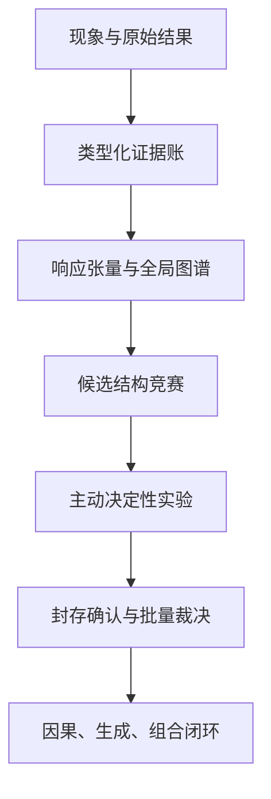

# 全局结构辨识研究框架

## 一、北极星问题

本项目的目标不是找到一个能读取答案的方向、神经元或探针，而是识别一个能够预测未知未来的紧凑机制结构：

\[
Z_e=f_M(H_e),
\qquad
\widehat{\mathcal R}=g_M(Z_e,I,Q,C),
\qquad
\widehat Z_{e+1}=T_M(Z_e,u_e).
\]

其中：

- \(H_e\)：计算事件 \(e\) 的完整物理状态；
- \(Z_e\)：候选功能状态；
- \(I\)：类型合法的干预；
- \(Q\)：行为、序列、缓存或因果读出；
- \(C\)：模型、任务、提示、解码、评价、精度等条件；
- \(T_M\)：候选状态转移结构；
- \(\mathcal R\)：未来因果响应。

候选结构的统一评分为：

\[
J(M)=
L_{\mathrm{new\ world}}
+L_{\mathrm{new\ intervention}}
+L_{\mathrm{multi\ step}}
+L_{\mathrm{transfer}}
+\lambda\,DL(M).
\]

真正的核心结构必须同时满足：压缩、预测、干预、组合和迁移。只在发现集热力图上漂亮，不构成机制证据。

## 二、研究单位

### 1. 战役是方向单位

`Campaign`（完整研究战役）包含：

1. 冻结问题和构念；
2. 冻结竞争机制；
3. 构建发现集与封存集；
4. 全域低成本扫描；
5. 结构发现与模型竞赛；
6. 主动选择决定性干预；
7. 一次封存确认；
8. 幸存机制闭环或集体关闭。

### 2. Phase 是执行与审计单位

每个 `Phase` 只能是以下一种类型：

- `calibration`（相机校准）；
- `discovery`（发现集探索）；
- `discrimination`（候选区分）；
- `confirmation`（封存确认）；
- `closure`（因果或生成闭环）；
- `audit`（独立审计）；
- `migration`（历史账本迁移）。

同一个 Phase 不得同时承担结构发现和最终确认。

## 三、五层工程架构



### 第一层：原始事实层

保存不可变的：输入、模型版本、精度、种子、合同摘要、原始输出、审计摘要和运行环境。

### 第二层：类型化证据层

每条证据必须携带：

- 构念类型；
- 证据等级；
- 闭合层级；
- 适用域；
- 通过与失败分区；
- 授权范围；
- 明确不能推出的结论。

### 第三层：全局结构层

把结果组织为响应张量：

\[
\mathcal R[
\text{模型},
\text{世界},
\text{因素},
\text{协议},
\text{事件},
\text{干预},
\text{读出},
\text{生成时间}
].
\]

然后生成层—词元轨迹图、源—接收运输图、因素—组件图、干预—读出图、协议交换图和跨模型响应图。

### 第四层：候选机制层

多个候选机制同时拟合同一份发现数据。每个候选必须输出：

1. 未见世界预测；
2. 未见干预预测；
3. 多步轨迹预测；
4. 与其他候选差异最大的实验；
5. 自己的死亡条件。

### 第五层：裁决与闭环层

封存确认最多保留一至两个机制。幸存者继续完成必要性、充分性、错误救援、因果中介、完整生成、组合、跨模型和训练形成；其余机制按限定适用域归档。

## 四、双轴证据系统

历史项目已经使用 `E1/E2/E3`，本框架保留原等级，不追溯改号，同时增加独立的闭合层级。二者不能混用。

### 1. 证据等级

| 等级 | 含义 |
|---|---|
| E0 | 概念、协议或未运行提案 |
| E1 | 描述性或初步观察 |
| E2 | 事后诊断、探索性结果或局部脚手架 |
| E3 | 前瞻冻结并在声明适用域内确认 |

证据等级表示实验纪律，不表示已经破解机制。

### 2. 闭合层级

| 层级 | 名称 | 最低要求 |
|---|---|---|
| L0 | 问题登记 | 对象、范围和反例可写清 |
| L1 | 行为资格 | 构念在匹配控制和必要分区通过 |
| L2 | 内部响应 | 有稳定内部响应签名，但尚未预测新干预 |
| L3 | 未来预测 | 预测未知样本、未知干预或多步响应 |
| L4 | 组件因果证据 | 组件或路径干预具有方向、特异性和控制优势 |
| L5 | 功能状态闭环 | 充分、必要、正确救援、错误救援失败、中介与最小联盟闭合 |
| L6 | 生成闭环 | 全词元轨迹、前缀反馈、键值缓存和结束词元闭合 |
| L7 | 组合与迁移 | 未见操作组合、跨协议和跨模型结构保持 |
| L8 | 形成闭环 | 能预测并干预训练中结构如何形成 |

任何对象都必须带作用域。例如“对象—marker、Qwen3、固定句式达到 L1”，不能简写成“语言达到 L1”。

## 五、四本账及其关系

### 1. 证据账

证据只写实际发生的结果。理论解释放在候选机制账，下一步放在拼图账。

### 2. 候选机制账

一个候选机制由以下六项构成：

\[
M=(\text{对象},\text{范围},\text{独特预测},\text{对照},\text{死亡条件},\text{重开条件}).
\]

候选状态只能是：候选、发现支持、确认支持、局部幸存、全局幸存、限定否决、拒答或关闭。

### 3. 关键拼图账

拼图不是“又发现一个统计性质”，而是破解机制必须闭合的问题，例如：合法干预语义、未来响应状态、最小因果联盟、自回归闭环和跨模型同构。

每块拼图保存依赖、当前层级、目标层级、阻塞原因、下一决定性测试和完成清单。

### 4. 决策账

任何授权、停止、否决或重开都登记：输入证据、规则、裁决、作用域、下一权限和禁止事项。

## 六、类型安全状态机

实验状态：

```text
draft
→ calibrated
→ preregistered
→ ready
→ running
→ auditing
→ adjudicated
→ archived
```

异常出口：

- `blocked`：前置条件未满足；
- `censored`：预算内无法观察目标；
- `invalid`：合同或实现错误，结果不能裁决科学问题；
- `abstain`：允许的观察不足以识别目标；
- `cancelled`：问题被上游证据关闭。

“没有通过”不能直接写成 `failed`，必须落到失败类型表。

## 七、失败类型表

| 类型 | 含义 | 允许的结论 |
|---|---|---|
| construct_failure | 构念未被任务或评价隔离 | 重新定义构念，不评价内部机制 |
| behavior_failure | 行为基座在声明范围不稳定 | 关闭该对象的当前物理授权 |
| instrument_failure | 已知真值相机不能恢复目标 | 修复或淘汰相机 |
| identifiability_failure | 当前观察合同不能唯一识别目标 | 增加观察或明确拒答 |
| predictive_failure | 候选不能预测封存结果 | 在当前范围否决其强版本 |
| specificity_failure | matched-null、错误供体或载体控制失败 | 不得声称语义因果 |
| causal_failure | 充分、必要、救援或中介链失败 | 限定关闭因果强版本 |
| generation_failure | 首词元后轨迹、缓存或停止不闭合 | 不得声称语言生成机制闭合 |
| composition_failure | 单操作不能预测未见组合 | 不得声称操作代数 |
| transfer_failure | 跨协议、模型或材料不保持 | 降级为局部机制 |
| resource_censoring | 预算内未观察目标 | 登记删失，不伪造阴性 |
| protocol_error | 实现或冻结合同错误 | 本次运行不用于科学裁决 |

## 八、进度的正确表示

项目不使用一个总百分比代表“破解了多少”。进度由四个互不替代的量组成：

1. 拼图检查项完成数；
2. 当前闭合层级与目标层级；
3. 候选空间缩减情况；
4. 封存预测和因果闭环通过情况。

因此，一个高价值负结果可以显著推进候选空间，却不会伪装成更高闭合层级。

