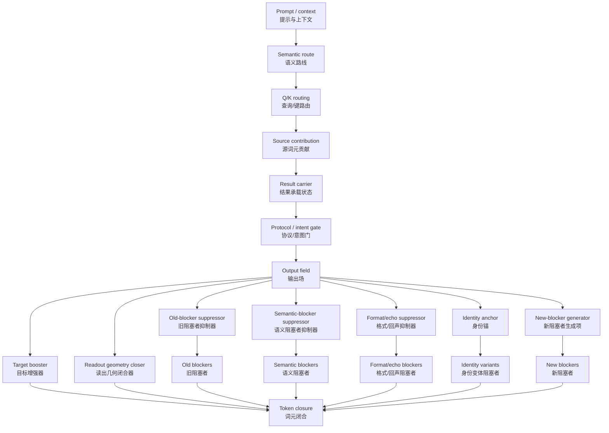

提问：

参考 `research\MainAnalysis\20260630_04_Phase500-800总结.md` 文件，把 Phase 600-805 的结果压缩成一张可预测、可验证、可复用的全词表闭合机制图谱。


回答：

# Phase 600-805 全词表闭合机制图谱

这份图谱的目标不是继续复述每个 Phase（阶段），而是把 Phase 600-805 的发现压缩成一个统一对象：

```text
Full-Vocabulary Closure Mechanism Atlas
（全词表闭合机制图谱）
```

它必须同时满足三件事：

```text
可预测：给定样本和内部状态，预测是否会 token closure（词元闭合）。
可验证：每条边都有 patch / ablation / projection / holdout 验证方式。
可复用：不同模型、不同语义域、不同 prompt format 可以填同一张表。
```

一句话总图谱：

```text
语言模型输出不是单个 target logit（目标对数几率）问题，
而是 target booster（目标增强器）、
old blocker suppressor（旧阻塞者抑制器）、
semantic blocker suppressor（语义阻塞者抑制器）、
format/echo suppressor（格式 / 回声抑制器）、
identity anchor（身份锚）、
readout geometry（读出几何）
在 full-vocabulary blocker field（全词表阻塞者场）中的共同闭合问题。
```

---

# 1. 核心闭合对象

给定样本 \(x\)、目标词元 \(y\)、全词表 \(V\)、干预 \(I\)，模型最终是否闭合由下面的硬条件决定：

$$
C_{\text{token}}(x,I)
=
\mathbf{1}
\left[
z_y^{I}(x)
>
\max_{v\in V,\ v\ne y}
z_v^{I}(x)
\right]
$$

其中：

```text
z_y：目标词元 logit（对数几率）
z_v：任意竞争词元 logit
C_token：严格词元闭合，1 表示目标词元是全词表 top1
```

全词表阻塞者集合定义为：

$$
B_{\text{full}}(x,I)
=
\{v\in V,\ v\ne y\mid z_v^I(x)>z_y^I(x)\}
$$

如果 \(B_{\text{full}}\) 非空，说明目标词元没有闭合。

Phase 795-805 的最大进步是：研究对象从单个 contrast answer（对照答案）变成整个 blocker field（阻塞者场）。这把问题从“目标够不够高”升级成“全输出场是否重排到正确状态”。

---

# 2. 一张总图



通俗解释：

```text
前半段负责“答案语义有没有走到答案位置”；
后半段负责“正确词元能不能在全词表竞争里胜出”。
```

Phase 600-700 主要解决前半段。  
Phase 700-755 把 source / writer / suppressor / route competition 整理成图谱。  
Phase 755-805 把问题推进到 full-vocabulary blocker field，并把 suppressor 拆成多类。

---

# 3. 全局机制公式

Phase 805 后，最合适的机制公式不再是：

$$
z_y-z_v
=
\Delta_{\text{target}}
+
\Delta_{\text{suppress}}
$$

而应该写成：

$$
z_y-z_v
=
\Delta_{\text{target}}
+
\Delta_{\text{old-blocker}}
+
\Delta_{\text{semantic-blocker}}
+
\Delta_{\text{format/echo}}
+
\Delta_{\text{identity-anchor}}
+
\Delta_{\text{readout-geometry}}
-
\Delta_{\text{new-blocker}}
$$

每一项含义如下：

| 项 | 英文 | 中文含义 | 当前证据 |
|---|---|---|---|
| \(\Delta_{\text{target}}\) | target booster | 抬高目标词元 | 强，有大量 Phase 支持 |
| \(\Delta_{\text{old-blocker}}\) | old-blocker suppressor | 压低旧阻塞者 | qwen3 / GLM4 较强，DS7B 弱 |
| \(\Delta_{\text{semantic-blocker}}\) | semantic-blocker suppressor | 压低语义阻塞者 | Phase 804 强支持 |
| \(\Delta_{\text{format/echo}}\) | format / echo suppressor | 压低格式、回声、标点、空白阻塞者 | 尚未闭合，Phase 806 应重点找 |
| \(\Delta_{\text{identity-anchor}}\) | identity anchor | 稳定目标词元身份和表面形式 | 尚未解决，Phase 805 显示 fragmented rate 始终为 1 |
| \(\Delta_{\text{readout-geometry}}\) | readout geometry closer | 改善最终读出几何，让剩余场整体闭合 | 尚未找到 |
| \(\Delta_{\text{new-blocker}}\) | new blocker emergence | 新阻塞者冒出造成扣分 | Phase 801-803 已证实是大瓶颈 |

完整机制闭合要求：

$$
S_{\text{old}}>0
$$

$$
S_{\text{semantic}}>0
$$

$$
S_{\text{format/echo}}>0
$$

$$
A_{\text{identity}}\ge 0
$$

$$
G_{\text{readout}}>0
$$

$$
R_{\text{new}}\le \eta
$$

$$
C_{\text{token}}=1
$$

这说明：目标增强、旧阻塞者抑制、语义阻塞者抑制都只是必要拼图，不是最终闭合。

---

# 4. 图谱节点定义

## 4.1 语义路线节点

| 节点 | 来源 Phase | 机制意义 | 可验证方式 |
|---|---|---|---|
| semantic route（语义路线） | 600-620 | 模型内部确实能选择正确语义值 | value token logit、source token attention、Q/K/V 分解 |
| Q/K routing（查询/键路由） | 606-620, 786-794 | 答案位置通过 Q/K 选择正确 source token | Q-only、K-only、V-only、QK replacement |
| source contribution（源贡献） | 693-704 | target_value / answer_line / self_last 可组合贡献 | source patch、source erase、channel ensemble |
| causal fiber（因果纤维） | 762-770 | 同一语义对象在不同上下文中的稳定因果画像 | effect vector cosine、balanced reanalysis |
| result carrier（结果承载） | 621-627, 685-692 | 被选中的值写入 residual carrier | residual delta projection、boundary scan |

## 4.2 输出场节点

| 节点 | 来源 Phase | 机制意义 | 当前状态 |
|---|---|---|---|
| target booster（目标增强器） | 700-755, 795-800 | 抬高目标词元或目标路线 | 已验证，但不足以闭合 |
| threshold shifter（阈值移动器） | 800-803 | 通过抬高目标线减少 blocker 数量 | DS7B 典型；不能等同 suppressor |
| old-blocker suppressor（旧阻塞者抑制器） | 801-802 | 在 target-neutral 情况下压低旧阻塞者 | qwen3 / GLM4 有证据 |
| semantic-blocker suppressor（语义阻塞者抑制器） | 803-804 | 直接压低同一批语义新阻塞者 | Phase 804 有方向级证据 |
| format/echo residual field（格式/回声剩余场） | 805 | 语义压低后剩余阻塞者主要转向格式/回声 | 待找 suppressor |
| identity-anchor residual field（身份锚剩余场） | 779-785, 805 | 语义对但表面词元身份不闭合 | 强瓶颈，未解决 |
| readout-geometry closure field（读出几何闭合场） | 662-664, 805 | 最终 LM head 空间的几何竞争结构 | 待系统测试 |

---

# 5. 阻塞者分型

全词表 blocker 不应再只求平均，必须分类。

$$
B_{\text{full}}
=
B_{\text{old}}
\cup
B_{\text{semantic}}
\cup
B_{\text{format/echo}}
\cup
B_{\text{identity}}
\cup
B_{\text{punct/ws}}
\cup
B_{\text{new}}
$$

| 类别 | 英文 | 中文说明 | 典型表现 | 对应抑制器 |
|---|---|---|---|---|
| \(B_{\text{old}}\) | old blocker | 干预前就高于目标的旧阻塞者 | baseline 中已经压过目标 | old-blocker suppressor |
| \(B_{\text{semantic}}\) | semantic blocker | 语义邻近、同类、词汇近邻 | apple / fruit / animal / tool 等邻近竞争 | semantic-blocker suppressor |
| \(B_{\text{format/echo}}\) | format / echo blocker | 格式、复读、解释路线 | newline、Answer、because、原文回声 | format/echo suppressor |
| \(B_{\text{identity}}\) | identity variant blocker | 目标表面形式变体 | 大小写、别名、分词变体、同义表面词 | identity anchor stabilizer |
| \(B_{\text{punct/ws}}\) | punctuation / whitespace blocker | 标点、空白、换行 | space、newline、冒号、句点 | protocol / format gate |
| \(B_{\text{new}}\) | new blocker | 干预后新冒出的阻塞者 | old blocker 下降但新竞争者出现 | new-blocker stabilizer |

每类抑制分数：

$$
S_c(I,x)
=
\frac{1}{|B_c|}
\sum_{v\in B_c}
\left(
z_v^{\text{before}}(x)
-
z_v^I(x)
\right)
$$

如果 \(S_c>0\)，说明该类 blocker 被压低。  
如果 \(S_c<0\)，说明该类 blocker 反而被释放。

---

# 6. 统一机制变量向量

以后每个组件、每个干预、每个样本都必须输出同一组变量：

$$
V_{\text{mech}}(x,I)
=
\left(
\Delta z_y,
S_{\text{old}},
S_{\text{semantic}},
S_{\text{format/echo}},
A_{\text{identity}},
G_{\text{readout}},
R_{\text{new}},
N_{\text{res}},
C_{\text{token}},
R_{\text{phrase}},
R_{\text{gen}}
\right)
$$

变量解释：

| 变量 | 中文说明 | 不能混淆为 |
|---|---|---|
| \(\Delta z_y\) | 目标词元提升 | 不等于真实抑制 |
| \(S_{\text{old}}\) | 旧阻塞者平均抑制 | 不等于新阻塞者稳定 |
| \(S_{\text{semantic}}\) | 语义阻塞者抑制 | 不等于格式闭合 |
| \(S_{\text{format/echo}}\) | 格式/回声阻塞者抑制 | 不等于身份锚 |
| \(A_{\text{identity}}\) | 身份锚改善 | 不等于目标 logit 提升 |
| \(G_{\text{readout}}\) | 读出几何改善 | 不等于单方向投影成功 |
| \(R_{\text{new}}\) | 新阻塞者率 | 越低越好 |
| \(N_{\text{res}}\) | 剩余阻塞者数量 | 越低越好 |
| \(C_{\text{token}}\) | 严格词元闭合 | 最终硬目标 |
| \(R_{\text{phrase}}\) | 短语闭合率 | 低于 token closure 的软目标 |
| \(R_{\text{gen}}\) | 自然生成闭合率 | 最接近真实行为 |

---

# 7. 全局评分

closure-fiber score（闭合纤维分数）可以作为基础分：

$$
S_{\text{closure-fiber}}
=
\alpha\Delta z_y
+
\beta A_{\text{identity}}
+
\gamma S_{\text{old}}
-
\lambda R_{\text{new}}
$$

但 Phase 805 后，这个分数不够完整。应升级为 global closure score（全局闭合分数）：

$$
S_{\text{global}}
=
w_T S_{\text{target}}
+
w_O S_{\text{old}}
+
w_S S_{\text{semantic}}
+
w_F S_{\text{format/echo}}
+
w_A A_{\text{identity}}
+
w_G G_{\text{readout}}
-
w_N R_{\text{new}}
-
w_R N_{\text{res}}^{\text{norm}}
-
w_H S_{\text{threshold-shift}}
$$

其中：

```text
S_threshold-shift（阈值平移分数）是惩罚项。
如果目标升高，但 blocker 自身没有下降，就不能当作真实抑制。
```

判别规则：

| 角色 | 判别条件 |
|---|---|
| target booster（目标增强器） | \(\Delta z_y>0\)，但 \(S_{\text{old}}\le 0\) 或 \(S_{\text{semantic}}\le 0\) |
| threshold shifter（阈值移动器） | blocker count 下降，但 blocker logit 不下降 |
| old-blocker suppressor（旧阻塞者抑制器） | target-neutral 下 \(S_{\text{old}}>0\)，且 \(|\Delta z_y|\) 小 |
| semantic suppressor（语义抑制器） | matched semantic blocker logits 真实下降 |
| format/echo suppressor（格式/回声抑制器） | \(S_{\text{format/echo}}>0\)，且不制造身份碎片 |
| identity anchor（身份锚） | surface variant blocker 下降，anchor gap 改善 |
| readout geometry closer（读出几何闭合器） | required bias to clear all 下降，且 token / phrase closure 改善 |
| closure candidate（闭合候选） | 上述多项同时成立，且 \(C_{\text{token}}=1\) 或自然生成闭合 |

---

# 8. 组件登记表

每个候选组件都登记为一条记录：

```text
component_id
model
phase_source
layer
module_type
head_or_channel
source_group
target_position
QKV_O_role
intervention_type
delta_z_target
S_old
S_semantic
S_format_echo
A_identity
G_readout
R_new
N_residual_blockers
C_token
R_phrase
R_generation
failure_mode
evidence_level
cross_case_stability
cross_domain_stability
cross_model_role_match
notes
```

失败模式必须登记，不能只登记成功：

| failure_mode | 中文说明 |
|---|---|
| target_boost_only | 只增强目标 |
| threshold_shift_only | 只做阈值移动 |
| old_suppress_new_blocker_explosion | 旧阻塞者下降但新阻塞者爆炸 |
| semantic_suppress_format_fail | 语义抑制成功但格式/回声失败 |
| identity_fragmentation | 身份锚碎片化 |
| readout_geometry_fail | 读出几何失败 |
| residual_semantic_fail | 语义残余仍过高 |
| full_closure_candidate | 完整闭合候选 |

---

# 9. 证据等级

图谱里的每条边必须标证据等级：

| 等级 | 名称 | 要求 |
|---|---|---|
| E0 | observational（观察） | 注意力、logit、投影相关 |
| E1 | causal patch（因果补丁） | restore 或 ablation 有效 |
| E2 | matched control（匹配对照） | random / matched control 排除伪因果 |
| E3 | holdout / cross-case（留出 / 跨样本） | 不是同案过拟合 |
| E4 | factor decomposition（因素分解） | Q/K/V/O 或 target-neutral 拆分 |
| E5 | prospective prediction（前瞻预测） | 先预测，再验证 |
| E6 | minimal sufficient circuit（最小充分回路） | 必要性 + 充分性 + 自然生成闭合 |

Phase 600-805 的多数结果目前处于 E2-E4。  
真正要破解机制，必须推进到 E5-E6。

---

# 10. 当前图谱状态

| 机制块 | Phase 证据 | 当前判断 | 缺口 |
|---|---|---|---|
| semantic route | 600-620 | 正确语义可以被内部选择 | 不保证输出闭合 |
| selection/result split | 621-627 | 选择状态和结果状态可分 | 自然生成仍依赖格式 |
| protocol / intent gate | 628-653 | 格式协议和任务意图是独立门控 | 会产生副作用 |
| readout competition | 654-673 | 首词元、续写、多竞争者分离 | 全词表尚未解决 |
| source contribution | 693-704 | 少数源贡献可近似复现部分路径 | 仍混合 route / identity / format |
| suppressor matrix | 743-755 | target boost 与 route suppression 分离 | 局部域到跨域仍不稳定 |
| causal fiber | 762-770 | 语义对象有稳定因果画像 | fiber 稳定不等于组件充分 |
| surface / identity route | 779-785 | token identity 是独立瓶颈 | identity anchor 未闭合 |
| Q/K/V/O atlas | 786-794 | 机制节点可对应公式变量 | 仍未到神经元级 |
| full blocker field | 795-800 | 闭合是全词表场问题 | true suppressor 需细分 |
| target-neutral suppressor | 801 | old blocker suppressor 与 target booster 分离 | new blocker 过多 |
| dose response | 802 | target dose 可降 new rate | 多为 threshold cover |
| semantic source localization | 803 | 定位 semantic release source | 未证明真实语义抑制 |
| semantic suppressor projection | 804 | 语义阻塞方向可直接压低 | token closure 仍为 0 |
| residual blocker audit | 805 | 剩余瓶颈转向 format/echo、identity、readout geometry | 需要 Phase 806 |

---

# 11. 三模型差异

| 模型 | 当前图谱画像 | 解释 |
|---|---|---|
| qwen3 | old suppressor 和 semantic suppressor 证据最清楚；语义清理后 residual 偏 format/echo | 更适合寻找 format/echo suppressor 和 readout geometry closer |
| GLM4 | 有较干净的局部 suppressor 证据，但语义残余仍偏高 | 适合验证 identity anchor 和 partial semantic suppressor |
| DS7B | target boost / threshold shift 强，old suppressor 弱；semantic projection 有效但残余极大 | 适合作为 threshold-shift 反例和粗糙压缩模型对照 |

不能把任一模型的具体层号直接当作通用语言机制。  
可复用的是角色和变量，不是固定层位置。

---

# 12. 预测任务

图谱必须从 retrospective explanation（事后解释）升级为 prospective prediction（前瞻预测）。

## 12.1 预测是否闭合

$$
\hat C_{\text{token}}
=
P
\left(
C_{\text{token}}=1
\mid
V_{\text{mech}},
G_{\text{atlas}},
x
\right)
$$

输入：

```text
样本 x
机制变量 V_mech
图谱节点 G_atlas
模型类型
目标 token
blocker class profile
```

输出：

```text
strict token closure probability（严格词元闭合概率）
phrase closure probability（短语闭合概率）
generation closure probability（自然生成闭合概率）
```

## 12.2 预测 blocker set

$$
\hat B_{\text{full}}(x)
=
g_{\theta}
\left(
h,
x,
G_{\text{atlas}}
\right)
$$

目标是预测：

```text
哪些 token 会成为 blocker；
它们属于哪一类 blocker；
哪个 blocker class 是主瓶颈。
```

## 12.3 预测最优干预

$$
\hat I^*(x)
=
\arg\max_I
S_{\text{global}}(I,x)
$$

输出不是“哪个 head 重要”，而是：

```text
该样本需要 target booster？
需要 old suppressor？
需要 semantic suppressor？
需要 format/echo suppressor？
需要 identity anchor？
还是需要 readout geometry closer？
```

---

# 13. 验证协议

每次图谱更新必须经过六步：

```text
1. classify blockers
   对 before / after 的 full-vocabulary blockers 分类。

2. compute V_mech
   计算统一机制变量。

3. assign role
   根据判别规则给组件分配角色。

4. run controls
   做 random、matched、cross-case、holdout 控制。

5. predict before intervention
   先预测 closure / blocker set / best intervention。

6. verify prospectively
   再运行干预，记录预测命中率。
```

验证指标：

| 指标 | 用途 |
|---|---|
| blocker set F1 | 预测 blocker 集合是否准确 |
| blocker class accuracy | blocker 分类是否准确 |
| role assignment accuracy | 组件角色是否预测正确 |
| intervention ranking correlation | 干预排序是否预测正确 |
| strict closure lift | 是否提升严格闭合 |
| natural generation lift | 是否提升自然生成 |
| cross-domain stability | 是否跨语义域稳定 |

---

# 14. 最小充分闭合回路

最终目标不是找到更多组件，而是找到：

```text
minimal sufficient closure circuit
（最小充分闭合回路）
```

定义：

$$
\mathcal C_{\min}
=
\arg\min_{\mathcal C}
|\mathcal C|
$$

满足：

$$
C_{\text{token}}(x,\mathcal C)=1
$$

且：

$$
S_{\text{old}}>0,\quad
S_{\text{semantic}}>0,\quad
S_{\text{format/echo}}>0
$$

$$
A_{\text{identity}}\ge 0,\quad
G_{\text{readout}}>0,\quad
R_{\text{new}}\le \eta
$$

候选组合：

```text
target booster set
+ old-blocker suppressor set
+ semantic-blocker suppressor set
+ format/echo suppressor set
+ identity-anchor stabilizer set
+ readout-geometry closer set
```

最小充分回路必须同时通过：

```text
restore sufficiency（恢复充分性）
degradation necessity（降级必要性）
erase necessity（擦除必要性）
cross-case holdout（跨样本留出）
cross-domain holdout（跨领域留出）
natural generation closure（自然生成闭合）
```

---

# 15. Phase 806 应该怎么做

Phase 805 的结论是：

```text
semantic suppressor 已经有方向级证据；
但 token closure 仍为 0；
剩余阻塞者转向 format/echo、identity anchor、readout geometry。
```

所以 Phase 806 不应该继续只增强 semantic suppressor。应进入：

```text
Phase 806:
format-echo and identity-anchor suppressor search
（格式回声与身份锚抑制器搜索）
```

最小设计：

```text
1. 固定 beta_semantic = 1。
2. 对 residual blockers 做全词表分类。
3. 构造 format/echo direction。
4. 构造 identity-anchor direction。
5. 测试 beta_semantic、beta_format、beta_identity 的单独和组合干预。
6. 记录 S_format/echo、A_identity、G_readout、N_res、C_token。
7. 如果仍不闭合，则瓶颈转移到 readout geometry closure。
```

Phase 806 的核心判据：

$$
S_{\text{semantic}}>0
$$

$$
S_{\text{format/echo}}>0
$$

$$
A_{\text{identity}}>0
$$

$$
N_{\text{res}}\downarrow
$$

$$
C_{\text{token}}=1
$$

如果做到前三项但 \(C_{\text{token}}=0\)，说明需要专门寻找：

```text
readout geometry closer（读出几何闭合器）
```

---

# 16. 最终压缩结论

Phase 600-805 可以压缩成这一张机制图谱：

```text
Semantic route（语义路线）
  -> Q/K routing（查询/键路由）
  -> source contribution（源贡献）
  -> result carrier（结果承载）
  -> protocol / intent gate（协议/意图门）
  -> output field（输出场）
  -> target booster（目标增强）
  -> old-blocker suppressor（旧阻塞者抑制）
  -> semantic-blocker suppressor（语义阻塞者抑制）
  -> format/echo suppressor（格式/回声抑制）
  -> identity anchor（身份锚）
  -> readout geometry closer（读出几何闭合）
  -> full-vocabulary token closure（全词表词元闭合）
```

当前已经基本验证：

```text
1. 语义路线存在。
2. source contribution 可以因果影响输出。
3. target boost 不等于 suppressor。
4. old blocker suppressor 与 target booster 可分离。
5. semantic blocker direction 可以被直接压低。
6. 语义抑制后仍不闭合，剩余瓶颈是 format/echo、identity anchor、readout geometry。
```

当前尚未完成：

```text
1. format/echo suppressor；
2. identity anchor stabilizer；
3. readout geometry closer；
4. minimal sufficient closure circuit；
5. prospective prediction validation。
```

因此，这张图谱的核心用途是：

```text
以后每个新实验不再问“某个组件有没有用”，
而是问：
它在全词表闭合方程中改变了哪一个变量？
它压低了哪一类 blocker？
它是否制造新 blocker？
它能否预测并提升 strict token closure？
```

这才是从 Phase 600-805 进入真正机制工程的转折点。
