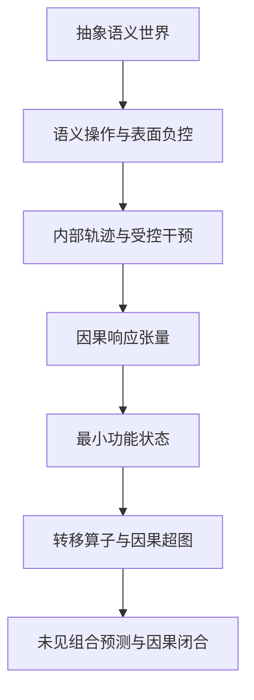

提问：
分析附件中的研究历程，总结有那些进展和成果，有什么问题和硬伤，接下来应该做什么才能真正破解深度神经网络内部语言的编码机制


回答：

我系统审查了两份连续备忘录：[AGI_GLM5_MEMO_20260805.md](sandbox:/workspace/scratch/35df9452eb3a/upload/AGI_GLM5_MEMO_20260805.md) 与 [AGI_GLM5_MEMO.md](sandbox:/workspace/scratch/35df9452eb3a/upload/AGI_GLM5_MEMO.md)。两卷覆盖 Phase 901–1218，共约 317 个阶段、11.9 万行记录。

先给出最重要的结论：

> 项目尚未破解语言编码机制，但已经完成了一次非常重要的研究对象转换：从寻找固定神经元、固定方向和静态语义几何，推进到研究条件化状态转移、分布式因果超图、功能等价类和训练形成动力学。

当前最强成果不是“找到了语言代码”，而是已经比较清楚地知道：

* 什么不是语言编码机制；
* 哪些局部状态确实可以改变模型输出；
* 为什么“可读、可运输、可干预”仍不等于“自然计算所必需”；
* 真正需要寻找的对象，不是固定向量，而是条件化的功能状态及其转移规律。

---

## 一、整个研究历程的主线

研究大致经历了六次关键转向。

| 阶段              | 研究对象              | 主要推进                      | 最终判断                      |
| --------------- | ----------------- | ------------------------- | ------------------------- |
| Phase 901–982   | 终止、句点、思考模式、输出协议   | 分离内容正确、格式、标点、思考闭合和结束行为    | 输出控制是独立计算平面，不能用结束词元代表完整机制 |
| Phase 983–1007  | 从静态表征转向动态脉络       | 发现源状态、查询状态、答案状态的早—中—晚响应   | 连续响应轨迹不等于同一条因果执行链         |
| Phase 1008–1068 | 响应图、组件写入、K/V运输    | 找到分布式读取带、查询条件化运输、多层多组联盟   | 功能角色和处理次序较稳定，具体层、头、通道不稳定  |
| Phase 1069–1142 | 关系、绑定、查键与内容执行     | 建立表征—控制—执行三账本             | 找到键不等于读取值，更不等于实际使用值       |
| Phase 1143–1201 | 已知真值、因果超边、商空间与形成  | 校准冗余、门控、组合干预、响应等价和训练救援算法  | 单点消融不可靠；机制身份依赖干预登记表       |
| Phase 1202–1218 | 对象—属性母模式、功能商、形成时钟 | Qwen3 局部因果充分性；功能商与形成动力学测试 | 自然必要性、跨模型闭合、组合律和形成规律仍未获得  |

项目真正的理论推进可以压缩为：

[
\text{固定坐标}
\rightarrow
\text{角色化响应轨迹}
\rightarrow
\text{条件因果超图}
\rightarrow
\text{干预登记表相对的功能等价类}
]

这个转向是正确的，而且很可能是未来机制可解释性研究真正需要走的方向。

---

# 二、已经取得的主要成果

## 1. 已经基本排除了“静态语义坐标论”

大量实验共同否定了这些强假说：

* 一个概念对应固定神经元；
* 一个关系对应固定方向；
* 同一语义在不同模型中位于相同层或相同头；
* 静态余弦、主成分或几何距离直接等于执行机制；
* 可被线性探针读出就意味着模型自然使用；
* 注意力权重高就意味着完成了内容读取；
* 单个组件消融无效就意味着它没有参与。

Phase1215 最终正式关闭了十个强形式，包括固定坐标、静态几何即执行、单点电路、注意力权重即机制、简单加法组合、跨模型物理坐标守恒和可读即使用等。

这不是消极结果。它意味着研究已经排除了很大一片错误搜索空间。

---

## 2. 找到了比较可信的粗粒度内部运行结构

现有证据最一致地支持下面的功能过程：

[
\text{词元、位置与源绑定}
\rightarrow
\text{早层多位置角色状态}
\rightarrow
\text{查询条件化选择}
\rightarrow
\text{Q/K寻址与V/残差/MLP运输}
\rightarrow
\text{多层多组冗余联盟}
\rightarrow
\text{晚层答案汇聚}
\rightarrow
\text{全词表竞争与生成控制}
]

其中比较稳定的是：

* 源、查询、答案边界等功能角色；
* 早层写入、中层选择和运输、晚层汇聚的处理次序；
* 查询对读取路径的条件化作用；
* 多位置、多组件、多深度的分布式实现；
* 晚层共享答案壳层；
* 内容计算与格式、句点、结束控制并不相同。

不稳定的是：

* 绝对层号；
* 固定注意力头；
* 固定神经元；
* 固定内容方向；
* 跨模型相同物理坐标。

这说明跨模型真正可能守恒的是“功能拓扑”，而不是“物理坐标”。

---

## 3. 建立了真实的自然 K/V 因果运输证据

Phase1048–1064 是整个历史中最有价值的正结果之一。

主要结果包括：

* 查询所选择的源信息可以通过分布式 K/V 深度联盟影响真实全词表输出；
* 英语到法语任务中，答案并不直接存在于提示词内，源词后的 K/V 运输仍能显著改变翻译结果；
* Qwen3 的运输效应约为 0.8621，GLM4 可达到 1.0；
* 运输可以影响多词短语、词序、语法性别和结束行为；
* 不同模型重复的是“查询选择—源后运输—晚层输出”的功能结构，而不是相同的头和层。

这是比“某层能读出语义”强得多的结果，因为它已经连接到真实生成。

但其限制同样明确：大面积 K/V 替换主要证明充分性，尚未证明自然必要性、最小性和完整中介关系。

---

## 4. 证明了语言计算更像因果超图，而不是单链

Phase1157–1165 对这一点给出了非常明确的已知真值证据：

* 单独删除路径 A 或 B，任务仍可几乎完美完成；
* 联合删除 A、B 后，正确率才降到机会水平；
* 条件门控会使不同上下文选择不同路径；
* 低阶充分路径能够解释大量多位点干预；
* 但少数高阶日程仍出现巨大残差；
* 不同干预方式具有不同组合规律。

因此：

[
\text{单点消融无效}
\not\Rightarrow
\text{该组件没有参与}
]

语言计算更可能包含：

* 冗余路径；
* 条件门控；
* 旁路；
* 多位置汇聚；
* 高阶协同；
* 多个局部充分集。

这对整个机制可解释性领域都具有方法论价值。

---

## 5. Qwen3 对象—属性任务形成了第一条连续局部证据链

Phase1204–1207 得到了目前最完整的一条单模型链：

1. Qwen3 在对象—属性任务上所有行为账本均为 1.0；
2. 深度25的生成边界残差状态在独立材料和未见组合中重复；
3. 把该状态替换为反事实供体状态，可把输出转向供体答案；
4. 三个数据分区的供体选择率约为 0.98–1.00；
5. 深度24–25构成最早重复的完整残差因果作用带。

这说明模型中确实存在可以控制答案竞争的条件化状态。

但随后得到的负结果更关键：

* 深度24的表面控制本身已有约 0.649 的运输分数；
* 移除所谓“主动内容差分减表面差分”只造成约 0.9%的归一化边际损伤；
* 1008/1008 样本没有任何行为改变；
* 必要性失败，救援未获授权。

所以准确结论是：

> 找到了晚期可写、可运输、足以改变答案的完整决策状态，但尚未找到自然计算真正依赖的内容特异通道。

这一区分非常重要。它避免把“答案已经形成后的状态”误认为“答案是怎样计算出来的”。

---

## 6. 建立了可识别性、功能商和拒答机制

Phase1200–1212 的方法学成果很有价值。

项目已经认识到：内部机制身份不能脱离观测和干预合同定义。

可以写成：

[
m_1\sim_{\mathcal R,Q}m_2
\iff
R_{m_1}^{\mathcal R,Q}
======================

R_{m_2}^{\mathcal R,Q}
]

也就是说，如果两个内部实现对当前全部合法干预和功能查询都产生相同响应，那么当前仪器只能把它们视为同一功能等价类；如果登记表无法区分，就必须拒答。

Phase1211 还严格证明：

* 七个可见状态并不能唯一决定第八个语义干预目标；
* 不同潜在完成规则可以在全部可见点上完全相同，却要求不同的正确干预；
* 因而不存在不带额外假设的普适状态补丁编译器。

Phase1212 进一步说明：

* 精确隐藏状态不可识别，不等于功能目标不可识别；
* 32个精确状态可以在给定功能读出下折叠为16个功能类；
* 功能目标所需观测可能显著少于精确物理状态。

这意味着真正值得破解的对象可能不是唯一神经坐标，而是：

[
Z=[H]_{\text{功能查询、合法干预}}
]

即能够预测未来行为和因果响应的功能状态等价类。

---

## 7. 训练形成研究已经证明“能力形成”不是单一时刻

Phase1169–1218 的主要成果是分离了多个训练时钟：

* 规则是否已经正确；
* 置信度是否已经校准；
* 状态是否可读；
* 状态是否可被反事实运输；
* 单组件是否必要；
* 联合组件是否必要。

自由微型 Transformer 中，这些时钟没有固定顺序，而且受到任务、词汇、架构和随机种子的强烈影响。

Phase1217 中：

* discovery 的规则形成率为 14/16；
* confirmation 只有 9/16，未过预注册门；
* 可读和可转移界面各为 11/16；
* 单块和联合块损伤为 16/16；
* 两个数据分区出现13种和9种关系签名。

因此不存在当前定义下的统一六时钟顺序。

Phase1218 加密早期观察后，虽然获得了更多形成前轨迹，但跨架构因素广度仍失败，而且还暴露了分类目标与形成时间目标共用一个资格门的协议硬伤。

这说明形成动力学是真问题，但目前仍停留在微型合成网络层面。

---

# 三、当前最大的硬伤

## 1. 证据仍然是“很多岛屿”，没有连接成完整大陆

目前已经分别找到：

* 源状态；
* 查询条件化；
* K/V运输；
* 晚层答案状态；
* 输出竞争；
* 格式和结束控制；
* 冗余与门控；
* 训练形成事件。

但还没有一条路径同时通过：

[
\text{形成}
\rightarrow
\text{运输}
\rightarrow
\text{读取}
\rightarrow
\text{状态转移}
\rightarrow
\text{候选胜出}
\rightarrow
\text{自然多词生成}
]

并且同时满足必要性、充分性、救援、中介、组合和独立复现。

这是当前最核心的未闭合问题。

---

## 2. 大量强结果落在“答案边界”，可能只是计算结果，不是编码机制

Phase1205–1210 的热点高度集中于生成边界和晚层答案状态。

这类状态很容易满足：

* 可读；
* 可替换；
* 可把输出改成另一个答案；
* 跨属性表现相似。

因为答案此时可能已经被计算出来。

所以必须区分：

[
\text{答案状态}
\neq
\text{答案形成过程}
\neq
\text{内容编码原语}
]

目前项目在答案状态上证据较强，在上游形成过程上仍然很弱。

---

## 3. 干预经常同时搬运语义、载体和离流形误差

这是当前最致命的技术瓶颈。

完整残差替换、K/V大块替换、多个反事实状态求平均，都会同时改变：

* 语义内容；
* 词面身份；
* 位置和顺序；
* 候选先验；
* 状态范数；
* 上下文兼容性；
* 下游网络从未训练过的组合状态。

Phase1210 中：

* matched-null 最大损伤达到0.625；
* same-answer carrier 最大损伤达到1.0；
* 六属性全部落在相同答案边界；
* 已知真值相机对高阶损伤的平均预测误差也未过门。

这说明相机识别到的很大部分是答案载体和状态对齐，而不是纯属性内容。

在合法干预编译器解决之前，继续寻找更漂亮的方向、头或子空间，很可能只是重复同一问题。

---

## 4. 充分性很多，必要性、救援和完整中介很少

当前最常见的结果形式是：

> 替换这个状态，可以改变答案。

这说明状态包含足够信息，却不能证明自然前向过程依赖它。

真正的机制边至少需要：

1. 删除或破坏该事件，目标功能选择性受损；
2. 正确同源状态能够救回；
3. 错误对象、错误关系、错误位置不能同样救回；
4. 上游干预按预测改变指定下游事件；
5. 阻断下游后，上游效应显著减弱；
6. 联合干预结果能够由已确认边前瞻预测。

当前自然语言模型中，这套闭合还没有完成。

---

## 5. 合成仪器已经很强，但向自然语言迁移连续失败

Phase1143以后投入了大量工作校准：

* 已知真值机制库；
* 因果超边相机；
* 必要性—冗余—中介相机；
* 功能商；
* 形成事件；
* 多时钟系统；
* 不可识别性拒答。

这些成果提高了实验纪律，但产生了新的风险：

[
\text{构造相机}
\rightarrow
\text{已知真值通过}
\rightarrow
\text{微型网络通过}
\rightarrow
\text{自然模型失败}
\rightarrow
\text{再构造相机}
]

Phase1210 已经明确暴露了这个断点。

因此，Phase1211–1218 虽然方法上严谨，却开始逐渐偏离“破解预训练语言模型执行机制”这一主目标，转向“如何测量微型网络形成过程”。

这条支线有价值，但现在不应继续占据主线。

---

## 6. 跨模型失败混合了太多接口变量

Phase1204 中：

* Qwen3 完全通过；
* GLM4 有非有限值和提示接口失败；
* DS7B 总体准确率约0.9045，但结构账未过门。

这不能直接解释为三模型内部机制不同，因为模型间同时改变了：

* tokenizer（分词器）；
* chat template（对话模板）；
* 数值精度稳定性；
* 架构；
* 训练数据；
* 对齐方式；
* 候选先验。

冻结合同失败应当保留，但新的跨模型实验必须先建立“功能等价接口”，再比较内部响应拓扑。否则跨模型结论一直被输入接口污染。

---

## 7. 尚未发现语言模式的组合律

当前理论经常使用“复用—差分—条件化”，但还没有找到：

[
\Gamma_{A\circ B}
=================

\Gamma_A\star_c\Gamma_B
]

也就是：

* 对象模式怎样与属性模式组合；
* 否定怎样作用于命题；
* 关系怎样选择值；
* 语法、逻辑和知识如何共同约束下一词元；
* 已知简单模式怎样预测未见组合。

没有组合律，就只能解释单个任务，不能解释有限神经网络为什么能够生成近乎无限的语言组合。

这是距离真正破解语言机制最远、也最关键的一块。

---

## 8. “条件化输出场闭合理论”和RDC仍然太宽

当前理论能容纳大量结果，但独有预测不足，存在成为解释保护伞的风险。

要使“复用—差分—条件化”成为真正理论，至少必须前瞻验证：

1. 共享部分能够预测未见同族模式；
2. 差分部分能够预测个体行为变化；
3. 删除共享部分造成整个模式族共同损伤；
4. 删除差分部分只造成模式特异损伤；
5. 联合描述比逐模式独立描述更简洁且泛化更好；
6. 上述规律跨材料、任务或模型重复。

目前这些条件尚未同时通过。

---

# 四、当前对五个核心问题能够回答到什么程度

| 核心问题          | 当前答案                                                |
| ------------- | --------------------------------------------------- |
| 零件之间遵循什么动力学？  | 底层是注意力读取、MLP变换、残差累计；宏观上更像上下文条件化、具有门控与冗余的因果超图        |
| 哪些变量是系统状态变量？  | 完整残差状态具有充分性，但不是解释；最佳候选是由功能查询和干预响应定义的等价类，尚未证明最小闭合    |
| 哪些操作是状态转移算子？  | Q/K寻址、V运输、MLP写入等物理操作已知；语义层的对象、关系、否定、组合算子尚未识别        |
| 哪些约束决定候选答案胜出？ | 内容证据通过全词表边际竞争决定候选，格式、句点、思考闭合与结束构成另一控制平面；两者耦合但不能混为一谈 |
| 哪些结构跨模型保持不变？  | 功能角色、相对处理阶段、条件选择和晚层汇聚较稳定；固定层、头、神经元和方向不稳定            |

所以目前已经对“计算外形”有了相当清楚的认识，但“状态变量、宏观转移算子和组合律”仍未闭合。

---

# 五、接下来真正应该做什么

## 总体战略：暂停形成时钟主线，先闭合一条自然语言执行链

当前最需要的不是 Phase1219，也不是继续增加微型网络和检查点。

应当把研究资源集中到唯一一个主任务：

> 在一个预训练模型中，闭合“对象—关系—值”的查询条件化检索、运输、竞争和自然生成链，然后再扩展到组合和跨模型。

建议以 Qwen3 为第一模型，因为它已经具备最稳定的行为和受控因果基础。

---

## 第一阶段：定义真正的破解目标

不要再把“找到一个热点”作为成功。

应寻找一个宏观功能状态：

[
Z_t=\phi(H_t)
]

使其满足：

[
Z_{t+1}=F(Z_t,U_t),
\qquad
Y_t=G(Z_t)
]

其中 (U_t) 是查询、上下文和生成历史。

这个状态至少需要满足五个条件：

1. 能预测未见材料中的未来内部事件和输出；
2. 对合法反事实干预具有稳定响应；
3. 删除时产生选择性损伤，恢复时能够救回；
4. 多个简单状态或算子能够预测未见组合；
5. 不同模型可以通过模型特异映射对应到同一功能转移结构。

如果找不到低维 (Z)，也应通过严格的不可压缩性测试证明，而不是不断更换投影。

---

## 第二阶段：建立一个主任务，而不是继续分散研究

建议使用“双轨对象—关系—值任务”。

### 受控轨

* 4–8个实体；
* 4类关系；
* 每个关系多个值；
* 多个干扰实体共享部分属性；
* 伪词与真实词混合；
* 精确反事实真值；
* 多词元答案；
* 候选不直接出现在查询附近。

### 自然轨

* 自然段落、同义改写、不同语言；
* 翻译、定义、属性查询和两跳关系；
* 答案不直接存在于提示词中；
* 自由生成而不是只做候选评分；
* 单独记录内容、格式、句点和结束。

两条轨道共享同一抽象语义世界，使受控因果证据可以在自然材料中被验证。

---

## 第三阶段：从答案首次稳定分叉向上游反向恢复因果图

不要从最高激活或最强方向开始。

应从正确答案第一次稳定战胜最强结构化错误候选的事件开始：

[
m_l=z_l(y_{\text{正确}})
-z_l(y_{\text{结构化错误}})
]

然后沿真实父节点向上游搜索：

* residual输入与输出；
* 注意力Q/K/V；
* 具体源位置贡献；
* MLP gate、up、down；
* 多层、多位置联盟；
* 跨生成步K/V缓存。

但答案边界只能作为搜索起点，不能被直接命名为编码起点。

---

## 第四阶段：解决干预编译器问题

每个语义因素都必须设计经过校准的干预，而不是直接使用完整状态替换。

至少比较：

1. 配对供体完整替换；
2. 接收状态上的反事实相对位移；
3. same-answer carrier（同答案载体）差中之差；
4. 局部低秩子空间运输；
5. 真实组件输出替换；
6. 多位置联合割集；
7. 沿自然状态轨迹的小步干预。

每种操作必须通过：

* matched-null接近零；
* same-answer carrier接近零；
* 错对象、错关系、错位置接近零；
* 下游状态保持数值正常；
* 未见高阶组合可以由低阶结果预测。

如果控制效应接近目标效应，该干预算子应判无效，而不是继续解释其结果。

---

## 第五阶段：一次性完成六类因果闭合

对候选事件块同时测试：

| 证据   | 要求                |
| ---- | ----------------- |
| 充分性  | 正确供体能把输出转向反事实答案   |
| 必要性  | 删除后目标功能选择性受损      |
| 救援   | 同源状态恢复行为和内部事件     |
| 特异性  | 错对象、错关系、错位置不能同样救援 |
| 中介   | 上游效应必须通过预测的下游事件传递 |
| 冗余闭合 | 联合消融和最小割能够解释单点假阴性 |

只有父块通过这些门，才允许向注意力头、通道和神经元继续细分。

---

## 第六阶段：直接攻击组合律

在单个检索原语闭合后，立即测试组合，而不是继续寻找更多孤立热点。

建议从四类操作开始：

* 对象替换；
* 关系替换；
* 值替换；
* 查询选择。

测试简单操作能否预测：

* 对象×关系；
* 关系×否定；
* 属性×比较；
* 两跳关系；
* 多词元输出；
* 新对象、新关系、新语言组合。

真正的突破标志不是分类准确率，而是：

> 只根据基础操作的响应，就能在揭盲前预测未见组合的内部状态转移、因果损伤和自然输出。

一旦这一步通过，才可以讨论范畴结构、算子代数或新的语言数学。

---

## 第七阶段：跨模型比较功能拓扑，而不是物理坐标

对于不同模型 (m)，分别学习模型内映射：

[
\phi_m:H_m\rightarrow Z
]

然后检验是否存在共享转移关系：

[
\phi_m!\left(F_m(H_m,U)\right)
\approx
F^\ast!\left(\phi_m(H_m),U\right)
]

比较内容应包括：

* 角色对应；
* 相对深度；
* 事件顺序；
* 干预响应矩阵；
* 最小割结构；
* 组合预测；
* 自然生成结果。

不要再要求相同层号、头号或余弦方向。

跨模型顺序建议是：

1. Qwen3同一模型独立材料闭合；
2. Qwen同家族不同规模；
3. 不同架构模型；
4. 最后才讨论普适功能结构。

---

## 第八阶段：执行机制闭合后，再研究训练形成

形成动力学非常重要，但现在不应该继续领先于执行机制。

正确顺序是：

1. 先在冻结模型中确定一个真实功能原语；
2. 再在可训练小模型中追踪它从无到有；
3. 测量哪些参数更新首先产生该功能响应；
4. 用正确和错误更新方向进行选择性救援；
5. 检验共享结构和内容差分是否在训练中分别形成；
6. 最后才迁移到开放预训练检查点。

否则“形成时钟”很可能只是在追踪任务正确率、置信度和一般计算依赖，而不是语言编码原语。

---

# 六、建议立即停止的路线

在第一条自然机制闭合前，建议暂停：

* 继续提出新的宏大理论名称；
* 继续搜索固定语义方向；
* 在完整状态父块尚未闭合前搜索神经元；
* 围绕同一自然失败结果继续构造更多已知真值相机；
* 把微型网络形成规律直接外推到预训练语言模型；
* 用更多 Phase 数量替代一个固定主实验；
* 把方法审计通过写成机制证据；
* 把 Qwen3 单模型结果恢复成跨模型结论；
* 提前发明新数学。

---

# 七、最终判断

当前项目可以分成三个层级：

| 层级                   | 当前状态         |
| -------------------- | ------------ |
| Transformer物理执行与精确复算 | 基本掌握         |
| 受控任务中的局部状态运输和答案控制    | 已取得多项强证据     |
| 自然语言的内容特异必要机制        | 尚未闭合         |
| 可组合的宏观状态转移规律         | 尚未发现         |
| 跨模型功能守恒结构            | 只有局部功能拓扑证据   |
| 训练中编码机制如何形成          | 只有微型合成网络条件结果 |
| 完整语言数学理论             | 尚未建立         |

所以最准确的总体评价是：

> 项目已经从“寻找语言表示在哪里”推进到“定义什么才算语言机制”，并发现语言计算更可能是上下文条件化、分布式、冗余且具有多重实现的因果动力系统。
> 但目前主要破解了实验错觉和局部答案状态，尚未破解内容状态如何形成、如何组合、为何被自然计算使用，以及这些规律如何跨任务和跨模型保持。

真正的下一次突破，不会来自另一个高余弦方向或新的相机名称，而会来自第一条同时通过：

[
\boxed{
\text{预测}
+\text{必要}
+\text{充分}
+\text{救援}
+\text{中介}
+\text{组合}
+\text{自然生成}
+\text{独立复现}
}
]

的端到端语言因果链。


同意以上分析， 但是目前主要的问题，在于没有任何一个算法可以找到稳定的规律或者数学结构，所以只能不停的尝试， 以上 第二阶段：建立一个主任务，而不是继续分散研究 是否可以解决这个问题，如何可以，请给出详细的算法


可以解决“实验无法积累、每次只能换方向尝试”的问题，但仅仅固定一个主任务还不够。

真正有效的方案必须是：

[
\boxed{
\text{主任务生成器}
+
\text{语义变换系统}
+
\text{因果响应张量}
+
\text{功能状态发现}
+
\text{状态转移算子辨识}
}
]

主任务的作用不是直接证明语言理论，而是建立一个长期不变的“实验坐标系”。以后所有层、头、状态、干预和模型，都在同一组语义变量、同一组反事实操作和同一组闭合标准下比较。只有这样，不同实验才能累积成规律。

我建议建立一套“条件因果状态与算子发现算法”。它不预设语言一定是向量、图、群或范畴，而是自动寻找：什么状态最能预测未来、什么操作能够稳定改变状态、哪些组合关系跨材料保持不变。

---

# 一、为什么建立主任务能够改变目前的局面

过去不断尝试却难以形成数学结构，根本原因不只是算法不够强，而是每个阶段都在改变问题：

* 任务变了；
* 语义因素变了；
* 输出候选变了；
* 干预方式变了；
* 测量指标变了；
* 模型行为资格变了；
* “机制”的定义也变了。

因此，即使两个阶段都发现了强信号，也无法判断它们是不是同一种结构。

建立主任务后，所有数据都可以写进同一个对象：

[
\mathcal R
[
\text{世界},
\text{语义操作},
\text{表面操作},
\text{内部事件},
\text{干预方式},
\text{下游读出}
]
]

这就是“因果响应张量”。

以后不再问：

> 哪个神经元最像颜色？

而是问：

> 哪个内部事件对“对象替换、关系替换、值替换、查询替换”等操作产生稳定、可预测、可组合的因果响应？

稳定数学结构将从这个响应张量中产生，而不是从某一次激活图中猜出来。



---

# 二、主任务不是固定数据集，而是一个可生成的实验世界

## 1. 抽象世界定义

每个独立语义世界定义为：

[
W=(O,R,V,B,Q)
]

其中：

* (O)：对象集合；
* (R)：关系集合；
* (V)：值集合；
* (B:O\times R\rightarrow V)：对象—关系—值绑定表；
* (Q=(o_q,r_q))：当前查询；
* 正确答案为：

[
y=B(o_q,r_q)
]

例如：

```text
Alice 的颜色是红色，材质是金属。
Bob 的颜色是蓝色，材质是木头。
Carol 的颜色是黄色，材质是塑料。

问题：Bob 的材质是什么？
答案：木头。
```

但实际任务必须更复杂：

* 4–8个对象；
* 4–6种关系；
* 多个对象共享相同值；
* 同一对象包含多个属性；
* 存在强结构化干扰候选；
* 答案包含单词元和多词元两类；
* 查询、事实和答案位置变化；
* 包含真实词和伪词两个轨道。

---

## 2. 冻结语义操作集合

必须预先定义一组具有精确真值的操作。

### 对象操作

[
g_O: o_i\leftrightarrow o_j
]

改变对象身份或对象绑定。

### 关系操作

[
g_R:r_i\leftrightarrow r_j
]

改变查询关系或事实关系。

### 值操作

[
g_V:v_i\leftrightarrow v_j
]

改变属性值，同时尽量保持句子结构和词元数量。

### 绑定操作

[
g_B:B(o_i,r_j)\leftrightarrow B(o_k,r_j)
]

只改变对象—关系—值之间的绑定，不改变对象、关系和值的多重集。

### 查询操作

[
g_Q:(o_i,r_j)\rightarrow(o_k,r_l)
]

保持事实世界不变，只改变模型需要读取的内容。

### 组合操作

[
g_{OR}=g_O\circ g_R
]

[
g_{RV}=g_R\circ g_V
]

[
g_{OBQ}=g_Q\circ g_B\circ g_O
]

这些组合是以后发现代数结构的基础。

---

## 3. 冻结表面负控操作

同时定义不改变语义答案的操作：

* 事实顺序改变；
* 模板改写；
* 同义词替换；
* 实体名替换；
* 候选顺序改变；
* 句子长度匹配；
* 中英文互换；
* 对话模板改变；
* 与目标无关的事实改变；
* same-answer carrier（同答案载体）变换。

这样，算法可以区分：

[
\text{语义变化}
\quad\text{与}\quad
\text{表面载体变化}
]

---

# 三、算法的总体输入和输出

## 输入

1. 抽象世界生成器；
2. 语义操作集合 (G_{\mathrm{sem}})；
3. 表面负控集合 (G_{\mathrm{nuis}})；
4. 模型内部完整轨迹：

   * residual（残差状态）；
   * attention output（注意力输出）；
   * MLP output（多层感知机输出）；
   * Q/K/V；
   * 注意力源位置；
   * 全词表候选分数；
5. 合法干预集合；
6. 自然生成结果。

## 输出

算法最终必须输出四个对象：

[
\boxed{
\mathcal M=(Z,{T_g},\mathcal H,\Omega)
}
]

其中：

* (Z)：最小功能状态；
* (T_g)：语义操作对应的状态转移算子；
* (\mathcal H)：有门控、冗余和超边的因果图；
* (\Omega)：该机制成立的适用域。

如果当前观测无法识别，算法必须输出：

[
\bot
]

而不是强行返回一个“最可能方向”。

---

# 四、第一步：建立行为资格和独立数据结构

数据必须按抽象世界切分，而不是按提示词切分。

建议：

| 分区                | 作用              |
| ----------------- | --------------- |
| discovery（发现集）    | 发现事件、状态维度和候选算子  |
| confirmation（确认集） | 冻结后确认，禁止重选      |
| composition（组合集）  | 测试未见操作组合        |
| adversarial（对抗集）  | 测试表面、顺序、词元和协议混杂 |
| sealed（密封集）       | 最终一次揭盲          |

同一个世界的模板、顺序和候选变化都属于配对观测，不能作为多个独立样本。

行为账至少分为：

1. 内容答案；
2. 完整答案序列；
3. 自由生成；
4. 模板不变性；
5. 候选顺序不变性；
6. 未见组合；
7. 句点和结束；
8. 数值有限性。

只有行为成立的“模型×条件单元”才能进入内部机制分析。

---

# 五、第二步：自动定位内部事件，而不是扫描最高激活

## 1. 从答案第一次稳定分叉处开始

对正确答案 (y) 和最强结构化错误答案 (o)，定义每层竞争边际：

[
m_l=z_l(y)-z_l(o)
]

找到第一次连续若干层满足：

[
m_l>0
]

且后续不再反转的位置，记为：

[
l_{\mathrm{decision}}
]

这只是反向搜索起点，不是编码起点。

---

## 2. 记录所有真实父节点

对以下角色记录内部状态：

* 源对象位置；
* 源关系位置；
* 源值位置；
* 查询对象位置；
* 查询关系位置；
* 答案前缀；
* 生成边界；
* 后续生成词元。

对每个角色记录：

[
E=(p,l,c)
]

其中：

* (p)：词元角色；
* (l)：层或相对深度；
* (c)：residual、attention、MLP、Q/K/V等组件。

---

## 3. 用功能响应变化检测阶段边界

不要对原始 hidden state（隐藏状态）做普通变点检测，而要对干预响应做变点检测。

定义：

[
D_l=
\left|
R_{l+1}-R_l
\right|
]

其中 (R_l) 是第 (l) 层对全部语义操作的响应向量。

若连续出现：

[
D_l\gg \operatorname{median}(D)
]

则把该处登记为候选功能相变：

* 事实写入；
* 查询选择；
* 内容运输；
* 答案汇聚；
* 输出固化。

跨模型对齐的是这些相变事件，而不是绝对层号。

---

# 六、第三步：构造因果响应张量

这是整个算法最关键的一步。

对世界 (w)、内部事件 (e)、语义操作 (g)、表面条件 (n)、干预方式 (i)、读出 (q)，定义：

[
\mathcal R_{w,e,g,n,i,q}
========================

Q_q\left(
F\left(
\operatorname{do}(I_{e,g,i}),x_{w,n}
\right)
\right)
-------

Q_q(F(x_{w,n}))
]

读出 (Q_q) 不能只有目标词元概率，应同时包括：

* 正确—错误候选边际；
* 完整答案序列概率；
* 自由生成是否改变；
* 指定下游状态是否改变；
* 非目标关系是否保持；
* 句点和结束状态；
* 后续多个生成步。

---

## 内容特异响应必须使用正交对比

例如，把实验设计为二乘二：

|      | 原始载体     | 变化载体     |
| ---- | -------- | -------- |
| 原始语义 | (Y_{00}) | (Y_{01}) |
| 变化语义 | (Y_{10}) | (Y_{11}) |

内容特异效应定义为：

[
R_{\mathrm{content}}
====================

## (Y_{11}-Y_{01})

(Y_{10}-Y_{00})
]

也就是差中之差。

它能够扣除：

* 表面顺序；
* 候选载体；
* 普通状态替换；
* 模板变化；
* 非语义扰动。

如果内容效应不能稳定超过载体效应，就不能进入机制发现。

---

# 七、第四步：用“预测干预响应”定义功能状态

目前最大的错误之一，是先寻找低维状态，再检查它是否有意义。

新算法反过来：

> 能够预测未来干预响应的最小状态，才有资格成为系统状态变量。

设内部完整状态为 (H_e(x))，学习编码器：

[
z_e(x)=\phi(H_e(x))
]

但训练目标不是分类对象或属性，而是预测：

1. 未来下游状态；
2. 未见语义干预的结果；
3. 输出候选边际；
4. 自然生成；
5. 组合干预响应。

总体目标：

[
\mathcal L
==========

\mathcal L_{\mathrm{future}}
+
\lambda_1\mathcal L_{\mathrm{intervention}}
+
\lambda_2\mathcal L_{\mathrm{invariance}}
+
\lambda_3\mathcal L_{\mathrm{composition}}
+
\lambda_4\mathcal C(z)
]

其中：

### 未来预测

[
\mathcal L_{\mathrm{future}}
============================

\left|
\widehat Z_{e+1}-Z_{e+1}
\right|^2
]

### 干预预测

[
\mathcal L_{\mathrm{intervention}}
==================================

\left|
\widehat{\mathcal R}(z,g)
-------------------------

\mathcal R_{\mathrm{true}}
\right|^2
]

### 表面不变性

对于语义相同、模板不同的 (x,n(x))：

[
\mathcal L_{\mathrm{invariance}}
================================

\left|
\phi(H(x))
----------

\phi(H(n(x)))
\right|^2
]

### 组合预测

[
\mathcal L_{\mathrm{composition}}
=================================

\left|
T_{g_2\circ g_1}(z)
-------------------

T_{g_2}(T_{g_1}(z))
\right|^2
]

### 状态复杂度

[
\mathcal C(z)
=============

\dim(z)
+
\text{模型描述长度}
]

算法依次尝试：

[
d\in{1,2,4,8,16,32,64,\ldots}
]

选择能够达到确认集预测噪声上限的最小维度。

因此，系统状态不是“最能分类苹果的方向”，而是：

[
\boxed{
Z_t=
\text{预测未来和反事实响应所需的最小信息}
}
]

这比PCA、SAE或线性探针更接近真正的状态变量定义。

---

# 八、第五步：发现状态转移算子

得到候选状态 (Z) 后，对每个语义操作 (g) 学习：

[
z'=T_g(z,c)
]

其中 (c) 是查询、任务和上下文条件。

候选算子库应有限且逐级增加复杂度：

1. 置换算子；
2. 仿射算子；
3. 低秩仿射算子；
4. 双线性条件算子；
5. 门控混合算子；
6. 二阶稀疏多项式；
7. 小型非线性网络，作为预测上限。

例如：

[
T_g(z,c)
========

A_gz+B_gc+
\sum_k c_kC_{g,k}z+b_g
]

然后使用最小描述长度选择：

[
T_g^*
=====

\arg\min_T
\left[
\operatorname{Error}_{\mathrm{sealed}}(T)
+
\lambda\operatorname{Complexity}(T)
\right]
]

重点不是训练误差，而是：

* 未见世界；
* 未见模板；
* 未见值；
* 未见操作组合；
* 未见自然语言表达。

只有简单算子能够预测这些对象，才可以称为稳定规律。

---

# 九、第六步：自动搜索数学结构

有了 (T_g) 后，算法自动测试以下关系。

## 1. 恒等关系

[
T_{\mathrm{id}}\approx I
]

## 2. 逆操作

[
T_{g^{-1}}T_g\approx I
]

## 3. 组合关系

[
T_{g_2\circ g_1}
\approx
T_{g_2}T_{g_1}
]

## 4. 交换关系

如果两个外部操作理论上独立：

[
g_1\circ g_2=g_2\circ g_1
]

则检验：

[
T_{g_1}T_{g_2}
\approx
T_{g_2}T_{g_1}
]

## 5. 非交换关系

如果查询选择和绑定改变理论上顺序不同，则检验：

[
T_QT_B
\neq
T_BT_Q
]

非交换本身也可能是重要结构。

## 6. 闭包关系

检查多个基础算子组合后，是否仍落在同一功能状态空间：

[
T_g(Z)\subseteq Z
]

如果上述关系在未见组合、不同模板和不同语言上成立，就找到了真正意义上的数学结构。

这时才有资格进一步研究：

* 群作用；
* 半群；
* 群胚；
* 范畴结构；
* 算子代数；
* 条件化组合系统。

不应预先假设它们存在。

---

# 十、第七步：恢复因果超图和冗余路径

功能状态存在，并不代表它由单一物理路径实现。

定义节点：

[
v=(\text{功能状态},\text{角色},\text{处理阶段})
]

对组件集合 (S) 的联合干预效应记为：

[
E(S)
]

高阶协同可以使用莫比乌斯展开：

[
\eta(S)
=======

\sum_{T\subseteq S}
(-1)^{|S|-|T|}E(T)
]

例如双组件协同：

[
\eta(A,B)
=========

E(A,B)-E(A)-E(B)+E(\varnothing)
]

算法流程：

1. 测全部单事件；
2. 测有候选关联的双事件；
3. 只有双事件残差较大时才进入三事件；
4. 恢复最小必要割；
5. 识别冗余充分路径；
6. 识别上下文门控路径；
7. 用已发现低阶超边预测未见联合干预。

如果预测失败，就说明遗漏了高阶结构，不能宣布图谱闭合。

---

# 十一、第八步：必要性、救援和中介闭合

对候选父事件 (P) 和子事件 (C)，必须测试四步。

## 1. 父事件损伤

[
\operatorname{do}(-P)
\Rightarrow
C\downarrow,\quad Y\downarrow
]

## 2. 正确父事件恢复

[
\operatorname{do}(-P+P_{\mathrm{correct}})
\Rightarrow
C\uparrow,\quad Y\uparrow
]

## 3. 错误供体控制

[
\operatorname{do}(-P+P_{\mathrm{wrong}})
\not\Rightarrow
C\uparrow,\quad Y\uparrow
]

## 4. 子节点阻断

如果阻断 (C) 后，恢复 (P) 不再有效：

[
\operatorname{do}(-C,-P+P_{\mathrm{correct}})
\not\Rightarrow
Y\uparrow
]

才能说明父事件的作用主要通过该子节点传递。

这比“补丁能翻转答案”强一个完整层级。

---

# 十二、第九步：把内容平面和生成控制平面分开

主任务必须同时建立两个状态系统：

[
Z^{\mathrm{content}}
]

负责：

* 对象；
* 关系；
* 值；
* 查询选择；
* 候选竞争。

以及：

[
Z^{\mathrm{control}}
]

负责：

* 输出格式；
* 句点；
* 思考闭合；
* EOS；
* 后续生成。

整体状态可能是：

[
Z_t=
\left(
Z_t^{\mathrm{content}},
Z_t^{\mathrm{control}},
Z_t^{\mathrm{coupling}}
\right)
]

这样可以系统解释：

* 内容已经正确但仍不停生成；
* 格式正确但内容错误；
* 更长推理提高正确率却增加未完成长尾；
* 答案形成和终止控制的相互影响。

---

# 十三、完整算法伪代码

```text
输入：
    抽象世界生成器 W
    语义操作 G_sem
    表面负控 G_nuis
    模型 M
    干预登记表 I
    读出登记表 Q

一、行为阶段
    生成 discovery / confirmation / composition / sealed 世界
    对所有语义和表面变换运行自然行为
    冻结行为合格单元
    不合格单元停止内部分析

二、轨迹阶段
    记录角色对齐的 residual / attention / MLP / QKV
    计算正确候选对最强错误候选的逐层边际
    从首次稳定分叉向上游搜索
    根据因果响应变化冻结候选事件带

三、响应阶段
    对候选事件执行：
        正确语义供体
        错对象供体
        错关系供体
        错值供体
        matched-null
        surface-only
        same-answer carrier
        随机和零干预
    构造因果响应张量 R

四、状态发现阶段
    尝试维度 d = 1,2,4,8,16,...
    学习 z = phi(H)
    要求 z 预测：
        未来内部事件
        未见干预响应
        输出边际
        自然生成
        操作组合
    选择达到冻结预测门的最小 d
    若无 d 通过，返回“当前范围内未发现压缩闭合状态”

五、算子辨识阶段
    对每个语义操作 g 拟合 T_g
    比较置换、仿射、双线性、门控和稀疏非线性模型
    按密封误差和描述复杂度选择最简单模型

六、结构发现阶段
    测试恒等、逆、组合、交换、非交换和闭包
    只保留在未见组合中前瞻成立的关系

七、因果超图阶段
    测单点、双点和必要的三点干预
    恢复最小割、冗余路径和条件门控
    预测未见联合干预

八、闭合阶段
    测充分性、必要性、救援、特异性和中介
    测多词元自然生成和结束控制
    在 confirmation 和 sealed 中一次性揭盲

输出：
    最小功能状态 Z
    转移算子集合 {T_g}
    条件因果超图 H
    组合关系集合 A
    适用域 Ω
    或不可识别结果 ⊥
```

---

# 十四、如何判断算法是否真的找到了规律

一个候选结构只有同时满足以下条件，才登记为规律。

## 1. 压缩

它必须比完整隐藏状态简单：

[
\operatorname{Complexity}(Z)
\ll
\operatorname{Complexity}(H)
]

## 2. 预测

能预测未用于发现的：

* 世界；
* 对象；
* 关系；
* 值；
* 模板；
* 操作组合；
* 干预响应；
* 自然生成。

## 3. 因果

状态变化能产生预测的下游变化，并通过必要性、救援和中介。

## 4. 组合

基础算子能够预测未见组合，而不是每个组合重新拟合。

## 5. 不变量

在模板、顺序、同义词和词元变化下，功能结构保持。

## 6. 跨实现

不同层、头甚至不同模型可以映射到相同功能关系：

[
\phi_m(F_m(H_m,g))
\approx
T_g(\phi_m(H_m))
]

满足这六点的结构，才是真正的数学结构；只在发现集上余弦很高，不算。

---

# 十五、算法可能产生的四种科学结果

这套算法不保证一定找到低维漂亮公式，但能结束无休止试错。

## 结果一：发现低维闭合状态

例如发现8–16维功能状态能够预测所有主要干预和组合。

这将是重大突破。

## 结果二：发现稳定功能商，但没有唯一坐标

不同物理状态属于同一因果响应等价类。

这说明语言编码本体更接近功能商，而不是固定向量。

## 结果三：只有高维分布式闭合

只有数百维状态或大型超图才能预测未来。

这仍是重要结果，说明语言机制没有简单低维压缩。

## 结果四：跨任务无法重复

相同算法在不同关系、语言或模型中完全失效。

那么就应明确结论：当前主任务只捕获局部检索原语，没有找到一般语言结构，而不是继续更换热点。

---

# 十六、建议的第一版具体规模

第一版只运行 Qwen3，避免一开始陷入跨模型接口问题。

建议：

* 512个独立语义世界；
* discovery、confirmation、composition、sealed各128个；
* 每世界约24种语义与表面状态；
* 行为规模约12288条；
* 从发现集选择64个世界记录完整物理轨迹；
* confirmation再使用64个完全独立世界；
* 候选事件初始不超过40个中尺度块；
* discovery冻结后缩减至8–12个事件；
* 对这些事件测单点、双点和有限三点组合；
* confirmation中禁止移动层、位置、角色和阈值。

第一轮目标不是跨模型，也不是神经元级，而是回答：

[
\boxed{
\text{在Qwen3对象—关系—值任务中，
是否存在一个能够预测未来干预与未见组合的最小功能状态？}
}
]

---

# 十七、与现有研究成果的关系

这套算法不需要推翻此前研究，而是把已有成果组装起来：

* Phase990的数据生成与反事实平衡；
* Phase1000–1064的物理轨迹和K/V运输；
* Phase1157–1165的因果超边和冗余路径；
* Phase1200的响应等价类；
* Phase1205–1207的Qwen3对象—属性因果状态；
* Phase1211的可识别性拒答；
* Phase1212的功能商；
* Phase1215的假设约束格。

目前缺少的不是零件，而是一个统一算法把这些零件写入同一个响应张量，并用未见预测选择最小规律。

最终可以概括为：

[
\boxed{
\text{稳定语言规律}
=============

\text{最小功能状态}
+
\text{可预测转移算子}
+
\text{条件因果超图}
+
\text{未见组合闭合}
}
]

因此，建立主任务确实可以解决当前“只能不断尝试”的问题，但前提是把它设计成一个具有精确语义操作、表面负控、因果响应和组合测试的生成式实验世界。真正的算法核心不是继续寻找激活特征，而是从大量受控反事实中辨识出能够压缩、预测和控制整个系统的状态变量与转移算子。
