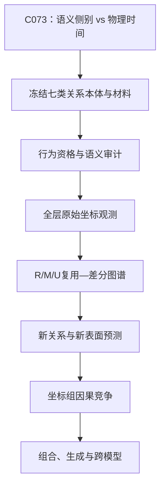

提问：
我认为，相对编码和复用差分是理解语言模式族的关键，以上 7 种关系之间，大概率基于相对编码，有复杂的复用和差分机制，比如任意两种关系，很可能会在某些layer和神经元中复用，在某些layer和神经元中差分， 而分析整体的复用和差分，就是破解的关键，     现在请给出可行的分析和测试方案

回答：

这个方向可行，而且很适合升级为一个长期主Campaign：

> 不再逐个寻找“某种关系的热点”，而是系统测量任意两种关系在什么层、什么角色位置、什么Hidden-State坐标上复用，又从哪里开始分化。

但必须把“相对编码与复用差分是关键”作为待验证主假说，而不是预设结论。

# 一、核心研究问题

对任意两种原子关系 (\rho_a,\rho_b)，需要回答四个问题：

1. 是否使用了相同Hidden-State坐标？
2. 使用相同坐标时，响应规则是否相同？
3. 在哪些层开始共享、分化、重新汇合？
4. 共享和特异坐标是否被后续网络因果使用？

最终产物不是“关系—神经元编号表”，而是：

$$
\boxed{
\text{关系对}
\times
\text{layer}
\times
\text{角色位置}
\times
\text{Hidden-State坐标}
}
$$

组成的：

* 复用图；
* 差分图；
* 条件响应图；
* 因果图；
* 组合图。

这里研究的是Hidden State的原始残差坐标，不严格等同于MLP内部神经元。

# 二、先处理当前C073边界

当前唯一正式授权仍是C073：

$$
\text{record/query语义侧别}
\quad\text{还是}\quad
\text{早/晚token因果位置}.
$$

C073只能继续使用：

* Qwen3；
* `state16`；
* 全维Hidden State；
* logits；
* 全新材料和三分区；
* 预注册的侧保持/侧破坏对照。

不能在C073中事后搜索layer、角色子集或坐标。

但C073运行期间，可以并行完成七类关系的：

* 关系本体；
* 材料生成；
* 语义审计；
* 零模型；
* 行为合同。

只是不提前读取这些新材料的Hidden State。这样项目不会停下来。

C073结束后再独立冻结“跨关系全层复用—差分图谱”合同。

# 三、七类关系必须改成三级结构

你列出的七类应作为“关系超族”，不能直接把整个大类平均。

关系结构应是：

$$
\text{超族}
\supset
\text{原子关系}
\supset
\text{具体实例}.
$$

例如“层级分类关系”内部至少包括：

* `instance_of`；
* `subclass_of`；
* `member_of`；
* `part_of`。

它们不能因为都属于“层级关系”，就预设使用同一机制。

真正分析应分为三层：

1. 同一原子关系跨新词是否复用；
2. 同一超族内不同原子关系是否复用；
3. 不同超族之间是否复用。

“组合关系”不应作为普通第七种原子关系，而应放在最后，专门研究基本关系怎样组合。

# 四、统一关系实例

每个实验实例登记为：

$$
\xi=
(\rho;u_{1:k},\tau_{1:k},c,\lambda,s,q),
$$

其中：

* (\rho)：原子关系；
* (u_{1:k})：实体或命题；
* (\tau_{1:k})：成员、集合、施事、受事等角色；
* (c)：上下文和表面；
* (\lambda)：语言；
* (s)：真假、极性、时态、作用域；
* (q)：判断、选择或生成接口。

所有跨关系比较只能在双方共同具有的角色和任务单元上进行。

例如不能直接把：

* 二元`part_of(x,y)`；
* 一元`blue(x)`；
* 命题算子`if(A,B)`；

强行放进同一四角色平均。

# 五、材料设计：三层材料、四种任务

## 1. 三层材料

### T0：符号世界

使用任意实体和冻结关系表，排除世界知识与实体共现。

同时使用：

* 正常关系词；
* 不透明关系代码。

不透明代码要在不同世界中轮换意义，防止模型只记住代码token。

### T1：受控自然语言

事实仍来自符号世界，但使用：

* 多种自然表面；
* 不同词序；
* 主动/被动；
* record先/query后；
* query先/证据后；
* 角色与物理位置交叉。

这一层主要检验跨表面和角色稳定性。

### T2：自然事实

最后测试自然知识外部效度，并分成：

* prompt中明确提供事实；
* 只依赖模型记忆。

后者混合了知识检索和关系处理，不能参与神经候选发现。

## 2. 四种任务轨道

每种关系都不能只做“记录一句，再问是否相同”，否则可能只测到通用字符串比较器。

必须分账：

| 任务     | 主要研究对象           |
| ------ | ---------------- |
| 绑定匹配   | 通用record/query比较 |
| 关系辨别   | 关系身份编码           |
| 关系特有推理 | 逆关系、顺序、传递、转换等运算  |
| 生成     | 是否只对yes/no接口有效   |

只有共享结构同时跨越关系辨别和关系特有推理，才可能是关系基元，而不只是通用匹配器。

# 六、每个关系建立配对反事实块

以有向二元关系：

$$
\rho:A\times B\rightarrow{\mathrm T,\mathrm F}
$$

为例，同一数据块至少包括：

| 条件               | 目的         |
| ---------------- | ---------- |
| (\rho(a,b))      | 正确实例       |
| (\rho(a',b))     | 排除只看参数2    |
| (\rho(a,b'))     | 排除只看参数1    |
| (\rho(a',b'))    | 双参数负控      |
| (\sigma(a,b))    | 区分近邻关系     |
| (\rho(b,a))      | 测方向与角色     |
| (\rho^{-1}(b,a)) | 测正确逆关系     |
| 同义表面             | 测跨表面稳定     |
| 输出标签轮换           | 排除yes/no方向 |

其他关系使用相应类型化控制：

* 属性：换主体、换属性、否定属性；
* 数值：交换参数、相等边界、改变差值；
* 事件：交换施事、受事、工具；
* 转换：错误输入、错误输出、正确逆变换；
* 命题算子：保持子句，只改连接词、真假或作用域。

# 七、建立全层原始观测张量

C073关闭后的新Campaign一次保存：

$$
X[
\rho,
\text{case},
\text{layer},
\text{role},
\text{coordinate}
].
$$

每次只改变一个因素 (a)，计算：

$$
\Delta_aH_{\ell,r,j}
====================

## H_{\ell,r,j}(T_ax)

H_{\ell,r,j}(x).
$$

因素 (a) 包括：

* 参数1替换；
* 参数2替换；
* 关系替换；
* 正关系/逆关系；
* 角色交换；
* 真假翻转；
* 表面改写；
* 语言改写；
* 输出标签反转；
* 语义侧别/物理早晚位置。

主观测不用PCA、t-SNE、UMAP或learned probe，而是保留全部原始坐标。

# 八、每个坐标建立“关系响应签名”

对于关系 (\rho)、层 (\ell)、角色 (r)、坐标 (j)，定义：

$$
\sigma_{\rho,\ell,r,j}
======================

\left(
z_{\rho,\ell,r,j,a}
\right)_{a\in\mathcal A}.
$$

其中：

$$
z_{\rho,\ell,r,j,a}
===================

\frac{
\operatorname{median}*{b}
\Delta*{a,b}H_{\ell,r,j}
}{
\operatorname{MAD}_{\rm matched\ null}
+\epsilon
}.
$$

通俗解释：

* 分子：该坐标面对某个变化时通常改变多少；
* 分母：在匹配的无语义变化条件下，它本来会波动多少；
* (b)：独立composition block，而不是把大量相关prompt当成独立样本。

因此每个坐标最终有一个向量，描述它面对：

* 换关系；
* 换角色；
* 换真假；
* 换表面；
* 换输出；

分别怎样响应。

这比只看一次激活大小更接近真正的复用机制。

# 九、最关键算法：把复用和差分分成三种

对任意两种关系 (\rho,\sigma)，在固定层和角色上，令：

$$
w_{\rho j}
==========

|\sigma_{\rho j}|_1,
$$

表示坐标 (j) 在关系 (\rho) 中的总响应强度。

再归一化响应模式：

$$
\widehat\sigma_{\rho j}
=======================

\frac{\sigma_{\rho j}}
{w_{\rho j}+\epsilon}.
$$

定义两种关系在同一坐标上的规则相似度：

$$
a_j
===

\left[
1-\frac12
\left|
\widehat\sigma_{\rho j}
-----------------------

\widehat\sigma_{\sigma j}
\right|*1
\right]*+.
$$

其中：

* (a_j\approx1)：同一坐标对两种关系的响应规则接近；
* (a_j\approx0)：同一坐标虽然都参与，但响应方式不同。

令：

$$
Z=
\sum_j
\max(w_{\rho j},w_{\sigma j}).
$$

## 1. 同坐标、同规则复用

$$
\boxed{
R_{\rho\sigma}
==============

\frac{
\sum_j
\min(w_{\rho j},w_{\sigma j})a_j
}{Z}.
}
$$

含义：

> 两种关系使用相同坐标，而且这些坐标面对角色、表面、真假等变化时采用相似规则。

## 2. 同坐标、不同规则的条件复用

$$
\boxed{
M_{\rho\sigma}
==============

\frac{
\sum_j
\min(w_{\rho j},w_{\sigma j})(1-a_j)
}{Z}.
}
$$

这最接近你所说的“复用差分”：

> 物理坐标被两种关系共同使用，但符号、强度、角色响应或条件组合方式不同。

## 3. 不同坐标专门化

$$
\boxed{
U_{\rho\sigma}
==============

\frac{
\sum_j
\left[
\max(w_{\rho j},w_{\sigma j})
-----------------------------

\min(w_{\rho j},w_{\sigma j})
\right]
}{Z}.
}
$$

含义：

> 两种关系主要使用不同坐标。

三者满足：

$$
R_{\rho\sigma}
+
M_{\rho\sigma}
+
U_{\rho\sigma}
=1.
$$

因此每个layer、每个角色都可以生成三张：

$$
7\times7
$$

关系矩阵：

$$
\mathbf R_\ell,\qquad
\mathbf M_\ell,\qquad
\mathbf U_\ell.
$$

它们分别显示：

* 哪里是同机制复用；
* 哪里是同载体、不同规则；
* 哪里是关系专门化。

# 十、逐坐标七关系编码

除了连续的 (R/M/U)，还应给每个坐标建立七关系响应码：

$$
c_{\ell,r,j}
============

(s^1_{\ell,r,j},\ldots,s^7_{\ell,r,j}),
$$

其中：

$$
s^\rho_{\ell,r,j}
\in
{-1,0,+1}.
$$

含义是：

* (+1)：在关系 (\rho) 中稳定正向响应；
* (-1)：稳定反向响应；
* (0)：没有越过冻结零模型门。

于是可以直接分类：

| 响应码特征        | 含义      |
| ------------ | ------- |
| 七类均非零且规则相似   | 全关系共享候选 |
| 若干类非零        | 局部复用候选  |
| 只有一类非零       | 关系特异候选  |
| 多类非零但符号相反    | 对抗性复用   |
| 只在某表面或输出接口出现 | 条件或协议响应 |

复用广度为：

$$
k_{\ell,r,j}
============

\sum_{\rho=1}^{7}
\mathbf1[s^\rho_{\ell,r,j}\neq0].
$$

但 (k=7) 不自动等于通用语义坐标，因为它也可能是：

* 位置坐标；
* 任务协议坐标；
* yes/no输出坐标；
* 通用置信度坐标。

# 十一、必须分离的五个主要混淆

| 混淆        | 控制方法              |
| --------- | ----------------- |
| 关系词词面     | 同义表面＋不透明代码轮换      |
| 输出极性      | yes/no、A/B等输出标签反转 |
| 真值方向      | 真/假中分别计算关系响应      |
| 语义侧别与早晚位置 | C073交叉词序设计        |
| 世界知识      | 符号世界、受控自然、自然事实分账  |

输出标签与语义可以分解为：

$$
\sigma^{\rm semantic}
=====================

\frac{
\sigma^{A}
+
\sigma^{B}
}{2},
$$

$$
\sigma^{\rm output}
===================

\frac{
\sigma^{A}
----------

\sigma^{B}
}{2}.
$$

只随着答案代码翻转的坐标属于输出协议，不属于关系语义。

真值与关系也应分账：

$$
\sigma^{\rm relation}
=====================

\frac{
\sigma^{\rm true}
+
\sigma^{\rm false}
}{2},
$$

$$
\sigma^{\rm truth}
==================

\frac{
\sigma^{\rm true}
-----------------

\sigma^{\rm false}
}{2}.
$$

# 十二、零模型和大量坐标问题

必须防止从所有layer和坐标中事后挑漂亮热点。

零模型至少包括：

1. 在真假、表面、位置和输出代码内置换关系标签；
2. 配对差分随机符号翻转；
3. 词面匹配但语义错误的伪配对；
4. 错角色、错关系、错身份；
5. 等规模、等范数随机坐标组；
6. 保持早晚位置但破坏语义侧别，及反向控制。

使用全图最大统计量：

$$
T_{\max}
========

\max_{\rho,\ell,r,j,a}
|z_{\rho,\ell,r,j,a}|.
$$

通俗地说：

> 先在大量随机置乱数据中记录“最漂亮的假热点能有多大”，真正坐标必须超过这个上限。

这样不会因为搜索了数十万个候选后，偶然找到一个高值就宣布机制。

# 十三、严格数据分区

建议使用：

1. discovery：生成响应码和候选组；
2. selection：冻结layer、角色、坐标编号、符号、阈值；
3. confirmation：全新实体和possible world；
4. surface holdout：全新表面和词序；
5. relation lockbox：完全未参与发现的新原子关系；
6. natural holdout：最后检验自然事实。

最强检验是：

> 用其他六类关系中发现的共享坐标和响应规则，预测完全未参与发现的第七类。

只有“六类预测第七类”成功，才开始有资格称为通用关系基元。

# 十四、观察后如何做因果验证

将坐标分成三组：

* (G_R)：同坐标、同规则复用组；
* (G_M)：同坐标、不同条件响应组；
* (G_{U,\rho})：关系 (\rho) 专属组。

## 对真正复用组 (G_R)

应满足：

* 干预同一组会影响多种关系；
* 效果跨输出标签保持；
* 错角色和错关系不能同样有效；
* 阻断后能用正确状态救援。

## 对条件复用组 (G_M)

同一批坐标中：

* 写入关系A的状态模式，应按A的方式改变输出；
* 写入关系B模式，应产生B的响应；
* 单纯等范数噪声不能模拟；
* 关系模式交换应产生可预测差异。

## 对关系特异组 (G_{U,\rho})

必须出现双重分离：

$$
G_A:
\rho_A\text{强},
\ \rho_B\text{弱},
$$

$$
G_B:
\rho_B\text{强},
\ \rho_A\text{弱}.
$$

统一因果量为：

$$
\operatorname{CE}_\rho(G)
=========================

Q_\rho
\left(
F_{>\ell}
(\operatorname{do}(G))
\right)
-------

Q_\rho
\left(
F_{>\ell}(H_\ell)
\right).
$$

继续测试：

* self；
* zero-delta；
* 正确/错误关系；
* 正确/错误角色；
* 坐标置乱；
* 等范数随机组；
* 连续剂量；
* matched阻断；
* 正确救援；
* 错误救援；
* 多组协同；
* 多token生成。

whole-state仍可作为上限正控，但不能代替坐标组机制。

# 十五、组合关系怎么测试

不能预设：

$$
d_{\rho_1\circ\rho_2}
=====================

d_{\rho_1}
+
d_{\rho_2}.
$$

应让以下候选竞争：

$$
\mathcal K_{\rho_2\circ\rho_1}
\stackrel{?}{\approx}
\mathcal C
(
\mathcal K_{\rho_2},
\mathcal K_{\rho_1};
c
).
$$

其中 (\mathcal C) 可能是：

* 加法；
* 顺序复合；
* 条件门控；
* 非线性交互；
* 没有稳定组合律。

组合律必须从基本关系中冻结，然后预测从未见过的组合。

只有能预测未见组合，才说明“关系基元”具有真正的组合价值。

# 十六、连续执行顺序

局部失败后的自动分支：

* 固定坐标不稳定，但跨层轨迹稳定 → 转入动态算子路线；
* 只在同一超族内复用 → 保留族内复用，不宣称全局基元；
* 只在输出接口中复用 → 标记为协议坐标；
* 共享组没有选择性因果作用 → 标记为公共载体；
* 某个关系行为失败 → 关闭该关系，不停止其他关系；
* 组合失败 → 保留基本关系规律，关闭组合强主张。

# 十七、证据等级与最终成功标准

| 等级 | 允许的结论              |
| -- | ------------------ |
| L0 | 材料、行为和相机合格         |
| L1 | 原始坐标复用/差分规律可重复     |
| L2 | 能预测新词、新表面或新关系      |
| L3 | 排除位置、词面、范数、真假和输出协议 |
| L4 | 坐标组有选择性因果证据        |
| L5 | 预测组合并在自然前向中使用      |
| L6 | 支持多token生成         |
| L7 | 跨模型保持功能结构          |

不需要每条关系立即达到L7。达到L1、L2也是重要规律，但不能把L1称为已破解因果机制。

# 最终建议

把下一主任务冻结为：

> 构建七类关系从embedding到全部Hidden-State层的原始坐标响应张量，利用 (R/M/U) 分解和七关系响应码，系统测量同规则复用、条件化复用和关系专门化；再以新关系预测和坐标组因果双重分离验证。

这套方案能直接检验你的核心判断：

$$
\boxed{
\text{语言模式族}
============

\text{共享坐标载体}
+
\text{关系条件差分}
+
\text{关系特异残差}
+
\text{层间动态重组}.
}
$$

但最后这一式目前只是待检验的分账模型。真正的突破点不是发现两个关系“余弦相似”，而是证明：

> 同一组原始坐标能够跨关系预测未知材料，并且在正确关系条件下产生可选择、可阻断、可救援的不同因果作用。
