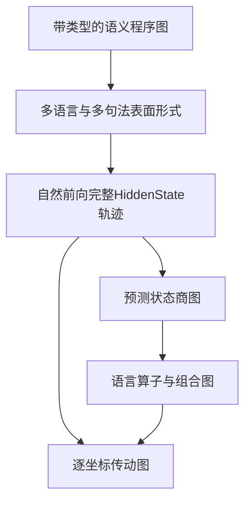

提问：

语言本身有无限种排列组合，但是LLM能表现出一定的语言能力，说明内部是有完整机制的，

目前以 HiddenState场进行破解，找到了一个标准的分析对象，避免分析Attention和MLP过于复杂的问题
但是分析语言编码，最大的问题，是语言本身有大量的排列，每种排列的编码机制都不一样，所以很难提取出特征，也无法确认最小单元。

目前的分析，主要的方式，就是基于某种语言结构，比如"回答对错"进行分析，进行HiddenState部分参数的替换，或者计算余弦。
但是 C112 说明了，内部是极为精细的齿轮结构，这些方式根本就没办法破解这种齿轮结构。
继续当前研究，换一个语句结构，继续差分替换，继续计算余弦，这些方式都是隔靴挠痒，永远都无法破解，现在请设计新的算法，核心关键在于：
要完成图谱，因为LLM是相对编码，单纯的找到苹果或者某个特征没有意义，必须完成图谱才能找到整体的结构。
需要找到语言模式的机制，比如 “但是”这种转折关系，  “翻译”这种特殊变化，内部模式是什么样的。
这里的关键，是一种新的系统的算法，而不是继续做参数替换，继续计算余弦。

回答：

结论：研究主线确实应该改变。下一步不应继续做“换一种句式 → 求差分/余弦 → 选Top‑K → 替换坐标”，而应直接重建：

[
\boxed{
\text{语言预测状态图}
+
\text{关系算子图}
+
\text{HiddenState逐坐标传动图}
+
\text{算子组合律}
}
]

可以把这套新方法称为：

# 预测状态—算子闭包—坐标流图谱算法

这是算法名称，不修改现有理论名称“条件化输出场闭合理论”。

先收紧三个判断：

1. 固定LLM对固定输入当然存在完整计算，但不保证它能压缩成少量、漂亮、可读的语言模块。
2. 无限句子不等于无限套机制。更可能是有限或可参数化的操作，在不同条件下递归组合。
3. C112只说明：有限等能置换下，“数值放在哪些物理激活坐标”会影响后续响应。它没有证明唯一坐标字典，也没有恢复完整“齿轮咬合图”。

而且必须严格称为“激活坐标级”，不是“权重参数级”。2560维HiddenState坐标不是模型权重。

---

## 一、旧路线到底缺少什么

| 旧路线    | 能回答       | 不能回答           |
| ------ | --------- | -------------- |
| 差分向量   | 两种条件改变了什么 | 变化如何被下一层计算     |
| 余弦     | 两个整体方向像不像 | 哪些坐标读取哪些坐标     |
| Top‑K  | 哪些坐标幅度大   | 弱坐标联合、门控、抵消    |
| 坐标替换   | 某组值能否改变输出 | 模型自然运行是否使用这条路线 |
| 单一任务模板 | 某种接口中的响应  | 模式如何跨语境和组合复用   |

真正缺少的是三个对象：

[
\text{状态是什么}
\quad
\text{操作是什么}
\quad
\text{坐标之间怎样传动}
]

新路线中，差分仍然存在，因为没有对照就无法识别“相对”。但差分只作为系统辨识的输入，不再被当作最终机制；余弦只做质量检查；HiddenState补丁只放在最后做因果审计。

---

# 二、“完整图谱”不是枚举全部句子

语言排列近乎无限，因此不可能画出“每个句子一个节点”的图。

正确的完整性定义应当是：

> 在一套冻结的语言生成规则中，用有限或可参数化的状态与算子，预测未见过的合法组合。

设：

* (\mathfrak G)：带类型的语义图语法；
* (\mathcal A)：允许的语言操作；
* (\mathcal C)：上下文与查询条件。

研究对象是它们的生成闭包：

[
\operatorname{Closure}(\mathfrak G,\mathcal A,\mathcal C)
]

“图谱完成”意味着能预测这个闭包中的新组合，不意味着列举全世界所有句子。

最终资产是：

[
\boxed{
\mathfrak A=
(G_{\mathrm{semantic}},
G_{\mathrm{predictive}},
G_{\mathrm{operator}},
G_{\mathrm{HiddenState}},
\rho)
}
]

其中 (\rho) 说明某个功能算子在HiddenState坐标层面如何实现。

---

# 三、第一步：把句子改写为“语义程序”

不再从一句孤立文本出发，而是先定义它表达的结构，再生成不同表面形式。

例如：

[
\text{“我喜欢吃苹果”}
===============

\operatorname{LIKE}
\left(
\text{我},
\operatorname{EAT}(\text{我},\text{苹果})
\right)
]

这里至少包括：

* `EAT`事件；
* 施事“我”；
* 受事“苹果”；
* `LIKE`态度关系；
* `EAT`事件作为`LIKE`的对象；
* 外层体验者与内层施事共指。

然后从同一语义图生成：

* 我喜欢吃苹果；
* 吃苹果是我喜欢的事；
* 苹果是我喜欢吃的东西；
* I like eating apples；
* 合法的主动、被动、否定、话题化表达。

这样才能区分：

[
\text{语义结构变化}
\quad\text{与}\quad
\text{词面、语序、语言变化}
]

不应再使用“苹果吃喜欢我”作为主要控制，因为它同时改变语法合法性、语序、角色和语义。

---

# 四、第二步：建立“预测状态图”，自动寻找最小单元

最小单元不应预设成token、词或某个坐标，而应定义成：

> 对所有未来语言使用方式都产生相同影响的历史状态。

设 (h) 是已经输入的语言历史，(\tau) 是未来查询、续写或操作。理想情况下：

[
h\sim h'
\iff
P_\theta(Y\mid h,\tau)
======================

P_\theta(Y\mid h',\tau),
\quad \forall\tau
]

那么 (h) 与 (h') 属于同一个预测状态。

通俗地说：

> 如果无论以后怎样追问、续写、翻译或组合，模型都无法区分两个过去，那么它们在当前研究范围内就是同一个功能状态。

实际不可能测试所有未来，因此使用冻结测试集、有限深度和误差范围：

[
h\sim_{\mathcal T,\epsilon,H}h'
]

预测签名不能只含一个`yes/no`首token，而应包括：

[
q_{\mathcal T}(h)=
\left[
P_\theta(Y\mid h,\tau)
\right]_{\tau\in\mathcal T}
]

测试族至少覆盖：

* 完整下一token分布；
* 完整候选序列概率；
* 自由生成与冻结语义解析；
* 事实、角色、指代、作用域查询；
* 续写倾向；
* 摘要重点；
* 翻译结果。

### 用反例逐步拆分状态

算法不是一开始假设“但是=转折状态”，而是：

1. 先把看似相同的历史放进同一状态；
2. 搜索一个未来问题或续句区分它们；
3. 找到反例就拆分；
4. 对它们执行相同语言操作；
5. 如果进入不同后继状态，再继续拆分；
6. 直到当前测试预算内无法继续区分；
7. 冻结状态图，再用新词汇、新模板验证。

这比“按余弦聚类”严格，因为判断依据是未来功能，而不是HiddenState方向相似。

注意：简单的“距离小于 (\epsilon)”不一定具有传递性，所以必须用分区细化和类内最大误差约束，不能直接用阈值聚类冒充数学等价类。

---

# 五、第三步：从状态图中提取“语言算子”

对语言操作 (m)，研究：

[
\boxed{
\mathcal T_m:
(z,\operatorname{args}(m),\kappa)
\longmapsto z'
}
]

其中：

* (z)：操作前的预测状态；
* (m)：否定、转折、翻译、角色绑定等操作；
* (\operatorname{args}(m))：操作对象；
* (\kappa)：上下文条件；
* (z')：操作后的预测状态。

“复用”不再定义为共享某256个坐标，而是：

> 多种模式能否共享同一算子程序骨架。

“差分”则是不同关系所需的参数、门控、角色和残差：

[
\mathcal T_f
============

\mathcal C
\left(
\mathcal T_{\mathrm{shared}},
D_f;
z,\kappa
\right)
]

这里不先假定 (\mathcal C) 是简单加法。

### 怎样自动判断某个模式是不是最小原子

假设已有算子库 (\mathcal O)。对组合模式：

[
m=m_k\circ\cdots\circ m_1
]

先预测：

[
\widehat{\mathcal T}_m
======================

\mathcal T_{m_k}\circ\cdots\circ\mathcal T_{m_1}
]

如果已有算子能够预测新组合，就不增加新原子。

只有当组合残差：

* 跨新词汇稳定；
* 跨新模板稳定；
* 不能由旧算子预测；
* 加入新算子后真正改善保留集预测；

才登记新模式原子。

总体目标是：

[
(\mathcal G^*,\mathcal O^*)
===========================

\arg\min_{\mathcal G,\mathcal O}
\left[
L(\mathcal G,\mathcal O)
+
L(\text{未来行为和HiddenState}\mid\mathcal G,\mathcal O)
\right]
]

通俗解释就是：

> 找到最短的一套规则，预测最多的未见语言组合。

这才是合同范围内的“最小单元”，而不是人为指定K=128或K=256。

---

# 六、第四步：真正建立逐坐标“齿轮传动图”

这是新算法最关键的部分。

过去只观察：

[
H_{\ell,t,j}
]

现在必须观察坐标之间的层间作用：

[
(\ell,t,j)
\longrightarrow
(\ell+1,t',k)
]

首先必须保存完整因果前缀的所有token位置，而不是只保存query、record、boundary等少数角色。

令：

[
Z_\ell(x)
=========

\operatorname{vec}
\left{
H_{\ell,t,j}(x)
\right}_{t,j}
]

完整自然层间计算是：

[
Z_{\ell+1}
==========

\Phi_\ell(Z_\ell;\kappa)
]

角色标签只用于解释，不能代替完整状态。否则未保存的token就是隐藏变量，层间传动图无法闭合。

## 6.1 直接计算局部坐标传动

建议解除旧合同中的“禁止梯度”，但仍然不拆Attention、MLP和权重。

计算层函数对HiddenState的局部导数：

[
J_{\ell,(t',k),(t,j)}(x)
========================

\frac{
\partial Z_{\ell+1,t',k}
}{
\partial Z_{\ell,t,j}
}
]

通俗地说，这张表回答：

> 在当前自然状态附近，第 (\ell) 层某位置的第 (j) 个坐标轻微变化，会让下一层哪个位置的哪个坐标变化多少？

这已经是坐标级“齿轮咬合候选”，不再是整体方向。

对于语言操作 (m)，定义自然端点之间的变化：

[
\Delta_m Z_\ell
===============

Z_\ell(m(x))-A_mZ_\ell(x)
]

(A_m) 是token/语义角色对齐；新增token不能强行相减，而应作为新增图节点。

边上的实际流量可写成：

[
F^{m,x}_{v\leftarrow u}
=======================

J_{\ell,v,u}(x),
\Delta_m Z_{\ell,u}
]

它回答：

> 这次“加入但是”或“改变施事”所造成的变化，具体通过哪些上游坐标传到哪些下游坐标。

## 6.2 有限变化的非线性分解

局部导数只适合小变化。对于两个完整自然状态，可以使用路径积分Jacobian：

[
\overline J_\ell^{m,x}
======================

\int_0^1
J_\ell
\left(
Z_\ell+\alpha\Delta_mZ_\ell
\right)
,d\alpha
]

理论上：

[
\Delta_m Z_{\ell+1}
===================

\overline J_\ell^{m,x}
\Delta_m Z_\ell
]

于是逐坐标：

[
\Delta_m Z_{\ell+1,v}
=====================

\sum_u
\overline J_{\ell,v,u}^{m,x}
\Delta_m Z_{\ell,u}
]

这第一次把“下游第 (v) 个坐标的变化”分解到每个上游坐标。

但必须严格记账：

* 该分解依赖所选路径；
* 直线路径可能离开自然HiddenState分布；
* 它是路径条件化的有效传动图；
* 不是模型自然运行必然经过的唯一通路。

若出现只有多个坐标联合才能解释的作用，则登记超边：

[
{u_1,u_2,\ldots}\rightarrow v
]

而不是强行给每个坐标分配独立语义。

## 6.3 如果仍然禁止梯度

只能从大量自然语义变化中识别局部有效算子：

[
\Delta_m Z_{\ell+1}
\approx
A_{\ell,m,z}\Delta_m Z_\ell
+
\epsilon
]

预测不足时再加入透明的二阶门控：

[
\Delta Z_{\ell+1,v}
\approx
\sum_u A_{vu}\Delta Z_{\ell,u}
+
\sum_{u<w}B_{vuw}\Delta Z_{\ell,u}\Delta Z_{\ell,w}
]

但这时只能称为：

> 有效预测依赖图。

如果梯度、独立激励和HiddenState干预全部禁止，就不可能从观察数据唯一恢复“哪个坐标因果驱动哪个坐标”。这是数学上的可识别性限制，不是算法不够聪明。

---

# 七、几个核心语言模式怎样进入新算法

## 1. “但是”

“但是”通常不改变两个分句各自真假，而改变：

* 预期是否被违背；
* 哪个分句是信息重点；
* 后续续写倾向；
* 整体评价或立场。

因此候选对象不是：

[
v_{\text{但是}}
]

而是：

[
\mathcal T_{\mathrm{but}}
(Z_A,Z_B,Z_{\mathrm{expectation}},\kappa)
]

材料应正交改变：

* `但是/而且/因此/句号/虽然……但是`；
* 两分句是否冲突；
* 是否存在明确预期；
* 子句顺序；
* 否定位置；
* 同主体或异主体；
* 局部或全局作用域；
* 多种释义与语言。

未来测试同时询问：

* A和B分别是否成立；
* B是否违反A建立的预期；
* 哪个分句控制总结；
* 下一句更可能怎样续写；
* 整体态度是什么。

如果“但是”和“然而”在新内容中进入相同预测状态、产生相同后继结构并共享坐标传动图，才支持复用。

如果不同用法持续被反例拆开，就应承认“但是”对应的是一族条件算子，不是一个原子。

## 2. 翻译

翻译必须分开：

* 语义内容保持；
* 目标语言选择；
* 目标语言表面生成。

对同一个语义图 (G)：

[
x_{\mathrm{zh}}=\rho_{\mathrm{zh}}(G),
\qquad
x_{\mathrm{fr}}=\rho_{\mathrm{fr}}(G)
]

检验语义操作与翻译是否近似交换：

[
\mathcal T_{\mathrm{zh}\to\mathrm{fr}}
\circ
\mathcal T_f^{\mathrm{zh}}
\stackrel{?}{\approx}
\mathcal T_f^{\mathrm{fr}}
\circ
\mathcal T_{\mathrm{zh}\to\mathrm{fr}}
]

例如：

1. 先把中文主动句变成被动句，再译成法文；
2. 先译成法文，再在法文中变成被动句。

如果两条路径到达相同预测语义状态，并产生可预测的语言特异输出状态，才开始得到翻译算子。

还可以检验直接与中转路径：

[
\mathcal T_{\mathrm{zh}\to\mathrm{fr}}
\stackrel{?}{\approx}
\mathcal T_{\mathrm{en}\to\mathrm{fr}}
\circ
\mathcal T_{\mathrm{zh}\to\mathrm{en}}
]

这里比较的是语义功能、完整生成和坐标传动结构，不是中法HiddenState原始坐标必须相同。

## 3. “我喜欢吃苹果”

目标公式是：

[
Z_{\text{整句}}
\stackrel{?}{\approx}
\mathcal T_{\mathrm{LIKE}}
\left(
\text{我},
\mathcal T_{\mathrm{EAT}}
(\text{我},\text{苹果})
\right)
]

如果单独的`EAT`与`LIKE`算子无法预测整句，并出现跨词汇、语态和释义稳定的残差，那么这个残差才可能代表：

* 事件嵌套；
* 外层体验者与内层施事共指；
* 态度—事件高阶绑定。

这比计算整句与几个改写句的余弦更接近组合机制。

## 4. 苹果—水果—食物—物体

自然知识可能只是预训练记忆，所以必须双轨：

* 人工伪词图：主识别；
* 自然苹果图：外部效度。

一条`is-a`边定义为图更新算子：

[
\mathcal U_{\mathrm{isA}(a,b)}:
Z_G\mapsto Z_{G\cup{a\to b}}
]

核心组合检验：

[
\mathcal T_{a\to c}
\stackrel{?}{\approx}
\mathcal T_{b\to c}
\circ
\mathcal T_{a\to b}
]

“苹果”的编码不再是一个向量，而是它在整个关系网络中的响应函数：

[
\mathcal N(\text{苹果})
=====================

\left{
\mathcal T_f
(\text{苹果},a,\kappa)
\right}_{f,a,\kappa}
]

这才是“苹果的生态位”。

如果自然苹果图成立、人工同构图失败，说明主要是知识记忆，不是抽象关系算子。

---

# 八、新算法如何验证，而不是重新变成统计游戏

统计不能完全取消，否则无法判断跨词汇复现。关键区别是：

> 统计只负责审计一条生成规则是否复现，不再把平均数或余弦本身当作机制。

主要裁决对象应当是：

* 未见句子的完整HiddenState逐坐标预测误差；
* 每个坐标的符号、幅度、形成层和角色预测；
* 下一预测状态是否正确；
* 完整输出分布的总变差或交叉熵；
* 完整生成序列的语义正确性；
* 未见算子组合的预测误差；
* 组合深度增加时误差是否失控；
* 算子库对数据的压缩程度；
* 理论能否预测模型的错误，而不只预测正确答案。

阈值不应随意给定，而应根据：

* 重复前向数值噪声；
* 表面改写基线；
* 随机算子；
* 句子逐条记忆模型；
* 单个全局线性模型；
* 输出协议模型；

在模型运行前冻结。

决定性实验是：

> 在模型实际运行某个新组合句以前，先由算子图预测它的完整HiddenState轨迹和输出；然后才揭盲真实前向。

---

# 九、一次性大Campaign

## 大阶段A：语义程序宇宙

并行建立四个图语法：

* 篇章：但是、虽然、因此、并且；
* 变换：翻译、释义、主动—被动；
* 组合：“我喜欢吃苹果”类事件嵌套；
* 知识图：is‑a、part‑of、属性、多跳路径。

每条路线同时有人工新词识别面板和自然语言外部面板。

## 大阶段B：自然全场观测

统一采集：

* 所有token位置；
* embedding和所有HiddenState；
* 全部2560激活坐标；
* 完整输出分布；
* 自由生成；
* 多种未来查询与续写。

发现阶段不做HiddenState替换。

## 大阶段C：预测状态最小化

* 建立模型实际预测状态图；
* 用反例不断细分；
* 用最小描述长度选择最小状态与算子库；
* 同时建立正确语义图与模型错误图。

行为失败不再让整个Campaign停止：

* 正确区域用于研究成功机制；
* 错误区域进入预注册的错误动力学图；
* 不能把错误图命名为正确语义机制。

## 大阶段D：坐标流与超图

* 计算自然状态局部Jacobian；
* 构造语言操作的坐标边流；
* 发现多坐标高阶超边；
* 提取跨材料稳定的门控子图；
* 不预设Top‑K、state或固定角色。

## 大阶段E：算子闭包总测试

一次性测试：

* 转折×否定；
* 翻译×语态；
* 态度×事件；
* `is-a`多跳；
* 操作换序；
* 嵌套深度外推；
* 同一语义跨语言和跨表面实现。

## 大阶段F：前瞻验证

冻结图谱后测试：

* 完全新词汇；
* 完全新模板；
* 新内容领域；
* 未见组合；
* 更深递归；
* 新语言方向；
* 其他模型。

跨模型不比较坐标编号，而比较预测状态、算子组合表、形成顺序和图结构。

## 大阶段G：最终因果审计

只有算子图已经能预测新轨迹后，才做少量定向实验：

* 删除冻结子图；
* 正确救援；
* 错误算子救援；
* 改变算子顺序；
* 检查完整自然生成。

此时HiddenState干预只是最后的审计，不再承担发现机制的任务。

---

# 十、理论公式怎样更新

理论名称保持：

> 条件化输出场闭合理论

组织原则保持：

> 复用—差分—条件化（RDC）

自然物理动力学：

[
Z_{\ell+1}
==========

\Phi_{\theta,\ell}(Z_\ell;\kappa)
]

预测状态抽象：

[
z=Q_{\mathcal T}(x)
]

语言算子：

[
Q_{\mathcal T}(m!\cdot!x)
\approx
\mathcal T_m
\left(
Q_{\mathcal T}(x);
\operatorname{args}(m),\kappa
\right)
]

组合规律：

[
\mathcal T_{m_2\circ m_1}
\stackrel{?}{\approx}
\mathcal T_{m_2}
\circ
\mathcal T_{m_1}
]

物理实现：

[
\rho(z,m,z')
============

\left{
J_{\ell}^{z,m},
\overline J_{\ell}^{z,m},
\text{门控坐标边与超边}
\right}
]

最接近智能机制的统一式是：

[
\boxed{
P_\theta
\left(
Y\mid m_n\circ\cdots\circ m_1(x)
\right)
\approx
\Omega
\left[
\mathcal T_{m_n}
\circ\cdots\circ
\mathcal T_{m_1}
\left(
Q_{\mathcal T}(x)
\right)
\right]
}
]

它要解决的是：

* 哪些状态被复用；
* 哪些算子共享骨架；
* 哪些差分由上下文门控；
* 组合顺序为何改变含义；
* 功能算子怎样落实到逐坐标传动图。

---

# 十一、当前是否需要新数学

目前不需要新的基础数学。

这套新算法可以由现有工具组成：

* 预测状态和自动机最小化；
* 概率双模拟；
* 反例驱动学习；
* 系统辨识；
* Jacobian微分；
* 最小描述长度；
* 带类型的图和超图；
* 算子组合代数。

真正可能产生新数学的时刻，是发现某组关系算子：

* 跨词汇；
* 跨语言；
* 跨任务；
* 跨模型；
* 可前瞻预测；
* 可组合；
* 可干预；

并且表现出既有结构无法表达的稳定组合律。

当前缺少的不是更复杂的数学，而是第一个真正可生成、可组合、可预测的语言算子。

---

## 最终判断

新的研究单位应从：

[
\text{某句话的差分向量}
]

升级为：

[
\boxed{
\text{可由未来行为定义的状态}
+
\text{状态之间的语言算子}
+
\text{算子的逐坐标传动实现}
}
]

最终突破标准也不再是“又发现一个高余弦场”，而是：

> 不运行某个新句子，先用图谱预测它的完整HiddenState轨迹、语言行为和失败条件；实际运行后逐坐标核对。

如果这一步能在“但是”、翻译、事件嵌套和苹果知识图中成立，就不再是隔靴挠痒，而是第一次真正开始恢复LLM的语言生成机制。
