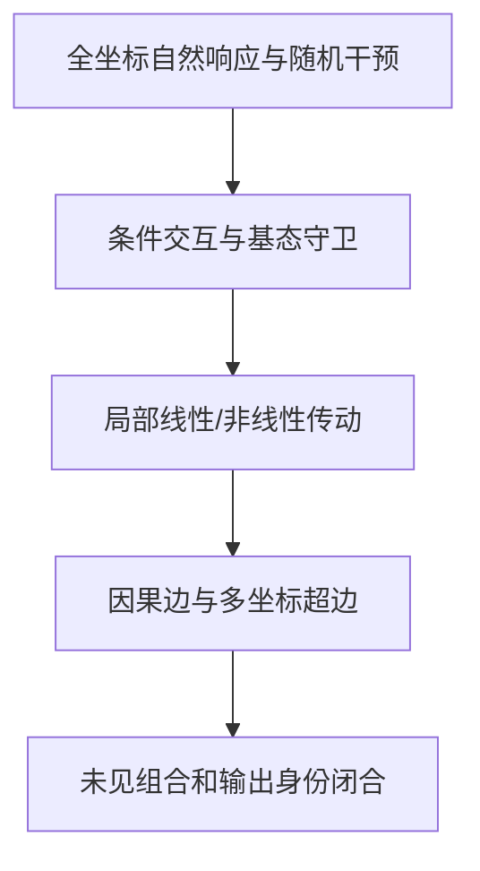

提问：
对于HiddenState场，如果内部是 单个激活坐标在层、角色、操作、语言、基态和输出边界下构成的条件齿轮结构。​那么 除了 top-k，正弦余弦，特征值，PCA等方式，还有什么数学方式可以提取这种结构

回答：

有。真正适合提取“条件齿轮”的，不是再换一种相似度或降维，而是把 HiddenState 看成一个由条件守卫控制的非线性动力系统，并直接识别：

> 哪个源坐标，在什么条件下，通过什么规律，影响哪些下游坐标，最后是否改变输出身份。

先澄清术语：(H_{q,t,d}) 是运行时的“激活坐标”，不是模型权重参数。因此更准确的目标是“激活坐标级条件传动结构”。

## 一、先定义真正要提取的对象

令：

[
s=(q,r,d),\qquad t=(q',r',d')
]

分别表示源、目标的层—角色—物理坐标；条件为：

[
c=(o,\ell,\sigma,w,H_q,\tau_{\mathrm{gen}})
]

包括操作、语言、表面、语义世界、当前基态和生成时钟。

从源层继续运行到目标层的网络记为：

[
\Phi_{q\rightarrow q'}(H_q;c)
]

那么齿轮最基本的数学对象不是“坐标幅值”，而是有限因果响应：

[
\boxed{
\mathcal K_{t\leftarrow s}(H,c;\delta)
======================================

\Phi_t(H+\delta e_s;c)-\Phi_t(H;c)
}
]

如果需要多源协同，则应写成条件超边：

[
\boxed{
e:
H_q[S_e]
\xrightarrow{,g_e(H_q,c),}
\Delta H_{q'}[T_e]
}
]

其中：

* (S_e)：一个或多个源坐标；
* (T_e)：一个或多个目标坐标；
* (g_e)：决定当前齿轮是否啮合的基态守卫；
* 传动规律可以是线性、分段线性或非线性的。

这才是“精密齿轮”假设的可检验版本。

---

# 二、最值得使用的数学方法

## 1. 函数 ANOVA 与 Möbius 高阶差分：找“哪些条件共同开门”

对每个物理坐标响应：

[
R_d(q,r,o,\ell,b)
]

分解为：

[
R_d
===

\mu_d
+f_q+f_r+f_o+f_\ell+f_b
+f_{q,r}+f_{r,o}+\cdots
+f_{q,r,o,\ell,b}
]

它回答的不是“哪个坐标最大”，而是：

* 坐标 (d) 是否对某个操作普遍响应；
* 是否只有“中文×受事×q24”时响应；
* 是否还必须满足某种基态符号或区间；
* 语言和角色只是调节幅度，还是完全更换传动规则。

对多个操作或坐标集合 (S)，可用 Möbius 差分提取纯交互：

[
\boxed{
\kappa_S
========

\sum_{T\subseteq S}
(-1)^{|S|-|T|}
\Phi(H+\delta_T)
}
]

例如两个坐标 (i,j) 的联合齿合：

[
I_{ij}
======

\Phi(H+\delta_i e_i+\delta_j e_j)
-\Phi(H+\delta_i e_i)
-\Phi(H+\delta_j e_j)
+\Phi(H)
]

如果两个坐标单独无效、联合有效，就不应强行解释为两个单坐标齿轮，而应登记为一个超边。

这类方法特别适合“我喜欢吃苹果”中的施事、态度、动作、受事、否定、语态等析因结构。

---

## 2. 切换动力系统：直接提取“基态守卫”

当前证据最接近的对象不是固定矩阵，而是：

[
\boxed{
\Delta H_{q'}
=============

\sum_{k=1}^{K}
g_k(H_q,c)
\left(A_kH_q+b_k\right)
+\varepsilon
}
]

通俗地说：

* 模型内部有若干套局部传动规则 (A_k)；
* 当前 HiddenState 和语言条件决定启用哪一套；
* 同一个操作在不同基态下可能使用不同齿轮。

守卫 (g_k) 可用：

* 稀疏逻辑规则；
* 分段仿射模型；
* 斜决策树；
* switching state-space model；
* mixture-of-experts；
* 稀疏门控网络。

还可以对相邻层加入 fused lasso：

[
\lambda\sum_q
\left|
A_{q+1}-A_q
\right|_1
]

从而识别某条传动关系在哪层出现、持续、切换或消失。

它非常适合回答：

> “第 (d) 个坐标不是总在工作，而是在特定角色、操作和基态下才进入传动链吗？”

---

## 3. 多剂量局部多项式与 Volterra 展开：找非线性齿合

不能直接假定存在稳定线性 Jacobian。先使用有限变化：

[
\Delta\Phi(H;\delta)=\Phi(H+\delta)-\Phi(H)
]

再比较：

[
\boxed{
\Delta H'
=========

J(H,c)\delta
+\frac12B(H,c)[\delta,\delta]
+\frac16C(H,c)[\delta,\delta,\delta]
+\cdots
}
]

其中：

* (J)：单坐标一阶传动；
* (B)：两个坐标的协同、抑制或门控；
* (C)：三坐标及更高阶齿合。

对单坐标，可同时计算奇响应与偶响应：

[
O(\varepsilon)
==============

\frac{\Phi(H+\varepsilon)-\Phi(H-\varepsilon)}{2}
]

[
E(\varepsilon)
==============

\frac{\Phi(H+\varepsilon)+\Phi(H-\varepsilon)-2\Phi(H)}{2}
]

* 奇响应随剂量稳定：支持一阶传动；
* 偶响应按 (\varepsilon^2) 增长：支持曲率；
* 同剂量重复不稳定：首先是数值问题；
* 同剂量稳定、不同剂量不同：可能是阈值、饱和或非线性。

这正适合处理 C626 的问题：两个剂量下矩阵高度不一致，所以现在不能固定一个 (J)，应先判断是 BF16、归一化耦合还是实际非线性。

---

## 4. 路径积分 Jacobian：把人工扰动与自然语言响应连接起来

语言操作通常不是无穷小扰动。设自然操作在上游产生：

[
R_{o,q}=H_q(o(x))-H_q(x)
]

那么严格的下游传播关系是：

[
\boxed{
R_{o,q'}
========

\int_0^1
J_{q\rightarrow q'}
\bigl(H_q+sR_{o,q}\bigr)
R_{o,q},ds
}
]

它比单点 Jacobian 重要得多，因为它检验：

> 从原句到变换后句子的整条自然响应路径，是否能由坐标传动面解释？

还可以拆成单坐标贡献：

[
C_{j\leftarrow i}
=================

\int_0^1
J_{ji}(H_q+sR_{o,q})
R_{o,q,i},ds
]

这才可能回答：

* 哪个上游坐标携带了操作响应；
* 它沿哪些层传给哪个下游坐标；
* 哪些小幅坐标虽然不在 Top-K，却对自然状态迁移很重要。

---

## 5. Hadamard/Rademacher 随机探针与压缩系统辨识

完整逐坐标扫描很昂贵。可以同时、公平地扰动所有坐标：

[
v_m\in{-1,+1}^{2560}
]

[
Y_m
===

\frac{
\Phi(H+\varepsilon v_m)-\Phi(H-\varepsilon v_m)
}{
2\varepsilon
}
\approx J(H)v_m
]

然后从：

[
Y\approx JV
]

恢复传动结构，使用：

* group lasso；
* sparse group lasso；
* 层级贝叶斯收缩；
* horseshoe prior；
* 稳定性选择；
* sparse + distributed-background 分解。

这不是 Top-K：每个坐标获得同等干预机会，坐标的重要性由下游因果响应决定，而不是由原始幅值决定。

但必须注意：压缩感知依赖稀疏假设。如果真实结构是稠密分布式的，稀疏恢复会人为制造“少量关键坐标”。恢复出的边必须再用逐坐标和组合写入独立确认。

---

## 6. SINDy与稀疏符号动力系统：寻找可读的齿轮方程

把层看成离散时间：

[
\boxed{
H_{q+1}-H_q
===========

\Theta(H_q,c)\Xi_q+\epsilon
}
]

候选函数库可以包括：

[
1,\quad H_i,\quad H_i^2,\quad H_iH_j,\quad
\mathbf1[H_i>0],\quad
H_i\mathbf1[o=A],\quad
H_i\mathbf1[\ell=\mathrm{zh}]
]

最终目标是恢复类似下面形式的规则：

[
\Delta H_{q+1,j}
================

aH_{q,i}
\mathbf1[\text{角色=受事}]
\mathbf1[\text{操作=否定}]
]

这只是方程形式示意，不是已有实验结果。

SINDy的核心是从候选函数库中寻找少量稳定动力学项，适合提取可解释方程；但坐标强相关时可能出现很多等价稀疏解，必须检查支持集合在新词汇、新表面、新世界上的稳定性。[SINDy原始论文](https://www.pnas.org/doi/10.1073/pnas.1517384113)

---

## 7. JVP、VJP与Fisher输出几何：找到真正通向答案的坐标

整体 HiddenState NRMSE 很好，不代表预测到了决定输出的方向。

定义目标答案与竞争答案的 logit margin：

[
m(H)
====

## \log p(y_{\mathrm{target}}\mid H)

\log p(y_{\mathrm{control}}\mid H)
]

VJP或梯度：

[
g=\nabla_Hm(H)
]

可以检查预测误差 (e) 是否正好落在输出关键方向：

[
g^\top e
]

这能解释一种常见现象：

[
|e|_2\text{很小},
\qquad
|g^\top e|\text{却很大}
]

即状态整体预测准确，但错过了输出身份边界。

进一步可使用输出分布的 Fisher 度量：

[
G(H)
====

\mathbb E_y
\left[
\nabla_H\log p(y\mid H)
\nabla_H\log p(y\mid H)^\top
\right]
]

[
|\delta H|_F^2
==============

\delta H^\top G(H)\delta H
]

它衡量的是“这段 HiddenState 变化对输出分布有多重要”，而不是普通欧氏距离有多大。

---

## 8. 条件 HSIC、条件互信息与向量值 RKHS

这些方法用于发现非线性条件依赖：

[
U_i\not!\perp\Delta H_j
\mid
(q,r,o,\ell,H_q)
]

其中 (U_i) 可以是对源坐标 (i) 的随机干预。

它们可以发现：

* 阈值式传动；
* 正负基态使用相反传动；
* U形或饱和响应；
* 语言改变后传动翻转；
* 最近邻无法表达的平滑非线性。

HSIC是基于核空间的非线性依赖检验，[原始方法](https://link.springer.com/chapter/10.1007/11564089_7)；向量值RKHS则可以直接学习：

[
(H_q,c,U)\mapsto\mathbb E[\Delta H_{q'}\mid H_q,c,U]
]

边界是：

* 自然数据上的HSIC，只是预测依赖；
* 对随机坐标干预计算条件依赖，才更接近定向因果证据；
* 核模型预测成功但稀疏模型失败，说明结构可能是分布式非线性的，而不是少量单坐标齿轮。

---

## 9. 因果有向超图：最适合保存最终“齿轮图谱”

最终不应只保存一个矩阵，而应构造：

[
V={(q,r,d)}
]

[
E=
\left{
S_e
\xrightarrow[g_e(H,c)]{}
T_e
\right}
]

其中：

* 节点是物理激活坐标；
* 普通边是单源传动；
* 超边是多坐标联合传动；
* 边标签记录语言、操作、角色、基态和输出时钟；
* 边权记录效应、剂量稳定性、置信区间和跨材料复现情况。

这张图可以直接区分：

* 固定单坐标齿轮；
* 基态切换的单坐标齿轮；
* 多源—多目标超边；
* 稠密分布式背景；
* 晚期输出身份模块。

关键是：相关或回归建立的图只能叫预测图；经过随机写入、删除和独立救援的边，才有资格进入因果图。

---

## 10. 预测状态等价与bisimulation：寻找真正被复用的“状态类型”

不一定要先聚类 HiddenState。可以根据未来行为定义两个状态是否等价：

[
H\sim H'
\iff
\forall o,;
\operatorname{Future}(H,o)
\approx
\operatorname{Future}(H',o)
]

通俗地说：

> 两个状态的坐标值可以不同，但如果对所有登记操作都产生相同后续响应和输出，它们属于同一种功能状态。

然后再寻找哪些物理坐标关系决定了等价类边界。

这特别适合：

* “苹果→水果→食物→物体”的中间节点状态；
* 不同语言中的同角色状态；
* canonical与paraphrase；
* 自然图、临时图、伪词图和反事实图。

它比普通聚类更接近“程序状态”，因为分类标准来自未来可执行行为，而不是静态距离。

---

# 三、可作为辅助，但不能单独证明齿轮的方法

| 方法                           | 用途                | 主要边界             |
| ---------------------------- | ----------------- | ---------------- |
| 条件轴CP/Tucker/Tensor Train    | 找层×角色×操作×语言的复用模式  | 因子不唯一，只能说明可压缩    |
| Koopman/EDMD                 | 检验一套可观测量能否跨层、多步滚动 | 字典选择敏感；不等于物理坐标因果 |
| 最优传输/MMD                     | 比较跨语言、表面、模型的响应分布  | 运输计划不是网络真实传动     |
| Sheaf                        | 表达局部规律是否能拼成全局一致规则 | 目前更适合作理论组织       |
| 持久同调/Mapper                  | 探索坐标响应指纹的簇、分支或环   | 只能产生候选拓扑         |
| ICA/字典学习                     | 找潜在独立成分           | 得到新基底，不是原物理坐标    |
| Shapley/Integrated Gradients | 分配输出贡献            | 基线依赖，有交互时分配不唯一   |

Tensor方法适合处理多轴数据，但如果目标是物理坐标，应该只压缩“层、角色、操作、语言、基态”等条件轴，保持源、目标坐标轴开放；普通CP/Tucker若同时旋转坐标轴，就不能再解释成单坐标齿轮。[张量分解综述](https://epubs.siam.org/doi/full/10.1137/07070111X)

Koopman/EDMD的价值也不应放在特征值，而应放在检验可观测量能否形成可复用的多步转移：

[
\psi(H_{q+1})
\approx
K_{q,c}\psi(H_q)
]

[EDMD原始工作](https://cwrowley.princeton.edu/papers/Williams-edmd-2015.pdf)

---

# 四、两个具体例子

## “我喜欢吃苹果”

把句子编译为：

* “我”：体验者/施事；
* “喜欢”：外层态度；
* “吃”：内层动作；
* “苹果”：受事；
* 另有语态、内外否定、更新顺序、语言和表面条件。

假设要检验源坐标 (i,j) 是否共同控制“谁吃什么”的下游状态，可做：

[
I_{ij\rightarrow t}
===================

\Phi_t(H+\varepsilon e_i+\eta e_j)
-\Phi_t(H+\varepsilon e_i)
-\Phi_t(H+\eta e_j)
+\Phi_t(H)
]

如果该交互：

* 在新人物、新食物和释义上仍存在；
* 只在正确角色和操作下存在；
* 能预测自然施事/受事变化；
* 删除后破坏正确输出；
* 独立材料估计的正确交互能救援；
* 错角色交互不能救援；

才接近一个条件齿轮超边。

这只是建议的检验方式，不是当前已有结果。C627的 (0/5) 只是否定了一个英文释义分支上的施事×受事迁移原型，并未排除其他非线性条件结构。

## “苹果→水果→食物→物体”

学习的不是固定“一跳向量”，而是：

[
\widehat H_{k+1}
================

\widehat H_k+
\widehat R_{\mathrm{up}}
(\widehat H_k,c)
]

然后检验同一局部规则能否滚动预测二跳、三跳和四跳，并胜过：

* 简单平均相加；
* 错误中间节点；
* 错操作；
* 零变化。

再用预测状态等价检验：

> 自然词“苹果”和伪词节点虽然坐标值不同，是否在“向上查询”下属于相同的未来状态类型？

不过C625–C629中所有图切片没有行为资格，因此这仍是下一阶段方法，不是已有图机制证据。

---

# 五、必须处理的三项硬伤

## 1. 坐标基底不是天然唯一

若：

[
H'_q=Q_qH_q
]

则：

[
J'_{q\rightarrow q'}
====================

Q_{q'}J_{q\rightarrow q'}Q_q^{-1}
]

原来稀疏的单坐标传动可能在旋转后变成稠密结构。

所以：

* “固定模型的第137维具有可干预作用”是合法物理陈述；
* “第137维天然代表苹果/施事”不是基底不变理论；
* 跨模型应比较响应拓扑、可控/可观测关系，而不是相同坐标编号。

## 2. LayerNorm/RMSNorm会制造全坐标机械耦合

改变一个坐标会经均值、方差或RMS归一化影响很多其他坐标。稠密响应不一定是语义传动。

需要比较：

* norm前与norm后干预；
* 纯归一化解析响应；
* 保持均值和范数的切空间扰动；
* 等范数随机方向；
* 去除径向和全一方向后的剩余响应。

## 3. BF16必须使用实际有效剂量

中心差分分母应是：

[
H_i^+-H_i^-
]

而不是名义上的 (2\varepsilon)。

如果正负扰动量化后相同，应记为NA。还需要：

* 同剂量重复；
* 零剂量/no-op；
* BF16可表示剂量阶梯；
* FP32影子计算；
* JVP/VJP对照；
* 未参与拟合的多坐标扰动验证。

---

# 六、我建议的主方法组合

如果只选择一套最有希望的路线，我会选：

[
\boxed{
\begin{aligned}
&\text{Möbius/ANOVA：识别条件守卫}\
+{}&\text{多剂量有限响应：识别非线性传动}\
+{}&\text{Hadamard随机探针：公平扫描全部坐标}\
+{}&\text{切换稀疏系统/SINDy：提取可读规则}\
+{}&\text{因果超图：保存多源—多目标齿轮}\
+{}&\text{JVP/VJP/Fisher：连接输出身份边界}
\end{aligned}
}
]

证据流水线应是：

每种方法最高只能进入对应证据等级：

[
\text{依赖}
\not\Rightarrow
\text{预测}
\not\Rightarrow
\text{稳定传动}
\not\Rightarrow
\text{组合}
\not\Rightarrow
\text{输出因果}
]

最终不是强行证明“单坐标齿轮”，而是让数据裁决：

| 结果             | 对应机制          |
| -------------- | ------------- |
| 单坐标跨条件稳定且因果闭合  | 单坐标条件齿轮       |
| 单坐标只在局部基态稳定    | 守卫切换齿轮        |
| 只有坐标组联合有效      | 多源—多目标超齿轮     |
| 稀疏模型失败、核模型成功   | 分布式非线性场       |
| 人工响应可预测但自然操作不能 | 实验局部结构，不是语言机制 |
| 状态传播成立但输出不变    | 缺少语义—身份桥      |
| 同剂量重复不稳定       | 数值/测量问题       |
| 所有跨材料外推失败      | 模板或词汇实例检索     |

结合C625–C629，固定线性方向齿轮已经明显受挫；固定模型基底中的单坐标条件齿轮尚未验证；当前最值得检验、也最符合已有拼图的是：

[
\boxed{
\text{由基态守卫选择的、分布式多源—多目标非线性条件传动超图}
}
]

现有微积分、有限差分、函数ANOVA、稀疏系统辨识、核方法、因果超图和控制理论已经足够提取它。目前不需要先发明新数学，也不需要全面展开Attention/MLP；应先在 HiddenState 层把“自然响应—局部传动—未见组合—输出身份”闭合。
