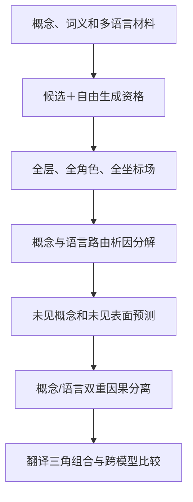

提问：

能不能用大量的翻译英文和法文，找到对应的编码规律，比如： 翻译苹果为英文，翻译香蕉为英文，翻译苹果为法文。
使用大量的测试数据，尝试找到苹果和翻译 等词在HiddenState场中的脉络。

以上方案是否可行，有什么问题，有什么可以改进的地方

回答：

可行，而且翻译是目前很有价值的旗舰语言程序之一。它天然包含三个可以分离的变量：

[
\boxed{
\text{概念内容}
\times
\text{源语言}
\times
\text{目标语言}
}
]

但不能只收集大量“苹果→apple”句子，然后比较HiddenState相似度。那样最容易找到的是词面、提示模板和输出token身份，不一定是翻译机制。

正确目标应当从“寻找苹果向量、翻译向量”，改为：

[
\boxed{
\text{研究某个概念在不同源语言、目标语言、上下文和角色下，
如何触发条件化的HiddenState状态转移}
}
]

---

# 一、为什么这个方向可行

翻译任务有一个非常适合机制研究的特点：同一个抽象概念可以有不同语言表面。

例如：

| 抽象概念   | 中文 | 英文     | 法文     |
| ------ | -- | ------ | ------ |
| APPLE  | 苹果 | apple  | pomme  |
| BANANA | 香蕉 | banana | banane |

这让我们可以尝试分离：

1. 概念本身：APPLE还是BANANA；
2. 源语言词面：苹果还是apple；
3. 目标语言：英文还是法文；
4. 翻译操作：要求翻译，而不是分类、重复或解释；
5. 输出身份：最终要生成apple还是pomme。

理论上可以研究：

[
\text{“苹果”}
\rightarrow
\text{APPLE概念状态}
\rightarrow
\text{英文目标词apple}
]

以及：

[
\text{“苹果”}
\rightarrow
\text{APPLE概念状态}
\rightarrow
\text{法文目标词pomme}
]

如果不同词汇都表现出相似的目标语言变换规律，就可能找到“翻译路由”的HiddenState机制。

---

# 二、用户给出的三个例子还缺少第四格

你提出：

* 苹果→英文；
* 香蕉→英文；
* 苹果→法文。

为了把“概念变化”和“目标语言变化”严格分开，必须补上：

* 香蕉→法文。

形成完整四格：

|    | 英文目标   | 法文目标   |
| -- | ------ | ------ |
| 苹果 | apple  | pomme  |
| 香蕉 | banana | banane |

令 (H_{c,\ell}) 表示概念 (c) 翻译到目标语言 (\ell) 时的某个HiddenState。

## 1. 概念差分

在目标语言保持英文时：

[
D_{\rm concept}^{en}
====================

## H_{\rm apple,en}

H_{\rm banana,en}
]

它主要包含“苹果和香蕉的区别”。

## 2. 目标语言差分

在概念保持苹果时：

[
D_{\rm target}^{apple}
======================

## H_{\rm apple,fr}

H_{\rm apple,en}
]

它主要包含“目标从英文切换成法文”的变化。

## 3. 概念×目标语言交互

[
I_{\rm concept\times target}
============================

## H_{\rm apple,fr}

## H_{\rm apple,en}

H_{\rm banana,fr}
+
H_{\rm banana,en}
]

通俗地说：

> “切换到法文”对苹果和香蕉是否使用相同的HiddenState动作？

如果交互接近零，可能存在相对通用的目标语言变换；如果明显不为零，说明翻译响应依赖具体概念和基态。

但即使交互接近零，也只能登记为候选，不能立即称为固定翻译算子。

---

# 三、真正需要寻找的不是一个“翻译向量”

最简单的假说是：

[
H_{\rm pomme}
\approx
H_{\rm apple}
+
v_{\rm English\to French}
]

即所有英文词翻译成法文，都加上同一个固定方向。

这个假说容易测试，但根据现有项目历史，它大概率过于简单。更合理的对象是：

[
\boxed{
\mathfrak R_{\ell_s\rightarrow\ell_t,q}
(c,H,r,\sigma)
}
]

其中翻译响应依赖：

* 概念 (c)；
* 当前HiddenState基态 (H)；
* 源语言 (\ell_s)；
* 目标语言 (\ell_t)；
* 层 (q)；
* 角色 (r)；
* 表面形式 (\sigma)；
* 上下文和词义。

更完整地写：

[
\widehat{\Delta H}_{q'}
=======================

\mathcal T_{\ell_s\rightarrow\ell_t,q\rightarrow q'}
\left(
H_q,
c,
\text{sense},
r,
\text{context}
\right)
]

所以要找的可能不是：

> 英文→法文的固定向量。

而是：

> 当前概念、词义、角色和基态共同选择的英文→法文响应族。

---

# 四、必须把“翻译”操作和“翻译”这个词分开

如果所有提示都写成：

> 把苹果翻译成英文。

那么HiddenState中与翻译任务相关的结构，可能只是对“翻译”这个token的响应。

因此需要多种等义表面，例如：

* 把“苹果”翻译成英文；
* “苹果”用英语怎么说？
* 给出“苹果”的英文对应词；
* What is the English word for “苹果”？
* English equivalent: 苹果 → ?

如果这些不同提示表面仍产生可迁移的内部响应，才更有理由称为“翻译操作”，而不是“翻译token效应”。

还应加入错误操作控制：

* 重复“苹果”；
* 解释“苹果”；
* 判断“苹果”属于什么类别；
* 把“苹果”翻译成错误目标语言；
* 输出与“苹果”无关但长度相同的词。

---

# 五、必须把概念、词面和输出身份分开

翻译任务至少包含四种不同对象：

[
\boxed{
\text{源词面}
\neq
\text{抽象概念}
\neq
\text{目标词汇身份}
\neq
\text{最终输出token}
}
]

以“苹果→pomme”为例：

1. 源词面是“苹果”；
2. 抽象概念是APPLE；
3. 目标词汇身份是法文词 `pomme`；
4. 实际生成可能是一个或多个token组成的字符串。

如果只观察q32或final norm，很可能找到的是第3、4项，而不是第2项。

这正是C632–C640已经发现的问题：晚期q32差分很容易控制W/X/Y/Z输出身份，但尚不能解释上游语义如何形成该身份。

因此翻译研究需要同时冻结两种输出协议：

## 自然翻译输出

例如：

* 苹果→apple；
* 苹果→pomme。

用于测试真实翻译行为和完整生成。

## 正交输出码

例如先要求模型求出正确翻译词，再根据旋转码本输出W/X/Y/Z。

这样可以把：

[
\text{知道正确翻译}
]

与：

[
\text{直接准备输出apple或pomme}
]

部分分离。

---

# 六、建议的数据结构

完整实验对象可以写成：

[
x=
(c,z,\ell_s,\ell_t,\ell_i,\sigma,r,\kappa,\Omega)
]

其中：

* (c)：概念，如APPLE；
* (z)：词义，如水果义或公司义；
* (\ell_s)：源语言；
* (\ell_t)：目标语言；
* (\ell_i)：指令使用的语言；
* (\sigma)：提示表面；
* (r)：当前语法角色；
* (\kappa)：上下文、作用域和绑定；
* (\Omega)：自然输出或旋转输出码。

对应HiddenState张量：

[
\mathcal F
==========

H[
c,z,\ell_s,\ell_t,\ell_i,\sigma,r,q,t,d
]
]

其中：

* (q)：层；
* (t)：token或角色位置；
* (d)：全部物理激活坐标。

这会把翻译研究从“比较几个词向量”升级为：

> 概念×语言路由×上下文×角色×层×坐标的条件响应图谱。

---

# 七、数据应该怎样扩大

大量数据确实有帮助，但数量不是最关键的，独立变化维度才是关键。

## 1. 概念范围

不能只使用苹果、香蕉等水果。至少要覆盖不同语义族：

* 水果；
* 动物；
* 工具；
* 人物；
* 地点；
* 抽象概念；
* 动作；
* 属性。

同时包含：

* 同类近邻：苹果/香蕉；
* 跨类差异：苹果/锤子；
* 上下位关系：苹果/水果；
* 多义词：Apple公司/苹果水果。

否则找到的可能只是“水果内部差异”，不是一般翻译规律。

## 2. 语言方向

至少应分别研究：

[
zh\to en,\quad zh\to fr,\quad
en\to fr,\quad fr\to en
]

如果资源允许，再加入逆向：

[
en\to zh,\quad fr\to zh
]

翻译不一定对称：

[
T_{zh\to en}
\neq
T_{en\to zh}^{-1}
]

所以不能只测试一个方向。

## 3. 上下文

孤立词翻译只测试词典映射。还需要句子上下文，例如：

* 我吃了一个苹果；
* 苹果发布了新设备；
* 他坐在河岸边——测试具有多义翻译的词；
* 单数、复数、性别和冠词变化。

否则很可能只发现模型记住的双语词典关系。

## 4. 自然词、伪词和临时词典

三种材料最好并存：

* 自然词：检验预训练知识；
* 伪词：检验提示中临时建立的跨语言关系；
* 反事实映射：检验模型能否覆盖原有词典记忆。

例如提示中临时规定一个伪词表示APPLE，再要求翻译。这样可以区分：

[
\text{记忆过的词对}
]

和：

[
\text{真正执行当前翻译程序}
]

---

# 八、HiddenState应该观察哪些位置

至少需要六类位置：

1. 翻译指令；
2. 源词；
3. 源词所在语法角色；
4. 目标语言标记；
5. 查询边界；
6. 每个生成步骤的答案边界。

并保存：

[
\text{embedding}
\rightarrow
q8
\rightarrow
q16
\rightarrow
q24
\rightarrow
q32
\rightarrow
\text{final norm}
]

需要研究的不是单条热力图，而是三类轨迹：

## 源概念轨迹

[
H_q(\text{苹果作为源词})
]

它怎样由词面身份变成上下文化概念。

## 目标语言路由轨迹

[
H_q(\text{英文目标})
\quad\text{与}\quad
H_q(\text{法文目标})
]

它在哪些层开始影响查询和源概念角色。

## 目标词身份轨迹

[
H_q(\text{准备生成apple})
\quad\text{与}\quad
H_q(\text{准备生成pomme})
]

它在哪个检查点形成稳定输出身份。

这可能形成一个候选链：

[
\boxed{
\text{源词面}
\rightarrow
\text{上下文化概念}
\rightarrow
\text{目标语言路由}
\rightarrow
\text{目标词身份}
\rightarrow
\text{生成}
}
]

但这是待检验假说，不是已有结论。

---

# 九、具体分析算法

## 1. 配对有限差分

同概念、不同目标语言：

[
\Delta_{\rm target}^{c}
=======================

## H(c,\ell_t^{(2)})

H(c,\ell_t^{(1)})
]

同目标语言、不同概念：

[
\Delta_{\rm concept}^{\ell_t}
=============================

## H(c_2,\ell_t)

H(c_1,\ell_t)
]

同概念和目标语言、不同提示表面：

[
\Delta_{\rm surface}
====================

H(\sigma_2)-H(\sigma_1)
]

目标是把概念、语言路由和表面变化分账。

## 2. Möbius/函数ANOVA

计算：

* 概念主效应；
* 源语言主效应；
* 目标语言主效应；
* 概念×目标语言；
* 源语言×目标语言；
* 概念×上下文；
* 操作×语法角色。

这样可以判断翻译响应主要是：

* 固定语言路由；
* 概念依赖；
* 上下文依赖；
* 还是多因素联合装配。

## 3. 条件响应预测

使用发现概念拟合：

[
(H_q,c,\ell_s,\ell_t)
\mapsto
\Delta H_{q'}
]

然后在完全未见概念上预测。

比较：

* 零响应；
* 族平均响应；
* 固定翻译向量；
* 逐坐标条件模型；
* 基态最近邻；
* switching守卫；
* 条件核模型；
* 张量交互模型；
* 错误目标语言响应。

如果“英文→法文”的规则只能在苹果、香蕉上成立，却不能预测未见词汇，就只是词对记忆。

## 4. 跨表面检验

发现集只使用：

> 翻译X成英文。

锁箱使用：

> X用英语怎么说？

如果规则仍成立，才能排除“翻译”这个词本身。

## 5. 翻译三角组合

比较：

[
T_{zh\to fr}(c)
]

与：

[
T_{en\to fr}
\bigl(
T_{zh\to en}(c)
\bigr)
]

通俗地说：

> 中文直接翻法文，与中文先到英文再到法文，是否进入相同的功能响应类？

不能只比较最终词都等于 `pomme`，还应比较：

* 上游响应；
* 目标身份；
* 后续查询；
* 新上下文中的行为。

如果不同路径产生相同未来响应，才可能形成翻译程序的功能等价类。

---

# 十、最关键的因果实验：概念和语言双重分离

仍使用完整四格：

|    | 英文     | 法文     |
| -- | ------ | ------ |
| 苹果 | apple  | pomme  |
| 香蕉 | banana | banane |

需要分别找到两个候选仪器。

## 1. 概念仪器

从APPLE切换到BANANA，但保持目标语言英文：

[
(\text{APPLE},en)
\longrightarrow
(\text{BANANA},en)
]

期望输出：

[
apple\longrightarrow banana
]

同时不能变成法文。

## 2. 目标语言仪器

保持APPLE不变，把目标语言英文切换成法文：

[
(\text{APPLE},en)
\longrightarrow
(\text{APPLE},fr)
]

期望输出：

[
apple\longrightarrow pomme
]

同时不能改变成香蕉概念。

## 3. 联合仪器

同时改变概念和目标语言：

[
(\text{APPLE},en)
\longrightarrow
(\text{BANANA},fr)
]

期望输出：

[
apple\longrightarrow banane
]

如果可以得到这种双重分离，就比“一个向量把apple改成pomme”强得多。

它说明内部至少可操作地区分：

[
\boxed{
\text{概念内容}
\quad\text{与}\quad
\text{目标语言路由}
}
]

随后还必须执行：

* 删除；
* 正确独立救援；
* 错概念救援；
* 错语言救援；
* 错角色、错层、错时钟；
* 完整多token生成。

---

# 十一、主要问题和硬伤

## 1. 词典记忆

模型可能只是记住：

[
苹果\leftrightarrow apple\leftrightarrow pomme
]

解决办法：

* 新词汇；
* 低频词；
* 伪词；
* 临时词典；
* 反事实映射；
* 整个概念族留出。

## 2. “翻译”token混淆

固定提示会让“翻译”这个词成为捷径。

解决办法：

* 多种等义表面；
* 不含“翻译”字样的提示；
* 不同语言书写指令；
* 同词面的非翻译任务控制。

## 3. 晚期输出身份污染

q32附近可能只编码 `apple` 或 `pomme` 的输出身份。

解决办法：

* 同时分析embedding、q8、q16、q24；
* 使用旋转输出码；
* 分离抽象翻译答案与自然词输出；
* 进行上游→晚期身份中介测试。

## 4. Tokenization差异

`apple`、`pomme`以及不同中文词可能拥有不同token数。

解决办法：

* 使用完整序列似然；
* 记录字符跨度到物理token映射；
* 分析首次答案分叉时钟；
* 不能只比较“最后一个token”。

## 5. 多义性

“苹果”可能指水果或Apple公司。没有上下文时答案不唯一。

解决办法：

* 每个词义单独登记；
* 使用明确上下文；
* 人类审核答案唯一性；
* 词义整体进入lockbox分区。

## 6. 翻译不是一一映射

不同语言可能没有精确一词对应；还涉及：

* 冠词；
* 性别；
* 数；
* 时态；
* 语序；
* 文化语义差异。

所以应从词级开始，但不能长期停留在词典翻译。

## 7. 大量行不等于大量独立证据

同一模板替换一万个词，不能当作一万个完全独立实验。

真正独立单位更接近：

* 概念；
* 词义；
* 语义族；
* 上下文世界；
* 语言方向；
* 释义作者。

## 8. 固定坐标不一定是数学不变量

同一模型中可以研究物理坐标；跨模型不能比较“第137维”。

跨模型应比较：

* 相对层深；
* 角色拓扑；
* 概念/语言双重分离；
* 翻译路径组合表；
* 功能响应等价类。

---

# 十二、建议采用一个大型翻译Campaign

不建议拆成大量小Phase。可以一次冻结一个“跨语言翻译相对编码大合同”。

## 分支一：材料和人类审查

一次覆盖：

* 中文、英文、法文；
* 多语义族；
* 多义词；
* 自然词、伪词、反事实词典；
* 单词和句子；
* 多种等义指令；
* 自然输出和旋转码输出。

## 分支二：行为资格

每个：

[
\text{源语言×目标语言×表面×语义族×输出协议}
]

分别测试候选和完整自由生成。

## 分支三：全坐标响应图谱

保存：

* embedding至final norm；
* 源词、目标语言、查询、答案边界角色；
* 所有2560个坐标；
* 每个生成时钟。

## 分支四：算法竞赛

同时比较：

* 固定翻译向量；
* 族平均差分；
* 概念条件模型；
* 基态守卫；
* 条件核；
* 张量交互；
* 响应等价类；
* 错语言、错概念和错操作控制。

confirmation阶段固定模型，真正的新概念、新词义和新模板只在lockbox评价。

## 分支五：因果闭合

要求同时成立：

[
\begin{aligned}
\text{概念写入}&\Rightarrow
\text{目标词改变、语言不变},\
\text{语言写入}&\Rightarrow
\text{目标语言改变、概念不变},\
\text{联合写入}&\Rightarrow
\text{概念和语言同时改变}.
\end{aligned}
]

再执行阻断和独立救援。

## 分支六：组合与跨模型

检验：

[
T_{zh\to fr}
\stackrel{?}{\sim}
T_{en\to fr}\circ T_{zh\to en}
]

并在每个模型自己的合格接口中比较功能对象，而不是坐标编号。

---

# 十三、最终判断

这个方向的可行性可以分成三层：

| 目标                         | 可行性判断                       |
| -------------------------- | --------------------------- |
| 找到与目标词输出相关的晚期HiddenState规律 | 很高                          |
| 找到跨词汇迁移的条件翻译响应族            | 较高，值得作为旗舰路线                 |
| 找到一个固定翻译向量或单坐标翻译齿轮         | 当前证据不支持，应作为竞争假设             |
| 分离概念内容与目标语言路由              | 可行，但必须用四格析因和双重因果分离          |
| 建立跨语言可组合的翻译算子              | 尚不确定，需要未见概念、翻译三角和生成闭合       |
| 破解普遍语言编码机制                 | 翻译是重要入口，但单独不足以覆盖语法、作用域和知识网络 |

最正确的研究对象不是：

[
\text{“苹果在哪几个坐标里？”}
]

而是：

[
\boxed{
\text{APPLE概念在不同词面、语言路线、上下文和角色下，
如何选择并运输一个条件化HiddenState响应，
最后形成目标语言词身份。}
}
]

如果能在全新概念上前瞻预测，并实现“概念改变但语言不变、语言改变但概念不变”的双重因果分离，那么翻译路线就会第一次从“跨语言词对观察”升级为真正的语言编码机制证据。
