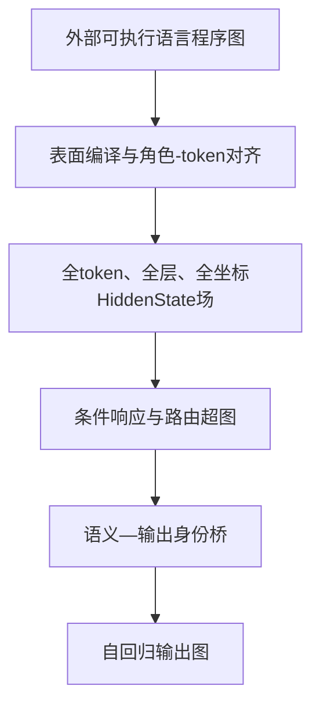

提问：

语言本身极为复杂，有大量的网络关联结构，比如苹果和不同水果的复用和差分，水果-植物-食物-物体等层次结构，各种功能的语法体系。
这些必然都会在 HiddenState中用某种差分和复用体现出来，  所以正确的方式，是一边完成语言模式图，  一边完成编码机制是如何相对编码，如何路由，如何差分复用的。

所以要破解语言的编码机制，要完成两个工作，一个是持续的完成语言模式族的图谱，一个是完成对应的编码机制，在深度神经中的脉络是什么样的。基于以上两者完成底层的机制破解，以及对应的数学理论。
当前的难点，在于无法找到某个token的定义，所有token都是基于上下文条件化的，而且关键参数不是top-k这种算法提取，需要基于词嵌入-hiddenstate场-logic 的多维度分析。

请分析以上思路是否正确，有什么问题，有哪些需要补充，系统的方案是什么样的


回答：


## 总判断

这个方向总体正确，而且比继续寻找“某个 token 对应某个固定向量或坐标”更接近真正的语言编码问题。

但“两项工作”还不够。更完整的结构应当是：

[
\boxed{
\text{三层图谱}
+
\text{两座桥}
+
\text{一套证据账本}
}
]

三层图谱是：

1. 外部可执行语言程序图；
2. 内部 HiddenState 条件响应图；
3. 输出身份与自回归生成图。

两座桥是：

1. 外部语言操作如何编译成内部状态转移；
2. 上游语义状态如何形成晚期输出身份。

否则很容易出现这样的结果：

> 语言图谱越来越大，HiddenState热力图也越来越大，但两者没有形成可预测、可组合、可干预的机制对应。

---

# 一、你的思路正确在哪里

## 1. 语言确实不能被还原成孤立token词典

“苹果”在不同上下文中可以是：

* “我喜欢吃苹果”中的受事；
* “苹果属于水果”中的类别节点；
* “苹果发布新芯片”中的公司；
* “假设苹果是一种工具”中的反事实节点；
* “他吃了它”中被代词重新绑定的对象。

因此：

[
\boxed{
\text{物理token}
\neq
\text{词汇对象}
\neq
\text{语义角色}
\neq
\text{上下文功能状态}
}
]

现代上下文模型本来就让同一词的表示依赖整个输入环境，而不是为每个词保存一个最终不变定义。[BERT原始论文](https://arxiv.org/pdf/1810.04805)

所以，不应该继续寻找：

[
\operatorname{Meaning}(\text{苹果})
=================================

H_{q,t,d}
]

而应寻找：

[
\operatorname{Meaning}
(\text{苹果}\mid x,\rho,Q,W)
]

即“苹果在当前上下文、角色、查询和世界中的功能状态”。

---

## 2. 相对编码与差分是正确入口

一个绝对HiddenState混合了：

* 词汇身份；
* 语义角色；
* 句法位置；
* 当前查询；
* 语言；
* 世界知识；
* 输出协议；
* 整个上下文。

配对操作的响应：

[
\mathfrak R_{\theta,o,q}(x)
===========================

\Pi_oH_q(o(x))-H_q(x)
]

至少可以把问题改写为：

> 当只改变某个登记语言操作时，整个HiddenState场怎样响应？

这比问“哪个坐标表示否定”“哪个坐标表示苹果”更接近机制。

不过差分仍然可能混入词面、长度、位置和token数量，所以必须有角色及token对齐映射 (\Pi_o)。

---

## 3. 复用不一定是“相同向量”，而可能是“相同运行规则”

真正的复用可能表现为：

* 相同基态守卫；
* 相同源—目标传动拓扑；
* 相同局部状态转移规则；
* 相同操作组合表；
* 相同未来行为等价类；
* 相同输出身份形成过程。

因此：

[
\text{复用}
\neq
\mathfrak R_1=\mathfrak R_2
]

更合理的是：

[
\boxed{
\mathcal T_{o,c}(H_1)
\sim_{\mathrm{future}}
\mathcal T_{o,c}(H_2)
}
]

即两个状态绝对坐标不同，但面对相同合法操作时，产生相似的未来状态变化和输出行为。

这很可能才是跨词汇、跨表面和跨语言的复用单位。

---

## 4. HiddenState优先是合理路线

如果模型的行为受到某个语言区分影响，那么这个影响最终必然经过某些内部状态传到输出。

但是，这不等于该语言结构必然：

* 长期显式保存在某个token；
* 对应固定向量；
* 对应单个坐标；
* 在所有上下文中位于同一层；
* 可以被线性方法直接读出。

它可能只在查询出现后临时形成，也可能跨多个token和层短暂存在。

所以应收紧为：

[
\boxed{
\text{语言规律必然约束模型计算}
}
]

但不能写成：

[
\boxed{
\text{每个语言规律必然具有稳定显式HiddenState变量}
}
]

HiddenState全场仍然是目前最好的主观测面，只是研究对象必须包含全部层、全部相关token、角色和输出时间线。

---

# 二、需要补充的核心修正

## 1. 外部语言图不等于模型内部图

这是最大的理论边界：

[
\boxed{
\mathcal G_{\mathrm{language}}
\not\cong
\mathcal G_{\mathrm{HiddenState}}
\quad\text{未被预设}
}
]

“苹果—水果—食物—物体”是研究者建立的本体。模型内部可能使用：

* 属性相似；
* 原型结构；
* 语言共现；
* 查询时临时推导；
* 多个重叠分类系统；
* 完全不同但行为等价的实现。

所以外部语言图不是“模型必须照抄的真实内部图”，而是：

> 用来生成操作、反事实、查询和可证伪预测的实验程序。

我们真正寻找的不是图同构，而是行为保持的近似编译关系：

[
\boxed{
\Psi_\theta(o(\mathcal L))
\approx
T_{o,c,H}
\bigl(\Psi_\theta(\mathcal L)\bigr)
}
]

这与“因果抽象”的思想接近：外部可解释变量与神经状态的对应，需要通过交换干预验证，而不能只靠相关性对齐。[Causal Abstractions of Neural Networks](https://proceedings.neurips.cc/paper/2021/hash/4f5c422f4d49a5a807eda27434231040-Abstract.html)

---

## 2. 语言图不应只是知识图，而应是“可执行语言程序图”

语言至少包含以下几个不同子系统：

| 外部子图    | 例子             | 内部需要研究什么    |
| ------- | -------------- | ----------- |
| 实体—类型图  | 苹果是一种水果        | 类型操作响应、多跳路径 |
| 属性关系图   | 苹果是甜的          | 对象—属性绑定     |
| 部分—整体图  | 果实属于苹果树的一部分    | 关系类型差分      |
| 事件角色图   | 我吃苹果           | 施事、动作、受事路由  |
| 态度/作用域图 | 我喜欢吃苹果         | 外层态度与内层事件   |
| 逻辑操作图   | 否定、条件、量词       | 作用域与组合      |
| 话语状态图   | 第一次记录后被第二次更新   | 写入、覆盖、当前状态  |
| 表面实现图   | 主动/被动、释义、翻译    | 词面差分与语义不变部分 |
| 查询图     | 问施事、受事、祖先节点    | 查询选择与读出路由   |
| 输出图     | 候选、自由生成、多token | 答案身份和生成时钟   |

所以更合适的对象是：

[
\boxed{
\mathcal L=
(W,V,E,\tau,\rho,\kappa,U,\mathcal O,\mathcal Q,A,\Sigma,\Omega)
}
]

其中：

* (W)：自然、临时、伪词、反事实世界；
* (V,E)：实体、事件和类型化关系；
* (\tau)：类型约束；
* (\rho)：语义角色；
* (\kappa)：作用域和绑定；
* (U)：更新状态；
* (\mathcal O)：合法操作；
* (\mathcal Q)：查询；
* (A)：抽象答案身份；
* (\Sigma)：语言和表面实现；
* (\Omega)：输出合同。

---

## 3. “logic”必须定义成可执行操作，而不是静态标签

不能先给样本贴上“否定”“因果”“层次推理”标签，然后去寻找相应坐标。

更严格的logic是：

[
o:
W_{\tau_{\mathrm{in}}}
\rightharpoonup
W_{\tau_{\mathrm{out}}}
]

[
Q:W\rightarrow A
]

即：

1. 当前世界处于某个状态；
2. 操作 (o) 改变状态；
3. 查询 (Q) 从更新后的状态计算答案；
4. 合法操作具有类型和作用域约束；
5. 多操作是否可组合，需要通过未见组合检验。

因此：

[
\boxed{
\text{Logic}
============

\text{合法操作}
+
\text{状态更新}
+
\text{组合规则}
+
\text{查询结果}
}
]

它不是某一个HiddenState坐标，也不是一种静态语义标签。

---

# 三、如何解决“token没有固定定义”

不要为token寻找一个固定定义，而应建立三层身份。

| 身份层  | 对象                    | 作用     |
| ---- | --------------------- | ------ |
| 物理身份 | token ID、位置、embedding | 模型实际输入 |
| 程序身份 | 实体、事件、角色、作用域、查询       | 外部语言功能 |
| 功能身份 | 面对操作时的未来响应等价类         | 内部机制定义 |

一个合法的内部状态实例应写为：

[
z=
(\theta,q,t,\rho,x,W,Q,\Sigma,H_q)
]

不是单独的：

[
z=(\text{token ID})
]

## 功能定义

两个上下文token实例属于同一种功能状态，当且仅当它们面对登记操作时具有近似相同的未来反应：

[
\boxed{
z\sim z'
\iff
\forall o,Q,c,\quad
Q\bigl(\operatorname{Future}(z,o,c)\bigr)
\approx
Q\bigl(\operatorname{Future}(z',o,c)\bigr)
}
]

因此，“苹果”“apple”或某个伪词节点即使HiddenState坐标完全不同，只要面对同类关系操作时具有相同未来状态转移，就可能属于同一功能类型。

可以进一步把一个词的意义定义成上下文功能状态族：

[
\boxed{
\mathcal M(w)
=============

\left{
[H_q(x,t)]*{\sim*{\mathcal O,\mathcal Q}}:
w\text{出现在}x
\right}
}
]

所以词义不是一个点，而是一个由语境、角色和操作组织的状态族。

这也允许角色绑定是分布式的，而不是一个角色对应一个神经元；分布式角色—填充值绑定在连接主义表示中本来就有成熟的数学先例。[Tensor Product Representations](https://www.sciencedirect.com/science/article/pii/000437029090007M)

---

# 四、修正后的系统架构：三层图谱＋两座桥



## 第一层：外部语言程序图

负责定义：

* 语言中有哪些对象和关系；
* 哪些操作合法；
* 哪些部分改变、哪些必须保持；
* 操作怎样组合；
* 查询应该返回什么；
* 抽象答案身份是什么。

## 第一座桥：表面编译与角色对齐

[
(x,M)
=====

\operatorname{Compile}_{\ell,\sigma,\Omega}(\mathcal L)
]

其中 (M) 保存：

[
\text{程序节点}
\rightarrow
\text{字符跨度}
\rightarrow
\text{物理token集合}
]

这样可以处理：

* 中文连续分词；
* 一个词拆成多个token；
* 主动/被动词序变化；
* 中英文token数量不同；
* 同一token承担多个程序角色。

机器编译负责唯一性和跨度检查，人类盲评负责自然度、歧义和跨语言等义性。

## 第二层：内部HiddenState条件响应图

完整观测场：

[
\mathcal F_\theta(x)
====================

\left{
E_{t,d}(x),
H_{q,t,d}(x)
\right}_{q,t,d}
]

语言操作响应：

[
\boxed{
\mathfrak R_{\theta,o,c,q}(x)
=============================

## \Pi_{o,c,q}H_q(o(x))

H_q(x)
}
]

最终寻找的不是固定方向，而是条件因果超边：

[
\boxed{
e:
H_q[S_e]
\xrightarrow{,g_e(H_q,c),}
\Delta H_{q'}[T_e]
}
]

它允许数据裁决出：

* 单坐标条件齿轮；
* 少量坐标联合超边；
* 多源—多目标响应；
* 稠密分布式非线性场；
* 只存在功能等价而无稳定物理坐标。

## 第二座桥：语义状态到输出身份

[
\boxed{
\mathcal B_{\mathrm{sem}\rightarrow\mathrm{id}}:
(H_q,\mathfrak R_q,Q,y_{<t},c)
\longmapsto
Z_t^{\mathrm{identity}}
}
]

这是目前最大的缺口。

C628的晚期精确供体写入说明晚期输出状态能够强制控制答案，但它绕过了自然桥梁，并没有解释上游语义状态如何形成答案身份。

## 第三层：自回归输出图

[
p_\theta(y_{1:T}\mid x)
=======================

\prod_{t=1}^{T}
\mathcal O_{\theta,\Omega}
\left(
Z_t^{\mathrm{identity}},
H_{L,t-1},
y_{<t}
\right)_{y_t}
]

它必须区分：

* 抽象答案身份；
* 具体语言词面；
* 首次分叉token；
* 后续生成历史；
* 单token与多token答案。

---

# 五、两个例子怎样落到双图谱上

## 例一：苹果—水果—植物、食物、物体

它不是一条简单的统一“属于”链，而是多关系图：

[
\operatorname{is_a}(\text{苹果果实},\text{水果})
]

[
\operatorname{edible_as}(\text{苹果果实},\text{食物})
]

[
\operatorname{part_of}(\text{苹果果实},\text{苹果树})
]

[
\operatorname{is_a}(\text{苹果树},\text{植物})
]

[
\operatorname{is_a}(\text{具体苹果},\text{物理物体})
]

因此，“水果→植物”和“水果→食物”不是同一种边。

需要分别研究：

* `is_a`是否有跨实体复用；
* `part_of`与`is_a`是否具有不同响应；
* 自然词和伪词是否调用同类关系路由；
* 反事实世界是否切换了基态守卫；
* 多跳时是否根据新中间状态重新选择下一步响应。

顺序路径应写为：

[
\widehat H_{k+1}
================

\widehat H_k+
\widehat{\mathfrak R}_{r_k}
(\widehat H_k,W,Q)
]

而不是把一个“向上向量”重复相加。

## 例二：我喜欢吃苹果

外部程序为：

[
e_{\mathrm{eat}}
================

\operatorname{Eat}
(\operatorname{Agent}=\text{我},
\operatorname{Patient}=\text{苹果})
]

[
p=
\operatorname{Like}
(\operatorname{Experiencer}=\text{我},
\operatorname{Content}=e_{\mathrm{eat}})
]

它至少包含：

* 外层体验者；
* 内层施事；
* 内层受事；
* 外层态度；
* 事件嵌套；
* 内外否定；
* 主被动；
* 指代；
* 更新顺序；
* 查询选择。

需要分别研究：

* 换受事时，响应如何从受事位置传播到事件和查询；
* 主动/被动改变位置但保持角色时，哪些功能关系保持；
* 外层否定和内层否定是否调用不同响应；
* “我”同时承担两个角色时，内部是共享还是分离；
* 原子操作能否预测未见的 (AB)、(BA) 和三操作组合；
* 上游事件状态怎样形成最后的答案身份。

这些都是未来检验对象，不是已有实验结果。

---

# 六、主要问题与硬伤

## 1. “语言结构必然显式存在于HiddenState”过强

正确的是：

> 它必须以某种方式影响模型状态和输出。

不保证：

* 固定保存在某层；
* 位于指定token；
* 可以线性读取；
* 对应单坐标；
* 不依赖查询；
* 跨语言使用相同物理坐标。

## 2. 外部本体可能强加给模型

解决方法不是只建立一个语言图，而是冻结多个竞争解释：

* `is_a`；
* 属性相似；
* 部分—整体；
* 功能分类；
* 表面拓扑；
* 临时形式路由。

然后让未见预测和干预结果判断哪个外部抽象更接近模型。

## 3. 差分不等于语义操作

差分中仍可能包含：

* 词汇变化；
* 位置；
* token数量；
* 长度；
* 查询；
* 输出格式。

必须加入：

* 同语义不同表面；
* 同表面不同语义；
* 错操作；
* 错角色；
* 等长度错误路径；
* 词汇、表面、世界整组留出。

## 4. 预测图不等于因果图

成功的probe或回归只说明信息可读取，并不证明模型使用了它。探针研究本身也长期强调相关性与模型实际使用之间的差距。[Probing Classifiers综述](https://direct.mit.edu/coli/article/48/1/207/107571/Probing-Classifiers-Promises-Shortcomings-and)

证据必须逐级升级：

[
\text{观察}
\rightarrow
\text{未见预测}
\rightarrow
\text{稳定传动}
\rightarrow
\text{写入充分}
\rightarrow
\text{删除必要}
\rightarrow
\text{独立特异救援}
]

## 5. HiddenState不能唯一恢复层内部实现

如果HiddenState状态转移、组合和输出因果全部闭合，就已经得到功能级语言状态机。

但不同Attention/MLP实现可能产生相同状态轨迹，所以HiddenState不能证明“唯一物理实现”。

因此暂不全面分析Attention/MLP是合理的；只有某条HiddenState传动边完成因果闭合后，才值得对该窄路径定点回查。

## 6. 组合爆炸

解决方法不是收集所有句子，而是建立程序生成器：

[
f=
(\tau_{\mathrm{in}},\rho,o,\kappa,W,
\tau_{\mathrm{out}},Q)
]

研究单位是语言程序族，而不是单句。

同时维护：

* 持续扩展的版本化总atlas；
* 每个Campaign运行前冻结的atlas快照；
* 揭盲后只能增加新版本，不能修改旧lockbox。

---

# 七、系统实施方案

## 大阶段A：语言程序atlas与行为接口

一次性建立核心程序族：

* 实体、类型、属性；
* 部分—整体、空间、时间、比较；
* 事件与语义角色；
* 态度、否定、量词、条件；
* 指代、更新、修正；
* 自然、临时、伪词和反事实世界；
* 中文、英文、规范表面和多套人工释义；
* 候选和自由生成输出协议。

产物：

* 可执行程序生成器；
* 字符—token—角色映射；
* 人类自然度与语义唯一性账本；
* 每个模型特异的行为资格矩阵。

本阶段不作HiddenState机制结论。

## 大阶段B：全场与功能状态atlas

在行为合格对象上保存：

[
{E_{t,d},H_{q,t,d}}_{q,t,d}
]

并行分析：

* 配对差分；
* ANOVA/Möbius交互；
* 基态守卫；
* switching dynamics；
* SINDy；
* 条件HSIC/RKHS；
* 层间变点；
* 功能状态等价；
* 单坐标、稀疏坐标组和稠密场竞争模型。

正式留出必须按整个词汇、表面、世界、拓扑和答案编码划分。

产物是预测响应图，不自动称为因果机制。

## 大阶段C：传动、路由与组合

统一执行：

* BF16实际剂量审计；
* 同剂量与no-op重复；
* norm前后和保均值/范数控制；
* 单坐标与Hadamard组合干预；
* 多剂量有限响应面；
* JVP/VJP；
* 自然语言响应路径积分；
* 因果超图恢复；
* 未见AB、BA、ABC及图路径滚动；
* 错中间状态、错操作和等范数控制。

这一阶段必须分类得到：

* 稳定单坐标齿轮；
* 条件超边；
* 稠密非线性传动；
* 数值不可识别；
* 只有预测而没有传动；
* 单步有效但不能组合。

## 大阶段D：语义—输出桥与跨模型理论裁决

分别冻结：

* 同语义、不同输出码；
* 不同语义、相同输出码；
* 首token相同、后续分叉；
* 不同长度答案；
* 跨词汇、表面和世界的独立供体。

检验：

* 上游操作是否改变晚期身份；
* 阻断身份是否阻断上游效应；
* 独立正确身份是否可以救援；
* 错身份、错关系、错层和错时钟是否不能救援；
* 完整多token自由生成；
* 各模型自己的接口资格；
* 跨模型相对层深、角色拓扑和操作组合表。

---

# 八、统一数据结构与证据账本

每条记录至少保存：

```text
program_id
world_id
operation_id
query_id
answer_identity
language
surface
role_char_spans
physical_token_map
behavior_candidate
behavior_generation
embedding_and_hidden_field
response_pair_id
intervention_id
output_clock
evidence_level
```

每条外部关系与内部边都有证据等级：

| 等级 | 含义               |
| -- | ---------------- |
| E0 | 外部程序与人类语义有效      |
| E1 | 模型行为合格           |
| E2 | HiddenState响应可预测 |
| E3 | 局部传动稳定           |
| E4 | 未见程序组合成立         |
| E5 | 输出充分性、必要性与特异救援   |
| E6 | 跨语言/跨模型功能对应      |

这样不会再把“看到热力图”“NRMSE改善”“一次状态写入成功”混成同一种机制证据。

---

# 九、RDC理论的统一公式

理论名称继续保持：

> 条件化输出场闭合理论

组织原则继续保持：

> 复用—差分—条件化（RDC）

统一主线可以写成：

[
\boxed{
\begin{aligned}
x&=\mathcal C_{\ell,\sigma,\Omega}(\mathcal L),\
\mathfrak R_{o,q}
&=
\Pi_oH_q(o(x))-H_q(x),\
\widehat{\mathfrak R}*{o,q'}
&=
\mathcal C_R!\left(
\mathcal U(H_q,\mathfrak R*{o,q}),
\mathcal D_{o,c}(H_q,\mathfrak R_{o,q});
g_{o,c}(H_q,\mathcal L)
\right),\
Z_t^{identity}
&=
\mathcal B_{\mathrm{sem}\rightarrow\mathrm{id}}
\left(
\Phi_{\ge q}
(H_q+\widehat{\mathfrak R}*{o,q}),
Q,y*{<t},c
\right),\
p_\theta(y_{1:T}\mid o(x))
&=
\prod_{t=1}^{T}
\mathcal O_{\theta,\Omega}
\left(
Z_t^{identity},y_{<t}
\right)_{y_t}.
\end{aligned}
}
]

目前未知的核心对象仍然是：

[
\mathcal U,\quad
\mathcal D,\quad
g,\quad
\mathcal C_R,\quad
\mathcal B_{\mathrm{sem}\rightarrow\mathrm{id}}
]

所以这仍是研究框架，不是已经闭合的经验定律。

---

# 十、最终结论

你的双主线应保留，但应把目标从：

[
\text{完成语言图}
+
\text{为每个token寻找HiddenState定义}
]

修正为：

[
\boxed{
\begin{aligned}
\text{破解语言编码机制}
={}&
\text{构造可执行、版本化的语言程序族图}\
&+\text{识别上下文化HiddenState条件响应超图}\
&+\text{验证二者之间的行为保持编译关系}\
&+\text{破解语义状态到输出身份的自然桥梁}
\end{aligned}
}
]

最重要的新定义是：

[
\boxed{
\text{一个token的意义}
=================

\text{它在特定上下文和角色下，
面对一组合法操作时的未来响应指纹}
}
]

而不是它的embedding、某层向量或Top-K坐标。

这条路线能够持续积累，而且每次增加新的语言族，都可以同时为外部程序图、内部响应图和证据账本增加一块拼图。它不能保证最终一定得到“单坐标精密齿轮”；但它可以严格区分最终机制究竟是：

* 单坐标条件齿轮；
* 少量坐标联合超齿轮；
* 稠密分布式非线性场；
* 或只有功能等价、没有稳定物理坐标对应。

这正是当前最有可能把大量局部发现组织成完整语言编码机制的主研究范式。
