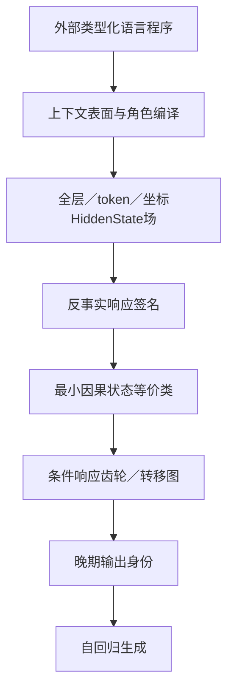

提问：

当前的核心问题在于两点：
1，语言本身就有极为复杂的知识网络，比如苹果-水果-食物-物体 的层级结构，颜色大小等属性，目前缺少一种数学化的方式，能同时包含这些特性。
2，LLM中无法找到最小作用量，或者某种不变性，缺少基础计算元素，只能在多层级的海量参数中找规律。
这两者都是大脑极高的可塑性产生的，背后很可能一套东西，现在的问题，每个token都在真实的使用中被反复雕琢，极为特殊，是结果不是本体，LLM大量参数复用，除了自回归这个因素，也很难找到其他唯一性规律，那么怎么找到某种方式，用数学完整的表述出来，

以上分析可能不对，自回归说明，整个语言体系其实都不特殊，不应该对部分进行特殊处理，每个token都使用相同的预测机制，说明 语言本身就是一样的体系， 只是不同token有不同的结构，对部分进行特殊处理，或者制定某种固定的分析模板，可能会得到特殊的结果。
这也是一直把语言看作不同模式的原因，不同模式具有层级结构，比如知识网络，分析推理，语法结构，然后产生了语言能力。

以上分析是否正确，有什么问题，应该如何解决

回答：

你的判断抓住了真正的困难：外部语言不是简单标签集合，内部编码也不是“一个概念对应一个坐标”。但其中有几个需要收紧的地方。

最关键的修正是：

$$
\boxed{
\text{真正应寻找的基础元素，可能不是token、坐标或固定向量，}
\text{而是“在一组语言操作下具有相同未来响应的状态等价类”。}
}
$$

这能同时处理语言网络复杂性、上下文条件化、参数复用和内部表示不唯一。

# 一、哪些判断正确

## 1. 语言不能用单一层级树表示

“苹果—水果—食物—物体”看似是一条层级链，实际上混合了不同关系：

$$
\operatorname{APPLE}^{fruit}
\xrightarrow{\text{subtype-of}}
\operatorname{FRUIT}
$$

$$
\operatorname{APPLE}^{fruit}
\xrightarrow{\text{edible-as}}
\operatorname{FOOD}
$$

$$
\operatorname{APPLE}^{fruit}
\xrightarrow{\text{physical-kind}}
\operatorname{OBJECT}
$$

$$
\operatorname{APPLE}^{fruit}
\xrightarrow{\text{product-of}}
\operatorname{APPLE\_TREE}
$$

此外还有：

* 颜色：不是固定值，而是绿色、红色、黄色等条件分布；
* 大小：依赖比较对象；
* 成熟度：随时间变化；
* “苹果”：可能指水果、树、品牌或名称；
* 自然知识与当前prompt定义可能冲突；
* 同一个实体在食物、植物学、交易等场景中承担不同功能。

因此外部语言知识必须至少是：

> 类型化、多关系、带属性、带作用域、带时间、带语境的图或超图。

单纯的知识树、静态向量或无类型知识图都不够。

## 2. token确实不是语义本体

token只是分词器建立的计算边界。它更像一个“地址”，而不是一个完整概念。

同一个`apple`在不同句子中：

* token embedding可能相同；
* HiddenState却会因角色、句法、上下文、问题和任务发生变化。

因此更合理的内部节点是：

$$
v=
(
\text{概念},
\text{词义},
\text{词形},
\text{上下文},
\text{角色},
\text{token跨度},
\text{层},
H
)
$$

而不是单独的“apple token”。

## 3. LLM确实存在严重的表示非唯一性

同一个功能可能由：

* 不同坐标组合；
* 不同层路径；
* 不同冗余子结构；
* 不同模型中的完全不同物理坐标

实现。

所以很难找到：

$$
\text{苹果}\longleftrightarrow\text{唯一坐标}
$$

更可能存在：

$$
\text{苹果在当前语言程序中的功能状态}
\longleftrightarrow
\text{一组可替代的坐标响应联盟}
$$

这也是为什么Top-K经常失败：最大的坐标不一定是必要坐标，许多较小坐标可能共同形成稳定作用。

## 4. 外部语言结构与内部机制必须同时研究

仅研究外部知识图，会不知道模型如何实现。

仅研究HiddenState，会陷入：

> 先看到某个激活规律，再事后给它一个语义名字。

正确路线确实是：

$$
\boxed{
\text{外部语言程序图}
\leftrightarrow
\text{内部HiddenState响应图}
}
$$

关键是找到二者之间可前瞻、可干预的映射。

---

# 二、需要修正的地方

## 1. 两种困难不能都归因于“大脑可塑性”

语言结构复杂，主要因为：

* 世界本身具有复杂关系；
* 人类需要描述事件、时间、因果、态度和反事实；
* 同一对象可以在不同任务中采用不同分类；
* 语言通过长期社会使用形成了多义性和习惯结构。

这不完全是大脑可塑性造成的。

LLM在训练期间会通过大量样本调整权重；但模型冻结后，普通推理过程中的HiddenState变化是上下文计算，不是权重继续发生可塑性改变。

因此应该区分：

$$
\text{训练形成的参数复用}
\ne
\text{推理中的上下文状态变化}
\ne
\text{生物大脑的持续突触可塑性}
$$

它们可能具有相似的分布式特征，但不能假定背后是同一物理机制。

## 2. 不应预设存在“最小作用量”

物理学中的最小作用量来自特定的变分结构。Transformer的一次前向是训练后函数的有限复合：

$$
H_{q+1}=F_q(H_q)
$$

没有理论保证它等价于：

$$
\delta S=0
$$

训练损失也不能直接被视为推理时的作用量。

因此当前更值得寻找的不是“最小作用量”，而是三种更弱、也更可验证的对象：

1. 最小充分预测状态；
2. 最小因果响应等价类；
3. 最短描述的条件转移图。

它们都能用现有数学严格定义。

## 3. 唯一性可能不是正确目标

由于残差流具有冗余和表示非唯一性，一个功能可能没有唯一物理实现。

因此真正可期待的不变量不是：

* 某个固定坐标；
* 某个固定方向；
* 某个固定HiddenState向量。

更可能是：

* 相同的角色关系；
* 相同的操作—响应结构；
* 相同的因果顺序；
* 相同的输出后果；
* 在坐标重参数化下保持的功能等价类。

换句话说：

$$
\boxed{
\text{物理坐标可以变化，功能响应关系保持不变}
}
$$

## 4. “完整数学描述”不一定是一条公式

语言至少包含四个层次：

1. 外部概念和世界关系；
2. 语言表面编译；
3. 内部状态动力学；
4. 输出身份与自回归生成。

试图用一个简单代数或一个向量空间同时表示全部层次，很可能再次过度压缩。

更合理的是一个分层数学系统，并定义各层之间的映射。

---

# 三、外部语言应该怎样数学化

建议把一个语言对象写成类型化程序：

$$
\boxed{
\mathcal L=
(C,Z,G_\tau,A,\rho,\kappa,\mathbf o,\ell,\sigma,Q,\Omega)
}
$$

其中：

* \(C\)：概念；
* \(Z\)：词义和当前世界状态；
* \(G_\tau=(V,E_\tau)\)：类型化关系图；
* \(A\)：属性及其取值条件；
* \(\rho\)：施事、受事、体验者等角色；
* \(\kappa\)：否定、态度、量词和更新的作用域；
* \(\mathbf o=(o_1,\ldots,o_n)\)：操作序列；
* \(\ell\)：语言；
* \(\sigma\)：表面表达；
* \(Q\)：查询；
* \(\Omega\)：候选、自由生成和答案解析协议。

## “我喜欢吃苹果”的外部程序

$$
\operatorname{LIKE}
\left(
\operatorname{experiencer}=I,\;
\operatorname{content}=
\operatorname{EAT}
(
\operatorname{agent}=I,\;
\operatorname{patient}=\operatorname{APPLE}^{fruit}
)
\right)
$$

这里同时包含：

* 外层喜欢事件；
* 内层吃事件；
* 两个“I”的共指；
* `apple`的水果词义；
* 体验者、施事和受事；
* 主动/被动变化；
* 内外否定的不同作用域。

例如：

* “我不喜欢吃苹果”：否定外层喜欢；
* “我喜欢不吃苹果”：否定内层吃；
* “苹果被我喜欢吃”：语态变化但事件角色尽量保持；
* “我曾喜欢吃苹果”：增加时间条件。

这些不是字符串变化，而是外部程序图的不同操作。

## 属性也不能只存成固定键值

苹果的颜色更适合表示为条件分布：

$$
P(
\operatorname{color}
\mid
\operatorname{APPLE}^{fruit},
\operatorname{variety},
\operatorname{ripeness},
\operatorname{lighting}
)
$$

大小应表示成关系：

$$
\operatorname{larger\_than}
(\operatorname{apple}_1,\operatorname{apple}_2;c)
$$

而不是一个脱离参照系的固定“大/小”标签。

---

# 四、内部最小计算元素应该如何重新定义

## 1. 不把token或坐标当作本体

设某一层的状态为：

$$
h=H_{q,t,:}(x)
$$

给定一组合法语言操作 \(\mathcal O\) 和观察量 \(\mathcal Q\)，定义这个状态的“反事实响应签名”：

$$
\boxed{
\Sigma(h)
=
\left\{
P(
\Delta H_{>q},Y
\mid
\operatorname{do}(o),h,c
)
\right\}_{o\in\mathcal O,c\in\mathcal C}
}
$$

通俗地说：

> 不问“这个状态长什么样”，而问“对它执行各种语言操作后，它会怎样反应”。

例如两个内部状态的坐标值完全不同，但在下列所有测试中结果一致：

* 查询它是不是水果；
* 翻译成法语；
* 加入否定；
* 改变施事；
* 沿知识图向上走一跳；
* 删除某个候选答案；
* 继续自由生成。

那么从当前研究目标看，它们可能是同一个功能状态。

## 2. 定义响应等价类

$$
h\sim_{\mathcal O,\mathcal Q} h'
$$

当且仅当：

$$
\forall o\in\mathcal O,\forall Q\in\mathcal Q,\quad
d_Q
\left(
\Delta_{o,Q}(h),
\Delta_{o,Q}(h')
\right)
\le\varepsilon
$$

于是内部最小状态空间不是原始HiddenState，而是商空间：

$$
\boxed{
\mathcal S_\theta
=
\mathcal H_\theta/
\sim_{\mathcal O,\mathcal Q}
}
$$

这个商空间把大量物理坐标不同、但未来功能相同的状态合并起来。

这可能就是当前一直缺少的“基础计算元素”：

> 一个基础元素不是神经元，而是一类具有相同反事实未来的内部状态。

它接近最小因果状态、预测状态和概率双模拟，而不是Top-K特征。

## 3. 定义条件齿轮

在这些状态等价类之间，语言操作形成条件转移：

$$
[s]
\xrightarrow{o,c}
[s']
$$

物理实现可以写成响应超边：

$$
e=(S_e,T_e,g_e,\Psi_e)
$$

当：

$$
g_e(H,\mathcal L,o,q,r,\alpha,t)=1
$$

时：

$$
\Delta H_{q',T_e}
=
\Psi_e(H_{q,S_e},o,\alpha)
$$

其中：

* \(S_e\)：源坐标联盟；
* \(T_e\)：目标坐标联盟；
* \(g_e\)：基态、角色、语言、操作、剂量和时间条件；
* \(\Psi_e\)：实际传动规律。

单坐标齿轮只是：

$$
|S_e|=1
$$

目前不能预设它一定成立。

---

# 五、连接外部语言图和内部状态图

需要寻找一个映射：

$$
\Phi_\theta:
\mathcal L
\rightarrow
\mathcal S_\theta
$$

它不要求相同概念永远映射到相同向量，而要求外部操作和内部转移近似交换：

$$
\boxed{
\Phi_\theta(o\mathcal L)
\approx
T_{\theta,o,\Phi_\theta(\mathcal L)}
\left(
\Phi_\theta(\mathcal L)
\right)
}
$$

这就是更合适的不变性。

例如：

* 中文“苹果”；
* 英文`apple`；
* 法文`pomme`；

原始token、坐标和轨迹可以完全不同。

但如果它们表达同一个水果词义，那么在登记操作下应保持关系：

* 都能回答“是一种水果”；
* 都能参与“吃”的受事角色；
* 都能在翻译操作中转到正确目标词；
* 都能沿相同的知识关系进行查询；
* 都能与香蕉保持相似的类别关系和不同的词汇身份。

所以跨语言真正应寻找的是：

$$
A_{\ell\to\ell'}
T_o^{(\ell)}
\approx
T_o^{(\ell')}
A_{\ell\to\ell'}
$$

这里 \(A\) 对齐的是功能状态和关系拓扑，而不是坐标编号。

---

# 六、当前理论的核心更新

理论名称仍为：

> 条件化输出场闭合理论

组织原则仍为：

> 复用—差分—条件化（RDC）

现在可以把内部演化写成：

$$
\boxed{
\Delta H_{q\to q'}
=
\mathcal C_{q\to q'}
\left(
\mathcal U_{q\to q'}(H_{\le q}),
\mathcal D_{\mathcal L,q\to q'}(H_{\le q});
g_{\mathcal L,q}(H_{\le q})
\right)
+\varepsilon
}
$$

其中：

* \(\mathcal U\)：不同语言程序广泛共享的网络动力学；
* \(\mathcal D\)：具体概念、关系、角色和作用域带来的条件差分；
* \(g\)：当前基态选择哪些局部响应；
* \(\mathcal C\)：把共享动力学和类型差分装配起来。

在此基础上加入最小功能状态：

$$
S_q=[H_q]_{\sim_{\mathcal O,\mathcal Q}}
$$

以及输出身份：

$$
Z_t^{identity}
=
\mathcal G_{\rm gen}
(S_{\le L}^{(t)},y_{<t},\Omega)
$$

完整生成：

$$
p(y_{1:T}\mid\mathcal L)
=
\prod_{t=1}^{T}
\mathcal O
\left(
S_{L,t-1},
Z_t^{identity},
y_{<t}
\right)_{y_t}
$$

于是全局结构为：

这比寻找“苹果固定向量”更接近真正的语言计算。

---

# 七、怎样真正寻找这种基础元素

可以把整个研究收束成一个主任务：

> 构建“类型化语言程序的最小因果响应自动机”。

## 第一步：建立外部语言程序母图

围绕少数旗舰对象建立完整、类型化的操作空间：

* “我喜欢吃苹果”事件图；
* 苹果多关系知识图；
* 中英法概念—词义—词形映射；
* 自然知识、临时知识、伪词知识和反事实知识；
* 语态、否定、共指、更新、翻译和路径查询。

不追求无限覆盖，先保证每个关系和操作具有明确类型。

## 第二步：采集全场，但按语义单元统计

保存：

$$
\mathcal H(x)=
\{H_{q,t,j}(x)\}_{q,t,j}
$$

同时冻结：

* 角色跨度；
* 表面；
* 词义；
* 世界状态；
* 操作；
  -问题；
* 输出合同。

统计单位必须是新概念、新词汇、新构式，而不是坐标、层和矩阵元素。

## 第三步：建立干预和查询字典

为每种外部操作登记：

* 正确操作；
* 反操作；
* 错关系；
* 错角色；
* 错层；
* 表面不变负控；
* 等义释义；
* 跨语言；
* 自由生成。

这些共同定义 \(\mathcal O,\mathcal Q\)。

## 第四步：计算响应签名

对当前样本内的坐标或坐标联盟，记录：

$$
\Sigma_x(h)
=
(
\Delta H_{q'},
\Delta m,
\Delta Z^{identity},
\Delta Y
)_{o,Q}
$$

这里不再只比较HiddenState距离，而是同时比较：

* 下游状态；
* 候选margin；
* 答案身份；
* 自由生成。

## 第五步：建立近似等价类

定义响应距离：

$$
d_{\mathcal O}(h,h')
=
\sup_{o,Q}
w_{o,Q}
d_Q(
\Delta_{o,Q}(h),
\Delta_{o,Q}(h')
)
$$

然后构造：

$$
[h]_\varepsilon
=
\{h':d_{\mathcal O}(h,h')\le\varepsilon\}
$$

必须使用confirmation和lockbox选择 \(\varepsilon\)，并处理近似关系不满足传递性的问题，例如通过图连通闭包或概率双模拟。

## 第六步：寻找最小转移图

在等价类之间拟合：

$$
[s]\xrightarrow{o,c}[s']
$$

选择能够最短描述未见响应数据的模型：

$$
\boxed{
\mathcal M^*
=
\arg\min_{\mathcal M}
\left[
L(\mathcal M)
+
L(
\text{heldout responses}
\mid
\mathcal M
)
\right]
}
$$

这就是MDL意义上的最小结构。

它比“哪个坐标最大”更接近真正的基础计算语法。

## 第七步：恢复物理坐标实现

得到稳定功能边后，再问它由哪些坐标实现：

* 全坐标中心有限差分；
* Hadamard/Rademacher平衡扰动；
* 多剂量Volterra展开；
* Sobol主效应和交互；
* 坐标联盟Möbius分解；
* 等范数随机、移位、反号和补集控制；
* 删除、必要性和独立救援。

这样把研究顺序改成：

$$
\text{先找功能状态}
\rightarrow
\text{再找物理坐标实现}
$$

而不是先在2560个坐标中盲找语义标签。

## 第八步：完成组合和生成闭合

真正基础元素必须能解释：

$$
T_B(T_A(s))
$$

而不仅是预测单步响应。

还必须完成：

$$
\text{内部状态}
\rightarrow
\text{输出身份}
\rightarrow
\text{完整自由生成}
$$

包括删除、错误救援、正确救援和生成时钟。

---

# 八、哪些数学不变量最值得寻找

不建议继续把主要精力放在固定方向、特征值或单坐标数值上。更值得寻找的是：

## 1. 实体重命名等变性

伪词图中把A、B、C统一替换为X、Y、Z，路径关系应保持。

## 2. 表面释义不变性

外部程序相同而句面不同，内部响应等价类应保持。

## 3. 跨语言关系等变性

概念状态经过语言对齐后，操作转移图应近似交换。

## 4. 角色置换规律

交换施事和受事时，响应应按角色拓扑变化，而不是任意改变。

## 5. 操作顺序残差

比较：

$$
T_BT_A(s)
\quad\text{与}\quad
T_AT_B(s)
$$

但只有识别出独立的 \(T_A,T_B\) 后，才能讨论非交换结构。

## 6. 因果响应等价

原始坐标不同，只要在所有登记操作下产生相同未来响应，就归入同一基础状态。

## 7. 最小描述长度

一个小型条件转移图能否显著压缩大量HiddenState和行为数据，是比“某个指标过门”更强的理论信号。

---

# 九、是否需要新数学

目前不需要新的基础数学。

现有工具已经足够表达这个研究对象：

* 类型论和类型化超图；
* 事件语义和可能世界；
* 条件动力系统；
* 有限状态随机过程；
* 因果干预；
* 信息瓶颈和MDL；
* 概率双模拟；
* 商空间；
* 层丛、纤维和局部运输；
* 响应超图；
* 自回归概率模型。

可能需要创新的是：

> 把这些数学组合成一套适合深度网络语言编码的统一识别方法。

这可能成为新的中层理论，但当前还没有证据要求发明类似微积分或群论级别的新基础数学。

只有出现以下现象，才应重新评估：

1. 自然语言程序中存在稳定的响应等价类；
2. 少数转移规则压缩大量HiddenState数据；
3. 未见操作可以真实顺序组合；
4. 删除和独立救援证明因果必要性；
5. 相同功能结构跨模型保持；
6. 现有类型图、动力系统和因果数学无法简洁表达这些规律。

当前仍是：

$$
\boxed{
\operatorname{Gate}_{new\ math}=0
}
$$

# 最终结论

你的核心判断大体正确：

> token和单个HiddenState都是上下文计算的结果，不是语义本体；语言与网络内部都呈现大量复用、差分和条件化。

但真正需要寻找的“本体”，很可能不是某个更隐蔽的向量或坐标，而是：

$$
\boxed{
\text{由反事实响应定义的最小功能状态}
+
\text{这些状态之间的条件转移规则}
}
$$

因此最有希望的统一路线是：

$$
\boxed{
\text{类型化语言程序}
\rightarrow
\text{全坐标HiddenState场}
\rightarrow
\text{反事实响应签名}
\rightarrow
\text{因果状态等价类}
\rightarrow
\text{条件齿轮转移图}
\rightarrow
\text{输出身份与生成}
}
$$

这条路线不要求每个token具有固定定义，也不要求找到唯一物理坐标；它把“复用”和“非唯一性”本身变成数学对象。只有在这个功能层先获得稳定结构，才有可能继续向下破解单坐标或坐标联盟的物理实现。

你的修正有一半非常关键：**不能把知识、语法、推理、翻译预设成彼此独立的内部模块，再分别寻找各自的HiddenState“指纹”**。这样确实容易把实验模板差异误写成模型机制。

但“所有token使用同一个自回归机制”也不能推出“语言内部没有不同结构”。需要区分三个层次：

$$
\boxed{
\text{统一目标}
\ne
\text{统一计算函数}
\ne
\text{所有上下文中的局部响应都相同}
}
$$

# 一、自回归究竟统一了什么

LLM统一使用：

$$
p_\theta(x_{1:T})
=
\prod_{t=1}^{T}
p_\theta(x_t\mid x_{<t})
$$

这说明所有语言现象最终都通过同一个接口接受训练：

> 根据已有上下文预测下一个token。

在同一层内，所有token位置也共享相同的Attention和MLP参数。因此不存在一个专门只处理苹果、另一个只处理否定的独立网络。

但是，自回归只统一了：

* 训练目标；
* 输入输出接口；
* 参数复用方式。

它没有证明不同上下文产生相同的有效计算。

即使使用同一个层函数：

$$
H_{q+1}=F_{q,\theta}(H_q)
$$

在不同基态上，它的局部响应也可以完全不同：

$$
J_q(H)
=
\left.
\frac{\partial F_{q,\theta}}{\partial H}
\right|_H
$$

通常：

$$
J_q(H_{\text{知识图}})
\ne
J_q(H_{\text{否定}})
\ne
J_q(H_{\text{翻译}})
$$

所以更准确的图景是：

$$
\boxed{
\text{一个统一的全局函数}
+
\text{由当前状态选择的不同局部计算}
}
$$

这正好与“条件齿轮”一致：不是不同语言模式拥有不同机器，而是同一台机器在不同状态区域表现出不同的局部传动结构。

---

# 二、不同“语言模式”究竟是什么

知识、语法、推理、翻译不一定是模型内部的独立模块。更可能是同一个条件预测系统中的不同约束组合。

例如句子：

> Alice ate the apple.

同时包含：

* 词汇身份：Alice、apple；
* 实体关系：Alice与苹果；
* 事件：吃；
* 角色：Alice是施事，苹果是受事；
* 时态：过去；
* 语序：英语主谓宾；
* 世界知识：苹果可以被吃；
* 输出约束：后面更可能出现与该事件一致的token。

这些东西不是先后进入多个互相独立的模式，而是同时约束：

$$
p(x_{t+1}\mid x_{\le t})
$$

因此可以把知识、语法、推理理解成：

> 同一个预测场中反复出现的约束家族。

它们具有可区分的结构，但不一定对应可分离的物理模块。

## 一个重要类比

相同的物理定律可以产生：

* 固体；
* 液体；
* 晶体；
* 湍流。

这些不是四套不同物理定律，而是同一动力系统的不同状态区域和组织形态。

类似地：

$$
\text{语法、知识、推理、翻译}
$$

可能是同一个语言预测场中的不同组织区域，而不是不同发动机。

---

# 三、原来的类型化程序哪里需要修改

原公式：

$$
\mathcal L=
(C,Z,G_\tau,A,\rho,\kappa,\mathbf o,\ell,\sigma,Q,\Omega)
$$

并不是错误的，但容易被误解成：

> 模型内部也分别存在概念模块、属性模块、作用域模块和翻译模块。

更合理的解释是：

> 这些字段只是研究者对同一个语言状态采用的观测坐标，不是对模型内部模块的预设。

就像用温度、压力、密度描述同一团气体，不意味着气体内部存在三个分别处理温度、压力和密度的处理器。

因此建议把外部语言首先统一为：

$$
\boxed{
\mathfrak L=
(\mathcal G,\mathcal O,\Sigma,\mathcal Q)
}
$$

其中：

* \(\mathcal G\)：所有可能的上下文关系状态；
* \(\mathcal O\)：能够作用于这些状态的部分变换；
* \(\Sigma\)：把关系状态序列化成不同语言和表面；
* \(\mathcal Q\)：从状态中读取答案或下一token分布。

## 1. 统一上下文关系状态

令：

$$
G_t=(V_t,E_t,\tau_t,\beta_t,\prec_t,\omega_t)
$$

其中：

* \(V_t\)：token出现、实体、概念、事件、命题；
* \(E_t\)：它们之间的多元关系；
* \(\tau_t\)：关系和节点类型；
* \(\beta_t\)：共指和变量绑定；
* \(\prec_t\)：语序、作用域、时间与更新顺序；
* \(\omega_t\)：当前世界、语境、可信度和条件。

这里不再把属性单独特殊处理。颜色也只是关系：

$$
\operatorname{COLOR}
(
\operatorname{apple},
\operatorname{red};
\operatorname{ripeness},
\operatorname{lighting}
)
$$

语法角色也是关系：

$$
\operatorname{EAT}
(
\operatorname{agent}=\operatorname{Alice},
\operatorname{patient}=\operatorname{apple}
)
$$

知识路径也是关系组合：

$$
\operatorname{APPLE}
\xrightarrow{\mathrm{subtype}}
\operatorname{FRUIT}
\xrightarrow{\mathrm{edible\_category}}
\operatorname{FOOD}
$$

否定是对命题的高阶关系：

$$
\operatorname{NOT}
\left(
\operatorname{EAT}(\operatorname{Alice},\operatorname{apple})
\right)
$$

这样，语法、知识、属性、作用域都进入同一个类型化关系系统，而不是几个分离模式。

## 2. 操作也是统一的关系变换

语言中的变化统一写成部分变换：

$$
o:
\mathcal G_{\operatorname{domain}(o)}
\rightharpoonup
\mathcal G
$$

例如：

* 实体替换；
* 角色交换；
* 添加否定；
* 改变时间；
* 添加事实；
* 删除事实；
* 沿关系路径查询；
* 改变语言表面；
* 改变问题。

“部分变换”意味着不是任何操作都能作用于任何对象。例如否定可以作用于命题，但不能直接作用于没有命题结构的孤立苹果实体。

类型在这里不是特殊模块，而是：

$$
\boxed{\text{规定操作在哪些状态上有定义}}
$$

## 3. 不同语言只是不同序列化

同一关系状态可以写成：

$$
x^{zh}=\Sigma_{zh}(G)
$$

$$
x^{en}=\Sigma_{en}(G)
$$

$$
x^{fr}=\Sigma_{fr}(G)
$$

例如：

* 我吃苹果；
* I eat apples；
* Je mange des pommes。

表面token不同，但它们可能对应相近的事件关系状态。

---

# 四、语言模式应该从“预设类别”改成“变换生成”

过去的研究经常先划分：

* 知识模式；
* 语法模式；
* 作用域模式；
* 翻译模式；
* 推理模式。

然后分别寻找内部特征。

风险是：模板、长度、答案标签、token位置等差异也随模式一起变化，最终发现的可能只是模板指纹。

更好的办法是：

> 不预先把语言分成几个互斥模块，而是从同一个基础上下文出发，施加不同的受控变换。

例如基础状态：

> Alice eats the apple.

可以生成：

| 变换   | 表面结果                         | 保持/改变的关系  |
| ---- | ---------------------------- | --------- |
| 释义   | Alice consumes the apple     | 事件核心尽量保持  |
| 被动   | The apple is eaten by Alice  | 角色保持，语序改变 |
| 角色交换 | The apple eats Alice         | 施事、受事改变   |
| 否定   | Alice does not eat the apple | 添加否定作用域   |
| 翻译   | Alice mange la pomme         | 语言改变      |
| 实体替换 | Alice eats the banana        | 受事身份改变    |
| 时间变化 | Alice ate the apple          | 时间改变      |
| 提问   | What did Alice eat?          | 查询改变      |

这些样本不是七种互不相关的模式，而是同一语言状态空间中的七种变换。

因此外部研究对象可以进一步压缩为：

$$
\boxed{
\text{上下文状态空间}
+
\text{一组类型化变换}
+
\text{查询与序列化}
}
$$

---

# 五、内部机制也应使用统一响应场

模型内部始终运行同一组层函数：

$$
H_{q+1}=F_{q,\theta}(H_q)
$$

不同语言现象不需要预设不同内部算子。真正应测的是同一全局函数在不同基态附近的局部响应：

$$
\mathfrak R_{q,o}(H)
=
F_{q,\theta}(H+\delta_o(H))
-
F_{q,\theta}(H)
$$

如果扰动足够小：

$$
\mathfrak R_{q,o}(H)
\approx
J_q(H)\delta_o(H)
$$

关键在于：

$$
\boxed{
J_q(H)\text{由当前整体状态决定}
}
$$

所以：

* 使用同一套模型参数；
* 使用同一个自回归目标；
* 仍然可以形成不同的局部响应生态位。

因此最统一的内部公式不是“每个模式一个算子”，而是：

$$
\boxed{
H_{q+1}
=
\mathcal U_q(H_q)
+
\mathcal D_q(H_q,\delta)
}
$$

其中：

* \(\mathcal U_q\)：所有语言输入共有的层动力学；
* \(\mathcal D_q\)：当前状态和输入变化产生的条件差分。

如果进一步存在局部齿轮：

$$
\mathcal D_q(H,\delta)
=
\sum_e
g_e(H,\delta)\Psi_e(H,\delta)
$$

其中所有 \(g_e,\Psi_e\) 都属于同一个全局系统，只是根据当前状态选择性激活。

---

# 六、真正应该寻找的不变量

如果不再把知识、语法、翻译当作预设模块，那么研究目标应从：

> 找到“翻译坐标”“否定坐标”“知识图坐标”

改成：

> 找到跨不同表面和任务仍保持的变换—响应关系。

## 1. 表面不变性

相同关系状态的不同释义：

$$
G(x)=G(x')
$$

是否满足：

$$
\Phi(x)\sim_{\mathcal O}\Phi(x')
$$

原始HiddenState不必相同，但未来功能响应应接近。

## 2. 实体重命名等变性

把Alice、apple替换为Mira、vessel，只要关系结构保持，内部转移结构也应对应变换。

## 3. 跨语言等变性

$$
A_{\ell\to\ell'}
T_o^{(\ell)}
\approx
T_o^{(\ell')}
A_{\ell\to\ell'}
$$

不是要求中文和法文使用相同坐标，而是要求操作关系在对齐后保持。

## 4. 角色拓扑保持

主动和被动表达不同，但施事—事件—受事关系应保持。

## 5. 查询变化的条件读出

同一事实状态面对不同问题时，内部事实不一定改变，但输出身份和被读取角色会改变。

这能分离：

$$
\text{世界/事件状态}
\ne
\text{查询路由}
\ne
\text{答案身份}
$$

---

# 七、如何防止“人为模式”制造特殊结果

这是下一轮实验设计最关键的纪律。

## 1. 先拟合全体共享动力学

$$
T_{\rm shared}:
(H_q,q,r,j)
\mapsto H_{q'}
$$

它不读取任何“这是语法题还是知识题”的标签。

## 2. 再加入非语义变量

包括：

* token位置；
* 长度；
  -表面模板；
* 词形；
* 候选位置；
* 答案标签；
* 提示协议。

得到：

$$
T_{\rm nuisance}
$$

## 3. 最后才加入语言关系和变换标签

$$
T_{\rm relational}
$$

正式增量必须是：

$$
\boxed{
G_{\rm relation}
=
S(T_{\rm relational})
-
\max
\left(
S(T_{\rm shared}),
S(T_{\rm nuisance}),
S(T_{\rm shuffled})
\right)
}
$$

其中`shuffled`使用打乱的关系/操作标签。

如果加入“知识”“翻译”“作用域”等标签没有产生未见数据增益，就不应登记为不同内部模式。

## 4. 同一表面表达不同结构

例如尽量使用相近词面，但改变：

* 谁是施事；
* 否定作用于哪里；
* 哪条关系是有效边；
* 当前采用第一次还是第二次更新。

这样排除模板识别。

## 5. 同一结构使用不同表面

使用：

* 多种释义；
* 主动/被动；
* 不同语言；
* 自然词/伪词；
* 不同词序；
* 不同问题表达。

只有跨表面复用的响应才可能是结构规律。

## 6. 不把模式标签当最终对象

模式标签只用于实验分层。最终内部对象应是：

$$
[h]_{\mathcal O}
$$

即在一组操作下具有相同未来响应的状态等价类。

---

# 八、对“语言能力怎样产生”的更准确解释

你的说法：

> 不同模式具有层级结构，比如知识网络、分析推理、语法结构，然后产生语言能力。

可以收紧为：

$$
\boxed{
\text{语言能力来自同一预测系统对大量重叠约束的联合建模}
}
$$

这些约束包括：

* token局部共现；
* 语序；
* 长距离依赖；
* 实体和事件绑定；
* 世界知识；
* 指代；
* 作用域；
* 任务要求；
* 输出协议；
* 已生成历史。

知识、语法、推理等是我们从这个统一系统中观察到的稳定约束家族，不一定是先验独立模块。

还要注意：

$$
\boxed{
\text{自回归本身不足以产生高级语言结构}
}
$$

简单n-gram模型同样是自回归的，但没有现代LLM的复杂能力。

高级能力来自自回归目标与以下因素共同作用：

* 大规模复杂数据；
* 足够容量；
* 上下文注意机制；
* 多层非线性计算；
* 参数共享；
* 优化形成的压缩与复用；
* 后训练和输出协议。

自回归是统一压力，不是全部解释。

---

# 九、对当前理论的修正

理论名称仍保持：

> 条件化输出场闭合理论（RDC）

不需要新增理论名称，但主体应收紧为：

$$
\boxed{
\text{一个统一的条件预测场}
+
\text{共享层动力学}
+
\text{基态选择的局部响应}
+
\text{晚期输出身份}
}
$$

外部统一对象：

$$
\boxed{
\mathfrak L=
(\mathcal G,\mathcal O,\Sigma,\mathcal Q)
}
$$

内部统一对象：

$$
\boxed{
H_{q+1}=F_{q,\theta}(H_q)
}
$$

外部变换到内部响应的目标关系：

$$
\boxed{
\Phi_\theta(\Sigma_\ell(oG))
\approx
T_{\theta,o,\Phi_\theta(\Sigma_\ell(G))}
\left[
\Phi_\theta(\Sigma_\ell(G))
\right]
}
$$

这里：

* 只有一个模型动力系统；
* \(o\)不是模型内部模块，而是研究者登记的外部状态变换；
* \(T\)依赖当前基态，不是固定方向；
* 不要求知识、语法、翻译拥有各自独立坐标。

完整输出仍为：

$$
p_\theta(x_{t+1}\mid x_{\le t})
=
\mathcal O_\theta(H_L(x_{\le t}))
$$

多token生成：

$$
p_\theta(x_{1:T})
=
\prod_t
\mathcal O_\theta
\left(
H_L^{(t)},x_{<t}
\right)_{x_t}
$$

---

# 十、最终判断

你的纠偏是重要的：

$$
\boxed{
\text{不能把研究者划分的语言模式直接当成模型内部模块}
}
$$

但更严格的结论不是“语言内部不存在不同结构”，而是：

$$
\boxed{
\text{不同语言结构可能是同一个自回归条件场中的不同约束组合和局部响应区域}
}
$$

因此下一步不应继续分别寻找：

* 知识坐标；
* 语法坐标；
* 推理坐标；
* 翻译坐标。

而应围绕一个主任务：

> 在同一个统一语言状态空间中，寻找哪些外部关系变换对应稳定、可迁移、可干预的内部响应等价类。

最新最简图景是：

$$
\boxed{
\text{统一关系状态空间}
\rightarrow
\text{统一自回归HiddenState动力学}
\rightarrow
\text{基态条件局部响应}
\rightarrow
\text{功能等价状态}
\rightarrow
\text{输出身份与生成}
}
$$

所以，原来的类型化图谱不应被删除，而应降级为：

> 对统一语言系统进行受控实验时使用的坐标系和变换说明书。

它帮助我们知道“改变了什么”，但不能预先规定模型内部“必须有什么”。
