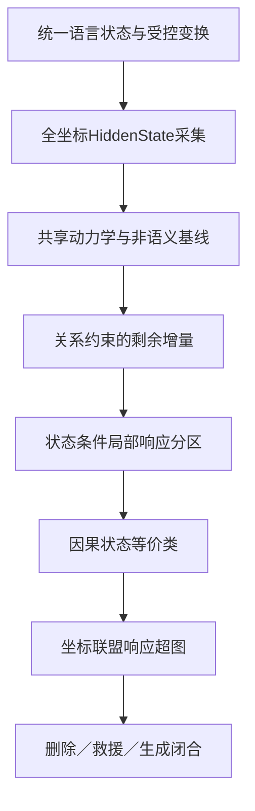

提问：
不同语言结构可能是同一个自回归条件场中的不同约束组合和局部响应区域  
现在的核心目前，就是如何分析LLM内部各种语言对应的约束组合和局部响应区域 是什么，完成尽可能多的语言对应的图谱，    现在最大的问题，应该用什么数学方式或者技巧实现

回答：

目前最适合作为主方法的不是PCA、Top-K或固定差分，而是：

$$
\boxed{
\text{状态条件因果响应系统识别}
=
\text{受控语言变换}
+
\text{共享动力学分离}
+
\text{局部响应分区}
+
\text{因果状态等价类}
+
\text{响应超图}
}
$$

核心思想是：不先寻找“知识区域”“语法区域”，也不直接聚类原始HiddenState；而是问：

> 在什么当前状态下，执行什么语言变换，会稳定产生什么下游HiddenState与输出变化？

这既尊重统一自回归机制，也允许同一个网络在不同基态下产生不同局部响应。

# 一、真正应该建立的数学对象

对一个上下文 \(x\)，保存完整场：

$$
\mathcal H_\theta(x)
=
\{H_{q,t,j}(x)\}_{q,t,j}
$$

其中：

* \(q\)：层或检查点；
* \(t\)：token/角色位置；
* \(j\)：物理激活坐标。

外部不再登记互相分离的“模式”，而登记合法语言变换：

$$
o:\mathcal G\rightharpoonup\mathcal G
$$

例如：

* 实体替换；
* 施事—受事交换；
* 外层否定；
* 内层否定；
* 语态改变；
* 事实更新；
* 路径加深；
* 翻译；
* 释义；
* 查询改变。

对每个操作测量配对响应：

$$
\Delta_o^{q,r}(x)
=
\Pi_oH_{q,r}(o(x))-H_{q,r}(x)
$$

\(\Pi_o\)负责token长度、位置和角色对齐。

但这仍只是“实际差异”。真正的局部因果响应还要在当前样本内扰动：

$$
J_x^{q,r,j\to q',r',k}
=
\frac{
H_{q',r',k}(\operatorname{do}(H_{q,r,j}+\epsilon))
-
H_{q',r',k}(\operatorname{do}(H_{q,r,j}-\epsilon))
}{
2\epsilon
}
$$

于是每个状态都有一个完整响应签名：

$$
\boxed{
\Sigma(H;x)
=
\left\{
\Delta_oH,\;
J_x,\;
\Delta m,\;
\Delta Z^{identity},\;
\Delta Y
\right\}_{o,q,r,Q}
}
$$

它同时记录：

* 自然语言变换后的HiddenState差异；
* 当前样本的局部坐标传动；
* 候选margin变化；
* 答案身份变化；
* 自由生成变化。

**这张响应签名才是建立语言内部图谱的基本材料。**

---

# 二、第一种关键数学：把共享动力学与语言约束分开

Phase 2192最大的教训是：层间变化的大头可能只是Transformer共有动力学。

所以第一步必须拟合一个不读取语言模式标签的共享模型：

$$
\widehat H_{q'}
=
\mathcal U_{q\to q'}
\left(
H_{\le q},
q,r,j,\nu
\right)
$$

其中 \(\nu\) 包含非语义变量：

* token位置；
* 长度；
* 表面模板；
* 词形；
* 提示格式；
* 候选位置；
* 答案标签。

然后语言关系只能解释剩余部分：

$$
R_o
=
H_{q'}-\mathcal U_{q\to q'}(H_{\le q},\nu)
$$

再拟合：

$$
R_o
\approx
\mathcal D_o(H_{\le q},\mathcal G)
$$

因此完整分解为：

$$
\boxed{
H_{q'}
=
\mathcal U_{q\to q'}(H_{\le q},\nu)
+
\mathcal D_o(H_{\le q},\mathcal G)
+
\varepsilon
}
$$

其中：

* \(\mathcal U\)：所有语言共有的“发动机基础运动”；
* \(\mathcal D_o\)：某个关系变换额外产生的条件差分。

## 怎么判断真的存在语言约束

不能只看typed模型胜过copy，而要检验：

$$
I(
H_{q'};o,\mathcal G
\mid
H_{\le q},\nu
)>0
$$

通俗地说：

> 已经知道当前HiddenState、层、位置、长度和模板后，再告诉预测器“这里改变了否定作用域”是否还能预测更多未来状态？

也可以使用最小描述长度：

$$
\Delta L_o
=
L(H_{q'}\mid H_{\le q},\nu)
-
L(H_{q'}\mid H_{\le q},\nu,o,\mathcal G)
$$

只有在未见词汇和未见表面上仍显著缩短描述长度，才能把 \(o\) 登记为真实约束增量。

这一步能防止：

* 模板指纹；
* token位置；
* final norm；
* 词汇身份；
* 固定答案标签

被误写成语言机制。

---

# 三、第二种关键数学：切换动力系统寻找局部响应区域

同一层函数固定：

$$
H_{q+1}=F_q(H_q)
$$

但不同状态附近的局部响应不同：

$$
J_q(H_1)\ne J_q(H_2)
$$

因此不应该拟合一个全球统一算子，而应拟合状态条件化的切换系统：

$$
\boxed{
\Delta H_{q\to q'}
=
\sum_{k=1}^{K}
g_k(H_{\le q},o,\mathcal G)
\Psi_{k,o,q\to q'}(H_{\le q})
+\varepsilon
}
$$

其中：

* \(g_k\)：当前样本是否位于第 \(k\) 个响应区域；
* \(\Psi_k\)：该区域中的局部传动规律；
* 多个 \(g_k\) 可以同时激活，不要求区域互斥。

通俗理解：

> 全部语言都由同一台机器处理，但当前HiddenState决定哪些齿轮咬合。

## 如何发现区域，而不是人为预设模式

不要按“知识/语法/推理”先分组。使用响应驱动的递归分区：

1. 所有样本先放在同一区域；
2. 拟合一个共同响应规律；
3. 找出哪些状态条件能显著解释预测残差；
4. 只有在confirmation上改善MDL或预测时才拆分区域；
5. 若两个区域对所有登记操作产生相同响应，则重新合并；
6. 最后用lockbox验证。

可能用于拆分的条件包括：

* 当前坐标状态；
* 角色；
* 相对层深；
* 是否存在否定；
* 当前关系类型；
* 查询指向哪个角色；
* 当前输出身份竞争；
* 自回归生成时钟。

这得到的是“响应区域”，而不是人工模式类别。

---

# 四、第三种关键数学：用因果状态等价类定义基础元素

直接在原始HiddenState上聚类通常会首先得到：

* 词汇聚类；
* 模板聚类；
* 长度聚类；
* token位置聚类。

更合适的是按未来功能聚类。

定义：

$$
h\sim_{\mathcal O,\mathcal Q}h'
$$

当且仅当：

$$
\forall o\in\mathcal O,\forall Q\in\mathcal Q,
\quad
d_Q(
\Delta_{o,Q}(h),
\Delta_{o,Q}(h')
)
\le\epsilon
$$

也就是：

> 虽然两个HiddenState的坐标值不同，但对所有登记操作都产生近似相同的未来状态和输出响应。

商空间为：

$$
\boxed{
\mathcal S_\theta
=
\mathcal H_\theta/\sim_{\mathcal O,\mathcal Q}
}
$$

这可能比“语义神经元”更接近真正的计算元素。

例如中文“苹果”、英文`apple`和法文`pomme`：

* 词汇坐标可能完全不同；
* 输出token身份也不同；
* 但在水果分类、受事绑定、知识路径等操作下，可能属于相同或对应的功能状态类。

与此同时，它们在“生成目标词”操作下必须进入不同的输出身份类。

因此能够自然分离：

$$
\text{概念功能状态}
\ne
\text{词汇身份状态}
\ne
\text{答案token身份}
$$

## 实际构造算法：分区细化

可以使用类似自动机最小化或概率双模拟的方法：

1. 初始把所有状态放入一个大类；
2. 对每个外部操作 \(o\) 观察未来响应；
3. 如果同一类中的状态在某个操作下产生不同响应，就拆分类；
4. 重复直到所有类在登记操作下都近似稳定；
5. 用全新操作和词汇测试这些类是否保持；
6. 用MDL选择最简单且有预测力的划分。

这比K-means或欧氏距离聚类更适合寻找语言计算结构。

---

# 五、第四种关键数学：响应超图，而不是坐标字典

最终图谱应该是一个条件响应超图。

节点：

$$
v=
([H]_{\sim},q,r,c)
$$

表示：

* 一个功能状态等价类；
* 所在层；
* 角色；
* 当前条件。

边：

$$
e=
(S_e,T_e,o,g_e,\Psi_e,\omega_e)
$$

其中：

* \(S_e\)：源坐标或源状态联盟；
* \(T_e\)：目标坐标、角色或输出状态；
* \(o\)：外部语言变换；
* \(g_e\)：调用条件；
* \(\Psi_e\)：HiddenState传动规律；
* \(\omega_e\)：对输出的作用；
* 同时登记不确定性和证据等级。

运行形式：

$$
g_e(H,o,c)=1
\quad\Longrightarrow\quad
\Delta H_{T_e}
=
\Psi_e(H_{S_e},o,c)
$$

一个操作可能调用多个超边，一个超边也可能被多种语言操作复用。

这能表达：

* 单坐标齿轮；
* 稀疏坐标联盟；
* 稠密分布式响应；
* 多组功能等价实现；
* 同一齿轮被语法、知识和推理共同复用。

---

# 六、第五种关键数学：Möbius反演分离重叠约束

语言约束经常同时发生。例如：

* 变更施事；
* 变更受事；
* 加入否定；
* 改成被动；
* 翻译为法语。

要知道一个响应来自哪种约束，需要析因设计和Möbius反演。

对两个因素：

$$
I_{AB}
=
H_{11}-H_{10}-H_{01}+H_{00}
$$

它测量：

> 同时进行A、B产生的变化，是否超出两者单独变化的简单相加。

对更多因素，可在布尔格上做Möbius展开：

$$
H(S)
=
\sum_{T\subseteq S}m(T)
$$

$$
m(S)
=
\sum_{T\subseteq S}
(-1)^{|S|-|T|}H(T)
$$

这样可以拆出：

* 实体身份主效应；
* 角色主效应；
* 语言主效应；
* 否定×角色交互；
* 语言×概念交互；
* 语态×否定×查询的高阶交互。

它不会假定一个模式对应一个特征，也不需要PCA。

但任何高阶项都必须在新词汇和新表面上复验，否则可能只是组合模板。

---

# 七、怎样恢复“单坐标齿轮”或坐标联盟

找到稳定响应超边后，再向下寻找物理坐标实现。

## 1. 全坐标有限差分

逐一扰动：

$$
J_{j\to k}^{(x)}
=
\frac{
F_k(H+\epsilon e_j)-F_k(H-\epsilon e_j)
}{
2\epsilon
}
$$

优点是保留物理坐标；缺点是计算昂贵，而且只能得到局部信息。

## 2. Hadamard/Rademacher平衡扰动

同时让全部坐标按照平衡的正负模式变化：

$$
v_s\in\{-1,+1\}^d
$$

$$
Jv_s
\approx
\frac{
F(H+\epsilon v_s)-F(H-\epsilon v_s)
}{
2\epsilon
}
$$

它不是PCA，也不是Top-K：

* 所有坐标都参与；
* 不预先删坐标；
* 可以用较少的平衡测量恢复源—目标响应结构；
* 适合重复多剂量实验。

## 3. Volterra展开识别非线性

$$
\Delta H(\delta)
=
J\delta
+
\frac12B(\delta,\delta)
+
\frac16C(\delta,\delta,\delta)
+\cdots
$$

用于区分：

* 单坐标线性作用；
* 两坐标交互；
* 高阶联盟；
* 剂量阈值；
* 饱和；
* 基态切换。

## 4. Sobol/Harsanyi联盟分解

$$
\operatorname{Var}(Y)
=
\sum_iV_i+
\sum_{i<j}V_{ij}+\cdots
$$

判断输出作用究竟来自：

* 单坐标；
* 坐标对；
* 稀疏联盟；
* 大量坐标的稠密共同作用。

## 5. 四个竞争假设必须同时测试

$$
\begin{cases}
H_1:\text{单坐标齿轮}\\
H_2:\text{稀疏坐标联盟}\\
H_3:\text{稠密条件场}\\
H_4:\text{多个功能等价实现}
\end{cases}
$$

不能只扫描单坐标，然后把失败解释成“没有机制”。

---

# 八、一个具体例子：苹果知识与翻译怎样进入同一图谱

基础上下文：

> 记录中，苹果是一种水果，水果可以作为食物。

登记变换：

* \(o_1\)：苹果替换为香蕉；
* \(o_2\)：中文改为英文；
* \(o_3\)：中文改为法文；
* \(o_4\)：将“水果”关系改为错误类别；
* \(o_5\)：增加反事实例外；
* \(o_6\)：查询上一层类别；
* \(o_7\)：查询目标语言词。

对于每个状态记录：

$$
\Sigma_x(H)=
(
\Delta_{o_1}H,\ldots,\Delta_{o_7}H,
\Delta m,
\Delta Y
)
$$

可能出现三个不同功能类：

1. 概念关系类：支持苹果→水果→食物路径；
2. 语言路由类：决定目标是中文、英文还是法文；
3. 输出身份类：决定最后生成`苹果`、`apple`还是`pomme`。

真正的共同规律可能不是固定“苹果向量”，而是：

$$
\boxed{
\text{概念关系状态}
+
\text{目标语言门}
\rightarrow
\text{目标词身份}
}
$$

其内部条件响应可表示为：

$$
Z^{word}_{target}
=
\mathcal B_{\rm lex}
(
[H]_{\rm concept},
[H]_{\rm relation},
[H]_{\rm language},
H_{\rm query}
)
$$

这里 \(\mathcal B_{\rm lex}\) 正是此前实验尚未找到的概念—目标词编译桥。

---

# 九、图谱应该怎样组织

不要只保存热力图。建议建立五层图谱。

| 图谱层           | 节点            | 边       | 当前目的    |
| ------------- | ------------- | ------- | ------- |
| 外部关系图         | 实体、事件、命题      | 类型化语言变换 | 定义改变了什么 |
| HiddenState场图 | 层、token、角色、坐标 | 自然层间转移  | 描述共有动力学 |
| 响应区域图         | 条件状态区域        | 操作条件响应  | 找局部规律   |
| 因果齿轮图         | 坐标/联盟         | 干预传动    | 证明物理作用  |
| 输出生成图         | 答案身份、生成时钟     | 自回归读出   | 完成生成闭合  |

每条图谱边都必须保存：

* 适用条件；
* 训练和测试语言；
* 未见词汇结果；
* 预测误差；
* 剂量稳定性；
* 错操作控制；
* 是否通过删除；
* 是否通过救援；
* 是否改变自然生成；
* 证据等级。

---

# 十、哪些方法不适合作为主线

以下方法可以辅助观察，但不应独立承担机制发现：

* 原始HiddenState欧氏聚类：容易聚类词面和长度；
* Top-K：遗漏分布式小坐标；
* PCA/SVD：只找方差，不找条件因果作用；
* 余弦相似度：不能分离状态、尺度和输出身份；
* 线性探针：证明可读，不证明模型使用；
* 固定平均差分：忽略基态条件；
* 最近邻供体搬运：容易借用模板和词汇相似；
* 全局Koopman算子：可能平均掉不同局部响应区域；
* 单一完整Jacobian：只属于一个样本和剂量；
* 独立模式模板：容易制造模式指纹。

---

# 十一、最可执行的统一主任务

建议把接下来的研究收束成：

> 构建统一语言状态空间中的最小条件因果响应图谱。

完整流程是：

## 一个大Phase内应完成的子路线

1. 使用人类审查后的中英法材料；
2. 从同一基础上下文生成实体、角色、否定、语言、查询等正交变换；
3. 候选和自由生成分别资格；
4. 保存全token、全层、全坐标原始场；
5. 拟合shared、nuisance、shuffled、relational四级模型；
6. 用MDL和条件互信息筛选真实约束增量；
7. 用切换系统识别局部响应区域；
8. 用响应等价类合并物理不同但功能相同的状态；
9. 对稳定边执行多剂量全坐标扰动；
10. 区分单坐标、稀疏联盟、稠密场和等价实现；
11. 进行错误操作、标签交换、错角色和错时钟控制；
12. 完成删除、独立救援和自然生成；
13. 原始数据无损保存，atlas只作索引。

统计单位必须是：

* 全新概念；
* 全新词汇；
* 全新关系结构；
* 全新表面；
* 全新语言。

不能把层、坐标或矩阵元素当作独立复现。

---

# 十二、最核心的数学公式

最终要识别的是：

$$
\boxed{
\Delta H_{q\to q'}
=
\mathcal U_{q\to q'}(H_{\le q},\nu)
+
\sum_k
g_k(H_{\le q},o,\mathcal G)
\Psi_{k,o,q\to q'}(H_{\le q})
+
\varepsilon
}
$$

并用响应等价关系建立最小状态：

$$
\boxed{
H\sim H'
\iff
\forall o,Q,\quad
d_Q(
\Delta_{o,Q}(H),
\Delta_{o,Q}(H')
)
\le\epsilon
}
$$

随后构建条件转移图：

$$
\boxed{
[H]
\xrightarrow{o,\;g_k}
[H']
}
$$

最后连接输出：

$$
\boxed{
[H]
\rightarrow
Z_t^{identity}
\rightarrow
p(y_t\mid y_{<t})
}
$$

这三组公式分别回答：

1. 同一自回归场如何产生不同局部响应；
2. 什么才是最小功能状态；
3. 内部功能状态怎样进入自然生成。

# 最终判断

如果只能选择一套主数学路线，我建议优先采用：

$$
\boxed{
\text{条件动力系统}
+
\text{条件互信息/MDL}
+
\text{概率双模拟}
+
\text{局部因果有限差分}
+
\text{响应超图}
}
$$

其中最关键的不是复杂算法，而是顺序：

$$
\boxed{
\text{先分离共享网络动力学}
\rightarrow
\text{再发现语言约束增量}
\rightarrow
\text{再按未来响应划分状态区域}
\rightarrow
\text{最后寻找物理坐标实现}
}
$$

这可以避免再次把词汇、模板、层深和输出标签误认成语言模式，也最有可能把大量分散Phase收束成一个可以持续扩展的统一语言内部图谱。
