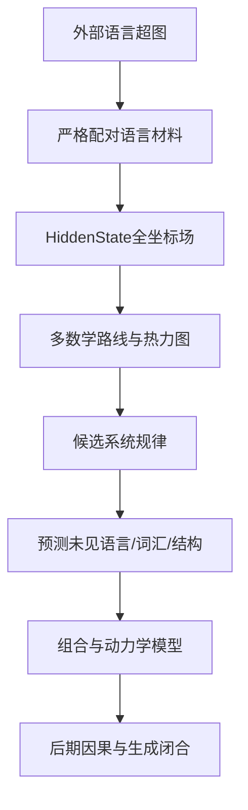

提问：
这个项目需要修改思路，要不然在做更多Phase都只会在外围继续打转，隔靴挠痒，永远都无法破解编码机制。 现在需要先假设存在一种编码机制，编码机制让LLM产生了稳定的语言能力，编码机制可能基于某种新的数学结构，或者新的数学理论，     现在需要优先使用各种数学工具，分析语言模式族应该建立什么样的超图或者其他的结构，对不同语言找到相同点。然后使用各种数学工具，对于HiddenState 场进行分析，尝试找到对应的编码机制，    先画出热力图。

核心是，不要先找闭环，先找闭环就永远无法突破，  应该是先找规律，找机制， 围绕规律和机制进行分析，尝试破解，  然后再尝试闭合，  由于语言本身的特殊，有些闭合要求可能是无法做到的，比如修改某些坐标值希望改变结果，  由于复用机制，即使找到了正确的编码机制，可能也是无法改变的，所以不能先要求闭合，而应该优先找到更底层的系统规律。

分析以上思路是否正确，应该如何改进接下来的研究

回答：

# 一、总判断：方向基本正确，而且现在必须转向

你的核心判断是正确的：

> 如果继续以“能否删除某组坐标、能否救援、能否形成完整闭环”为每一轮研究的起点，项目很可能继续在“发现一个相关结构—因果门失败—重新换材料”的循环中打转。

过去大量 Phase 已经反复说明：

* HiddenState 中可以稳定识别语言族；
* 具体坐标身份重要；
* 跨词汇、表述、语言、查询角色经常能够迁移；
* 但直接删除族平均方向通常不具有选择性；
* 救援不能稳定成立；
* 自主生成不一定兑现 teacher forcing 中已经存在的答案信息。

这更像是在说明：

> 当前用于寻找机制的对象和数学表达不对，而不一定说明机制不存在。

因此研究顺序应该从：

$$
\text{先要求因果闭合}
\rightarrow
\text{闭合失败}
\rightarrow
\text{换一个候选}
$$

调整为：

$$
\boxed{
\text{先建立外部语言结构}
\rightarrow
\text{寻找HiddenState规律}
\rightarrow
\text{形成候选数学结构}
\rightarrow
\text{预测新现象}
\rightarrow
\text{最后才做闭合}
}
$$

但需要加上两个重要修正：

1. “存在编码机制”应作为工作假设，不应预先认定它一定是单一、简洁的新数学结构。
2. 不能完全取消验证；应把因果闭合从“发现规律的前置门”降级为“机制理论的后期验证门”。

---

# 二、为什么此前容易在外围打转

## 1. 一直在问“能不能分类”，没有充分问“规律是什么”

目前很多方法本质上是：

$$
H\longrightarrow\text{族标签}
$$

例如：

* 这个 HiddenState 属于分类链还是否定族？
* 完整坐标是否胜过排序坐标？
* 中英文能否相互分类？

这些实验可以证明 HiddenState 有信息，却不能直接告诉我们：

* 苹果和梨复用了哪些坐标；
* 苹果作为“食物”与苹果作为“公司”怎样切换；
* “喜欢”如何改变“吃苹果”的预测；
* 分类链的第一条边如何与第二条边组合；
* 具体坐标之间是加法、乘法、门控还是替代关系。

所以它们更像在建立“状态指纹库”，而不是破解运行规律。

## 2. 一直用族平均方向寻找齿轮

过去常使用：

$$
d_f=\mu_f-\mu_{\text{global}}
$$

然后删除或调用 \(d_f\)。

这隐含了一个很强的假设：

> 同一个族在所有样本中使用同一条固定方向。

但真实机制可能是：

$$
d_f=d_f(\text{词汇、语言、角色、上下文、token、层})
$$

例如“苹果”在以下句子中的内部作用不可能完全相同：

* 我喜欢吃苹果。
* 苹果是一种水果。
* 苹果公司发布了产品。
* 这个苹果不是红色的。
* 苹果被小明吃了。

因此，族平均方向可能是“多个条件齿轮的平均影子”。它可以分类，但无法干预。

## 3. 直接修改坐标可能触发复用和补偿

你的判断很重要：因果干预失败不一定说明机制找错。

可能存在：

* 多条冗余路径；
* 多个坐标联盟表达同一功能；
* RMSNorm重新调整尺度；
* 后续层修复早期扰动；
* 一个坐标同时被多个功能复用；
* 只有特定上下文下某组坐标才有效；
* 单点删除后，其他坐标接管功能。

因此：

$$
\text{单坐标删除无效}
\not\Rightarrow
\text{该坐标没有参与编码}
$$

但也不能走到另一个极端：

$$
\text{任何干预都无效}
\Rightarrow
\text{仍然宣布找到了机制}
$$

更合理的做法是建立分级证据，而不是一个“闭环/不闭环”的二元门。

---

# 三、新研究范式：规律优先、机制建模、闭合后置

理论名称仍保持：

# 条件化输出场闭合理论

组织框架仍保持：

# 复用—差分—条件化（RDC）

修改的是研究方法，不是理论名称。

## 新的研究顺序

## 证据等级也需要调整

| 等级       | 要回答的问题                   | 是否要求干预 |
| -------- | ------------------------ | ------ |
| L0 可视化规律 | 热力图上是否有重复结构              | 否      |
| L1 统计复现  | 新词、新句式中是否重复              | 否      |
| L2 条件不变量 | 跨语言、角色、图深是否保持某种关系        | 否      |
| L3 预测规律  | 能否预测未见 HiddenState 或未来输出 | 否      |
| L4 组合规律  | 两个已知结构能否预测组合结构           | 否      |
| L5 响应等价  | 不同实现是否具有相同未来响应           | 软干预可选  |
| L6 局部因果  | 删除、调用、救援是否有选择性           | 是      |
| L7 生成闭合  | 是否稳定控制自然多 token 生成       | 是      |

研究突破可以先发生在 L2—L4，不应该要求每个候选在发现当天就通过 L6—L7。

---

# 四、第一主任务：建立外部语言模式族超图

## 1. 为什么不能只建立分类树

“苹果—水果—食物—物体”是一条分类链：

$$
苹果\xrightarrow{is-a}水果
\xrightarrow{is-a}食物
\xrightarrow{is-a}物体
$$

但苹果还连接：

$$
苹果\xrightarrow{color}红色
$$

$$
苹果\xrightarrow{action}吃
$$

$$
苹果\xrightarrow{part}果皮
$$

$$
苹果\xrightarrow{contrast}梨
$$

“苹果”甚至可能指公司。

因此语言体系不是树，而是：

> 多类型节点、多类型关系、多角色、多上下文和多未来输出组成的有类型超图。

## 2. 建议的外部超图

定义：

$$
\boxed{
\mathcal G_L=(V,E,\tau,\rho,C,Q,Y)
}
$$

其中：

* \(V\)：实体、概念、属性、动作、命题、token；
* \(E\)：普通边和超边；
* \(\tau(v)\)：节点类型；
* \(\rho(e)\)：关系类型；
* \(C\)：语言、上下文、表述、时态、否定等条件；
* \(Q\)：查询角色；
* \(Y\)：可能的未来输出集合。

## 3. 为什么需要“超边”

普通图的一条边只能连接两个节点，但语言结构经常需要同时绑定多个角色。

例如：

> 我喜欢吃苹果。

它至少包含：

$$
e_{\text{eat}}
=
(\text{主体=我},\text{动作=吃},\text{对象=苹果})
$$

以及：

$$
e_{\text{attitude}}
=
(\text{体验者=我},\text{态度=喜欢},\text{事件=吃苹果})
$$

“喜欢”不是只连接“我”和“苹果”，而是作用于整个“我吃苹果”事件。因此更适合用超边：

$$
e=(r_1=v_1,r_2=v_2,\ldots,r_k=v_k)
$$

## 4. 外部图谱应分成六层

| 层     | 内容             | 示例         |
| ----- | -------------- | ---------- |
| 词汇层   | token、词、同义词    | 苹果、apple   |
| 实体概念层 | 对象与类别          | 苹果、水果、物体   |
| 关系层   | 属性、分类、因果、位置    | is-a、位于、导致 |
| 角色层   | 主体、对象、工具、范围    | 谁喜欢、喜欢什么   |
| 操作层   | 否定、量词、疑问、翻译    | 不、所有、哪个    |
| 预测层   | 可能的未来 token/答案 | 水果、红色、吃    |

## 5. 跨语言如何找共同点

不能要求：

$$
H(\text{苹果})
\approx H(\text{apple})
$$

因为两种语言的 token、词序和表面形式不同。

更合理的假设是：

$$
\mathcal G^{zh}
\xrightarrow{\rho_{zh}}
\mathcal G^\ast
\xleftarrow{\rho_{en}}
\mathcal G^{en}
$$

其中：

* \(\mathcal G^\ast\)：语言无关的抽象语义超图；
* \(\rho_{zh},\rho_{en}\)：中文和英文的实现方式。

跨语言共同点不一定是状态相等，而可能是：

* 差分关系相同；
* 图邻接结构相同；
* 查询响应相同；
* 层间变化顺序相同；
* 对未来输出的作用相同。

---

# 五、第二主任务：把 HiddenState 建成真正的“场”

当前最重要的数据对象应为：

$$
\boxed{
\mathcal H[i,t,q,j]
}
$$

其中：

* \(i\)：样本；
* \(t\)：token 位置；
* \(q\)：层或检查点；
* \(j\)：具体激活坐标。

如果加入语言图谱信息：

$$
\mathcal H[G,C,Q,i,t,q,j]
$$

它不再只是一个向量集合，而是：

> 外部语言图、条件、token、层和坐标共同索引的高维离散场。

## 必须同时分析六种基本场

### 1. 原始有符号场

$$
H_{t,q,j}
$$

看具体坐标的正负值和幅值。

### 2. 层增量场

$$
\Delta_qH_{t,q,j}
=
H_{t,q+1,j}-H_{t,q,j}
$$

回答：

> 第 \(q\) 层向 residual stream 写入了什么？

这比只看 \(H_q\) 更接近状态转移。

### 3. Token增量场

$$
\Delta_tH_{t,q,j}
=
H_{t,q,j}-H_{t-1,q,j}
$$

回答：

> 读到“喜欢”“吃”“苹果”时，哪些坐标发生变化？

### 4. 配对内容差分场

$$
\Delta_{\text{苹果-梨}}H
=
H(\text{我喜欢吃苹果})
-
H(\text{我喜欢吃梨})
$$

消除共享句式，保留对象差异。

### 5. 二阶条件差分场

$$
\Delta^2_{\text{态度}\times\text{对象}}H
=
[H(\text{喜欢苹果})-H(\text{喜欢梨})]
-
[H(\text{讨厌苹果})-H(\text{讨厌梨})]
$$

回答：

> 苹果/梨差异怎样被喜欢/讨厌条件调制？

### 6. 析因残差场

$$
R_H=
H-
\widehat H_{\text{语言、表述、长度、查询、模板}}
$$

用于擦除已知表面主效应。

---

# 六、第一步确实应该先画热力图，但热力图必须系统化

不能只画一张族平均 \(|H|\) 热力图。建议一次生成以下热力图矩阵。

## A. 基础场热力图

1. sample×coordinate 原始有符号 \(H\)；
2. family×coordinate 均值；
3. family×coordinate 中位数；
4. family×coordinate 符号一致率；
5. family×coordinate 稳定出现频率。

## B. 复用—差分热力图

6. 苹果—梨等内容差分；
7. 喜欢—讨厌等关系差分；
8. 主体角色差分；
9. 中文—英文平行差分；
10. direct—natural 表述差分；
11. 一阶差分的跨样本方差；
12. 二阶交互差分。

## C. 动力学热力图

13. layer×coordinate 的 \(\Delta_qH\)；
14. token×coordinate 的 \(\Delta_tH\)；
15. token×layer 的族信号强度；
16. 坐标首次出现层；
17. 坐标符号翻转层；
18. 坐标持续时间；
19. 从一个坐标联盟转移到另一个联盟的重叠率。

## D. 组合图热力图

20. 单边关系场；
21. 两边组合场；
22. 三边组合场；
23. 实际三边场减去单边叠加预测：

$$
I_{123}
=
H_{123}
-H_1-H_2-H_3
+H_{12}+H_{13}+H_{23}
-H_0
$$

这就是三阶 Möbius 交互项。

如果 \(I_{123}\) 稳定非零，说明组合不是简单加法。

## E. 坐标协同热力图

24. coordinate×coordinate 条件协方差；
25. 差分坐标的共同符号；
26. 两坐标联合出现频率；
27. 条件互信息；
28. 高阶协同或冗余；
29. 跨语言坐标联盟重叠；
30. 跨查询坐标联盟重组。

## 热力图排序原则

可以在 discovery 集上：

* 按族差分强度；
* 按首次出现层；
* 按坐标协同社区；
* 按符号模式；

确定一个固定坐标顺序。

然后必须把同一个顺序原封不动用于 confirmation 和 lockbox。

不能每张图单独重新排序，否则会制造“视觉相似”。

---

# 七、应该同时尝试哪些数学结构

## 1. 析因设计和 Möbius 分解

这是第一优先级。

把句子因素写成集合：

$$
S=\{\text{主体、态度、动作、对象、语言、否定}\}
$$

每个子集 \(T\subseteq S\) 对 HiddenState 的贡献可用 Möbius 反演估计：

$$
F_S
=
\sum_{T\subseteq S}
(-1)^{|S|-|T|}
\mathbb E[H\mid T]
$$

它能够区分：

* 苹果的独立贡献；
* 喜欢的独立贡献；
* 喜欢×苹果交互；
* 主体×喜欢×苹果高阶交互。

这最接近“条件齿轮的组合规则”。

## 2. 张量与多线性结构

把 HiddenState 场看成：

$$
\mathcal H_{\text{族}\times\text{语言}\times\text{角色}\times
\text{token}\times\text{层}\times\text{坐标}}
$$

可以使用 CP、Tucker、Tensor Train 等寻找：

* 哪些因素近似可分离；
* 哪些必须通过交互项解释；
* 哪些坐标总是作为一个联盟出现。

但张量分解只能作为候选生成器；最终必须把结果映射回具体坐标，不能只保留低维抽象分量。

## 3. 图与超图

内部图定义：

* 节点：激活坐标；
* 普通边：两个坐标的条件协同；
* 超边：多个坐标只有共同出现才产生的效应；
* 边标签：语言族、token、层、查询角色；
* 边权：稳定性、互信息或预测增益。

这是目前最值得优先发展的结构。

## 4. 信息论和部分信息分解

研究多个坐标对未来输出的信息：

$$
I(H_S;Y_{\text{future}}\mid C)
$$

进一步区分：

* 冗余信息：多个坐标都携带同一信息；
* 独有信息：只有某坐标携带；
* 协同信息：单独都没有，组合才有。

这能直接解释为什么：

> 单坐标删除无效，但多个坐标共同构成机制。

## 5. 局部 Jacobian 与 Hessian

不立刻做实际干预，也可以先研究局部响应：

$$
J_{kj}
=
\frac{\partial H_{q+1,k}}{\partial H_{q,j}}
$$

或输出响应：

$$
J^Y_j
=
\frac{\partial z_Y}{\partial H_j}
$$

二阶交互：

$$
K_{jk}
=
\frac{\partial^2 z_Y}
{\partial H_j\partial H_k}
$$

* Jacobian 看单坐标局部传递；
* Hessian 看坐标之间是否存在非加性交互。

## 6. 动力系统和局部状态转移

不要强求一个全局 Koopman 算子，而应允许条件化局部算子：

$$
H_{q+1}
=
A_{G,Q,C,q}H_q+b_{G,Q,C,q}+\epsilon
$$

比较不同语言下的算子是否满足：

$$
A^{zh}_{G,Q,q}
\sim
A^{en}_{G,Q,q}
$$

相同点可能存在于：

* 特征值结构；
* 稳定子空间维数；
* 能量转移顺序；
* 响应函数；

而不是原始矩阵相等。

## 7. 层丛和层论作为跨语言候选

可以把抽象语义图看作“底空间”，中文、英文和不同表述是其上不同局部实现。

通俗理解：

* 底层是“苹果属于水果”这一关系；
* 中文、英文是不同坐标页；
* HiddenState 是模型在不同条件下形成的局部截面；
* 研究它们在共享语义区域是否满足一致拼接。

这可能比要求中英文 HiddenState 直接相等更合理。

但目前只能作为候选数学工具，不能宣称已经发现层丛结构。

## 8. 群胚而不是全局群

语言变换通常不是所有状态之间都可逆：

* 中译英可以定义；
* 肯定转否定可以定义；
* 主动转被动可以定义；
* 但不是所有变换都能在所有句子上使用。

因此比“全局变换群”更合适的可能是群胚：

> 只在满足条件的对象之间定义局部变换。

---

# 八、什么才算发现了一个“系统规律”

不应再用“因果闭合是否通过”作为唯一标准。

一个候选规律至少应满足以下四项中的前三项：

## 1. 压缩性

一个较小的规则可以解释大量 HiddenState 数据：

$$
L(\text{规则})+L(\text{残差})
<
L(\text{原始数据})
$$

也就是最小描述长度原则。

## 2. 预测性

从已知条件预测未见条件：

$$
\widehat H(\text{我喜欢吃梨})
$$

能否由：

* “我喜欢吃苹果”；
* 苹果—梨差分；
* 对象替换规律；

共同预测出来？

## 3. 组合性

能否用单边机制预测多边组合：

$$
\widehat H_{a\to c}
=
\mathcal C(H_{a\to b},H_{b\to c})
$$

而不是每个组合重新拟合。

## 4. 响应一致性

即使小幅删除不能改变行为，候选规律是否能预测：

* 哪些 logits 会变；
* 哪些坐标会被后续层补偿；
* 补偿发生在哪层；
* 哪个冗余联盟接管。

这也是机制证据。

---

# 九、对“单个激活坐标精密齿轮”的修正

应保留这个研究方向，但不能把它设成先验结论。

目前证据支持：

> 在一个固定模型内部，具体坐标地址具有功能意义。

因为排序坐标后，族识别显著下降。

但尚不支持：

> 每个坐标具有一个固定、独立、可命名的语义功能。

更合理的三级结构是：

### 第一级：坐标齿

单个坐标提供：

* 某种方向；
* 某种阈值；
* 某种条件响应；
* 某种局部读出贡献。

### 第二级：条件齿轮

多个坐标在特定条件下形成联盟：

$$
K_{G,Q,C}
=
\{(j,\sigma_j,\alpha_j)\}
$$

### 第三级：齿轮箱

多个条件齿轮通过复用、竞争和组合完成语言任务：

$$
\mathcal M
=
\{K_1,K_2,\ldots,K_n;\mathcal C,\mathcal S\}
$$

其中：

* \(\mathcal C\)：组合规则；
* \(\mathcal S\)：切换和选择规则。

最终要破解的不是“哪个坐标是苹果”，而是：

> 哪些坐标在什么条件下组成苹果相关联盟，这个联盟如何与水果、喜欢、吃、否定等联盟组合。

---

# 十、建议建立的统一数学主体

在不修改理论名称的前提下，可以把内部编码主体更新为：

$$
\boxed{
H_{q+1,t}
=
H_{q,t}
+
F_q^{shared}
+
\sum_{e\in E(G)}F_{q,e}^{(1)}
+
\sum_{\{e_1,e_2\}\subseteq E(G)}
F_{q,e_1,e_2}^{(2)}
+
\sum_{\{e_1,e_2,e_3\}}
F_{q,e_1,e_2,e_3}^{(3)}
+
F_q^{query}
+
F_q^{realization}
+
\epsilon
}
$$

含义：

* \(F^{shared}\)：共享预测底盘；
* \(F^{(1)}\)：单关系或单角色效应；
* \(F^{(2)}\)：二阶条件组合；
* \(F^{(3)}\)：三阶组合；
* \(F^{query}\)：当前要读取什么；
* \(F^{realization}\)：已知答案是否能被自主输出。

真正的新数学如果出现，很可能来自高阶项：

$$
F^{(2)},F^{(3)},\ldots
$$

是否具有稳定的：

* 稀疏结构；
* 超图结构；
* 组合代数；
* 条件变换规律；
* 跨语言响应不变量。

---

# 十一、接下来的大阶段方案

## Phase A：外部语言超图与全析因材料体系

一次完成：

* 概念、属性、关系、语法、上下文、翻译六大类；
* 类型节点、角色节点、操作节点、输出节点；
* 普通边和超边；
* 中英文共享抽象图；
* 自然独立改写；
* 2—6边图；
* 树、链、支路、环、冲突边和无关边；
* query×language×difficulty 行为配平；
* discovery/confirmation/whole-family lockbox。

本 Phase 的产物是正式外部语言图谱，而不是一个新分类数据集。

## Phase B：HiddenState 全场热力图与数学路线总扫描

一次性生成前述30类热力图，并同时运行：

* 一阶差分；
* 二阶、三阶 Möbius 差分；
* 张量分解；
* 坐标协同图；
* 超图社区；
* 条件互信息；
* 信息冗余/协同；
* 局部 Jacobian/Hessian；
* 条件动力系统；
* 层丛/群胚一致性诊断；
* 最小描述长度比较。

这一 Phase 不做因果闭环，目标是筛出3—5种最有解释力的系统规律。

## Phase C：候选“齿轮语法”与预测竞赛

把候选规律写成可计算模型：

$$
\widehat H(G,Q,C)
$$

要求它预测：

* 未见词汇；
* 未见图；
* 未见组合；
* 未见语言表述；
* 未见查询角色；
* 下一层 HiddenState；
* 未来 token 分布。

评价重点是：

* 预测误差；
* 描述长度；
* 跨条件稳定性；
* 是否能由单边预测多边；
* 是否能解释坐标联盟重组。

只有能预测新结构的规律，才进入机制候选。

## Phase D：动态条件齿轮与补偿机制

对候选齿轮研究：

* 哪个 token 写入；
* 哪层形成；
* 哪层换载体；
* 哪些坐标负责保持；
* 删除后哪些坐标补偿；
* 补偿发生在哪层；
* 自主生成首个分叉前发生什么。

这一步仍以观察和系统辨识为主，可以做小剂量响应，但不以改变最终答案为硬门。

## Phase E：后置因果和闭合验证

最后才执行：

* 多坐标联盟干预；
* 保范数干预；
* 冗余联盟同时阻断；
* 补偿路径阻断；
* 独立 donor 救援；
* 组合调用；
* 多 token 自然生成；
* 跨模型响应等价。

这时闭合的对象不再是“族平均方向”，而是前几阶段形成的完整齿轮模型。

---

# 十二、最终结论

你的研究路线修改是必要的。最应该停止的是：

> 每发现一个族相关方向，就立即要求它删除、救援和闭合；失败后再换一个方向。

新的唯一主线应当是：

$$
\boxed{
\text{外部语言超图}
\leftrightarrow
\text{HiddenState条件场}
\leftrightarrow
\text{坐标超图与动力学规律}
}
$$

研究顺序应是：

$$
\boxed{
\text{画全场}
\rightarrow
\text{做差分}
\rightarrow
\text{找高阶交互}
\rightarrow
\text{建立超图}
\rightarrow
\text{发现组合规律}
\rightarrow
\text{预测未见结构}
\rightarrow
\text{最后闭合}
}
$$

同时要保留一条科学边界：

> 不先要求闭合是正确的；但一个候选如果既不能压缩数据、不能预测新样本、不能解释组合，也不能产生任何可验证响应，就仍然不能称为编码机制。

当前最值得押注的机制假设不是“每个坐标对应一个语义”，而是：

$$
\boxed{
\text{LLM语言编码可能是一个}
\;
\text{条件化、动态重组、具有高阶协同的坐标超图系统}
}
$$

单个坐标是“齿”，条件联盟是“齿轮”，多个联盟的复用、切换与组合才是完整“齿轮箱”。下一阶段真正要寻找的，就是这套齿轮箱的结构规律。
