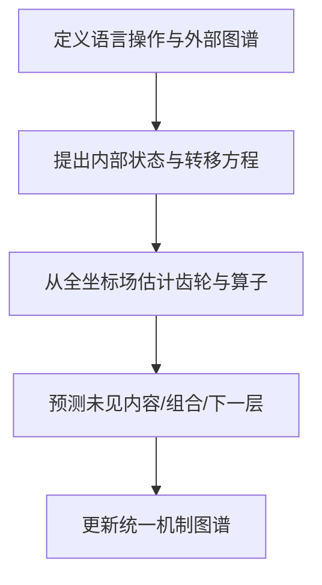

提问：
查看了测试的Phase 2378–2387 历史，发现了当前研究最核心的问题，所有的测试，都是设计出一种测试，然后根据结果分析LLM有哪些特征，但是分析都只是简单总结LLM对这个测试有什么特性，而没有真正的站在语言模式的角度分析，LLM是如何通过某种脉络处理语言模式族的，或者站在LLM编码机制的角度，LLM通过什么编码机制，完成了这个功能。  
一直基于表象，而不是内部机制，进行分析，这样即使再跑几万个Phase，也无法破解， 请给出具体的建议，应该怎么做，  

回答：

你的判断基本正确，而且抓住了研究长期无法突破的根因。

Phase2378–2387虽然比早期实验更严格，去除了显式编号、增加了锁箱、全坐标场和负控，但大部分结论仍停留在：

> 设计任务 → 找到可解码/可匹配信号 → 描述信号有什么特点。

例如：

* “来源句可以匹配”；
* “逐样本坐标置乱后下降”；
* “独立句可以预测输出准备状态”；
* “某个Attention head更关注正确来源句”。

这些是内部现象，却还不是内部机制。

真正的机制至少必须回答：

1. 内部的状态变量是什么；
2. 哪些坐标共同组成一个功能单元；
3. 这个单元在什么条件下启用；
4. 它如何从一层转移到下一层；
5. 不同语言族如何复用同一组坐标；
6. 样本内容如何在共享结构上形成差异；
7. 多个语言关系如何组合；
8. 最终怎样影响下一个token。

Phase2384–2385已经接近入口——发现了“独立句内容场到句前输出准备场”的功能桥——但仍然只证明“可以匹配”，没有把这座桥逆向成运行方程。

因此必须把范式从“测试LLM有什么特征”，改成：

> 以语言模式族为外部数学对象，以HiddenState条件动力学为内部对象，直接重建从语言关系到坐标齿轮、再到输出概率的运行规律。

---

# 一、为什么旧范式必然不断产生新现象，却难以产生机制

旧范式通常是：

它的问题不是测试不严格，而是缺少一个固定的“待求解机制”。

例如，得到0.95的四选一匹配率后，仍然不知道：

* 是词汇重叠；
* 是句子语义；
* 是位置；
* 是共同的激活分布；
* 是一个条件算子；
* 还是几个因素同时贡献。

于是下一个Phase只能再加一个负控。负控推翻一种解释，却没有主动重建替代机制。

正确范式应当是：

测试不再是研究主体，而只是裁决候选机制方程的工具。

---

# 二、必须先定义“什么结果才叫机制”

一个语言模式族 \(f\) 的内部机制，至少应表示成：

$$
\mathcal M_f=
\left(
Z_f,\,
C_f,\,
T_f,\,
R_f,\,
O_f
\right)
$$

其中：

* \(Z_f\)：内部状态变量，即哪些物理坐标或坐标群携带该模式；
* \(C_f\)：启用条件，例如当前是否需要分类、翻译、排序；
* \(T_f\)：跨层状态转移规律；
* \(R_f\)：与其他语言族共享和差异化的关系；
* \(O_f\)：如何影响输出token概率。

只有找到这五部分，才能称为“语言族条件齿轮”。

因此，以后每个Phase不能只回答“准确率是多少”，必须明确更新以下至少一项：

| 机制对象 | 必须回答的问题                  |
| ---- | ------------------------ |
| 状态变量 | 哪些坐标或坐标群构成功能状态？          |
| 启用条件 | 什么上下文让它出现、消失或改变？         |
| 跨层转移 | 它在不同layer中如何保持、放大、抑制或换组？ |
| 复用差异 | 不同语言族、不同内容如何共享和分化？       |
| 组合规律 | 两个语言功能组合后是否可以预测？         |
| 输出编译 | 它怎样改变下一token概率？          |

如果一个Phase不能更新这张表，就不应该继续执行。

---

# 三、把“语言模式族”从标签改成操作

过去常把语言族理解为数据类别：

* taxonomy；
* translation；
* punctuation；
* temporal；
* coreference。

但从机制角度看，语言模式族应当定义为对语言对象执行的操作。

例如：

$$
T_{\mathrm{taxonomy}}:
\text{实体}\rightarrow\text{上位类别}
$$

$$
T_{\mathrm{translation}}:
(\text{语义},\text{源语言})
\rightarrow
(\text{相同语义},\text{目标语言})
$$

$$
T_{\mathrm{coreference}}:
\text{代词}\rightarrow\text{上下文实体}
$$

$$
T_{\mathrm{order}}:
\{\text{句子对象}\}
\rightarrow
\text{满足语义关系的排列}
$$

$$
T_{\mathrm{punctuation}}:
\text{当前结构状态}
\rightarrow
\text{边界/延续形式}
$$

一旦把语言族定义为操作，研究问题就从：

> 模型能否识别水果？

变成：

> 当模型需要从“苹果”转到“水果”时，HiddenState中出现了什么条件变化？这套变化是否也适用于香蕉、梨和其他语言？它在不同layer中如何运行？

这才是机制问题。

---

# 四、建立固定的统一机制方程

保持现有理论名称不变：

> 条件化输出场闭合理论
> RDC：复用—差分—条件化机制

建议把下一阶段所有实验统一到一个工作方程：

$$
\boxed{
\Delta H_{q,t}
=
B_{q,t}
+
R_{q,t}(role)
+
\sum_f c_f(x_{\le t})
\,\Gamma_{f,q}(H_{q,t})
+
D_{u,q,t}
+
\sum_{f<g}I_{f,g,q,t}
+
\epsilon
}
$$

其中：

* \(\Delta H_{q,t}=H_{q+1,t}-H_{q,t}\)：第 \(q\) 层对状态的整体更新；
* \(B\)：共享前向底盘；
* \(R\)：主体、客体、来源句、输出位置等角色状态；
* \(c_f\)：语言族是否以及多强地被当前上下文调用；
* \(\Gamma_{f,q}\)：第 \(q\) 层的语言族条件齿轮算子；
* \(D_u\)：苹果与香蕉等具体内容差分；
* \(I_{f,g}\)：分类+翻译等高阶组合；
* \(\epsilon\)：当前未解释部分。

输出端保持：

$$
p(y_{t+1}|x,y_{\le t})
=
\operatorname{softmax}
\left(
W_U\,N(H_{L,t})
\right)
$$

今后的核心任务不是再证明 \(H\) 中“存在信息”，而是估计：

$$
\Gamma_{f,q},\quad
c_f,\quad
D_u,\quad
I_{f,g}
$$

以及它们如何共同形成最终输出。

---

# 五、首先用现有 Phase2378–2387 数据重建机制

不需要立刻再跑一批新任务。现有数据已经足够进行第一次机制式重分析。

## 1. 把现有数据整理成统一条件张量

将每条样本按以下维度重新索引：

$$
X[
f,u,\ell,s,d,\sigma,t,o,q,j
]
$$

其中：

* \(f\)：语言族；
* \(u\)：内容unit；
* \(\ell\)：语言；
* \(s\)：句首或表面形式；
* \(d\)：正向/逆向；
* \(\sigma\)：来源排列；
* \(t\)：目标句位置；
* \(o\)：pre/early/end；
* \(q\)：layer；
* \(j\)：物理坐标。

过去这些标签主要用于分组汇总准确率；现在要用它们分解HiddenState的组成。

## 2. 直接分解每个坐标的来源

对每层、每token位置、每个物理坐标拟合：

$$
H
=
\mu
+
F_f
+
U_u
+
L_\ell
+
S_s
+
D_d
+
P_{\sigma}
+
O_t
+
F_fD_d
+
F_fO_t
+
F_fU_u
+
\epsilon
$$

通俗地说，把一个激活值拆成：

* 所有句子共有的部分；
* 语言族共有部分；
* 样本内容部分；
* 中英文部分；
* 正逆方向部分；
* 来源位置部分；
* 输出进度部分；
* 各因素的交互部分。

然后分别画全层全坐标热力图。

这一步会直接回答：

* 哪些坐标主要表示词汇内容；
* 哪些坐标主要表示方向；
* 哪些坐标在多个语言族中复用；
* 哪些坐标只有在“某语言族+某方向”组合时出现；
* 哪些坐标只是来源位置或输出进度。

这比继续做四选一分类更接近内部结构。

---

# 六、把 Phase2384–2385 的“内容匹配”升级为条件算子

现有研究只拟合了类似：

$$
P\approx a\odot C+b
$$

其中：

* \(C\)：独立句内容场；
* \(P\)：输出句前准备状态。

但它把所有机制压缩成了一个匹配准确率。

下一步应当把算子分层拆开：

$$
P_{r,t,q_o}
=
T^{shared}_{q_s,q_o}C_{r,s,q_s}
+
T^{family}_{f,q_s,q_o}C
+
T^{direction}_{d,q_s,q_o}C
+
T^{position}_{t,q_s,q_o}C
+
T^{interaction}_{f,d,t}C
+
\epsilon
$$

依次比较以下候选机制。

## 模型A：共享加法偏移

$$
P=C+b
$$

解释：主要是内容直接延续，只增加输出准备偏置。

## 模型B：共享逐坐标增益

$$
P=a\odot C+b
$$

解释：同一组物理坐标被重新放大或压低。

这对应最简单的“同坐标齿轮复用”。

## 模型C：语言族条件增益

$$
P=
(a_0+a_f)\odot C+b_f
$$

解释：不同语言族使用相同物理坐标，但改变齿轮传动比。

## 模型D：稀疏跨坐标混合

$$
P=A_f^{\mathrm{sparse}}C+b_f
$$

解释：语言族不仅调节原坐标，还把少量坐标映射到另一组坐标。

这对应“齿轮换组”或“坐标迁移”。

## 模型E：高阶条件算子

$$
P
=
A_0C
+
\sum_k c_kA_kC
+
\sum_{k<m}c_kc_mA_{km}C
+b
$$

解释：分类、翻译、方向和输出位置共同决定运行方式。

所有模型使用同一锁箱。选择标准不是训练准确率最高，而是：

1. 能否预测未见内容；
2. 能否预测同义不同词；
3. 能否预测未见条件组合；
4. 是否明显优于embedding；
5. 规则是否足够简洁。

如果共享对角算子就足够，说明主要是坐标原位复用。

如果必须使用语言族特定稀疏矩阵，说明不同语言族存在不同齿轮连接。

如果只有复杂非线性模型有效，则说明当前“精密齿轮”不是简单线性结构。

---

# 七、真正研究“不同layer如何复用和差异化”

对每个语言族 \(f\)，定义其共享相对响应：

$$
G_{f,q,j}
=
\mathbb E_u
\left[
H_{q,j}(f,u)
-
H_{q,j}(control,u)
\right]
$$

具体内容差分：

$$
D_{f,u,q,j}
=
\Delta_fH_{u,q,j}
-
G_{f,q,j}
$$

层更新：

$$
U_{f,q,j}
=
G_{f,q+1,j}
-
G_{f,q,j}
$$

然后把每个layer归类。

| 状态 | 数学表现                       | 机制解释       |
| -- | -------------------------- | ---------- |
| 保持 | \(G_q\neq0,\ U_q\approx0\) | 该层复用已有状态   |
| 放大 | \(U_q\)与 \(G_q\)同向         | 强化当前语言模式   |
| 抑制 | \(U_q\)与 \(G_q\)反向         | 压低不需要的候选   |
| 分化 | \(D_{u,q}\)增加              | 从共享族进入具体内容 |
| 合并 | 多个内容差分减小、共享项增强             | 从实例抽象到类别   |
| 换组 | 旧坐标消失、新坐标出现                | 编码重新表达     |
| 组合 | \(I_{f,g,q}\)突然增加          | 形成高阶语言结构   |
| 编译 | 对目标token的logit贡献上升         | 转入输出身份     |

这会产生真正的跨层脉络图，而不是“最佳层是q24”这种单点结论。

---

# 八、构建真正的坐标齿轮超图

定义节点：

$$
v=(q,j)
$$

即“某一层的某一个物理激活坐标”。

建立三种关系。

## 1. 同层协同超边

如果坐标 \(j_1,j_2,j_3\) 单独都不能预测语言族，但联合后可以，就形成：

$$
e_{\mathrm{gear}}
=
\{(q,j_1),(q,j_2),(q,j_3)\}
$$

它是条件齿轮组，而不是相关坐标列表。

## 2. 跨层转移边

如果第 \(q\) 层坐标组能够预测第 \(q+1\) 层另一组的相对响应：

$$
(q,\mathcal S_1)
\rightarrow
(q+1,\mathcal S_2)
$$

就建立动力学边。

## 3. 跨语言族复用边

如果分类、翻译等语言族使用相同坐标组，但拥有不同增益：

$$
\Gamma_{f,q}
=
g_{f,q}
\odot
\Gamma_{\mathrm{shared},q}
+
\Gamma_{\mathrm{specific},f,q}
$$

就把它表示为：

* 共享齿轮；
* 语言族条件系数；
* 语言族专用残差。

最终内部图谱为：

$$
\mathcal G_H^M
=
\left(
V_{q,j},
E_{\mathrm{gear}},
E_{\mathrm{transition}},
E_{\mathrm{reuse}},
E_{\mathrm{output}}
\right)
$$

这才是“语言模式族在HiddenState场中的脉络图”。

---

# 九、现有长句重排结果应该怎样重新解释

长句重排不能再整体称为“对象重排功能”，应拆成四个内部子机制：

$$
\text{长句重排}
=
\text{句内容场}
+
\text{语义顺序场}
+
\text{目标选择场}
+
\text{输出进度场}
$$

当前已经看到：

* 独立句内容场；
* 输出句前状态能匹配对应内容；
* 某个Attention head可能关注正确来源句；
* 生成接口修复后部分样本可以完整重排。

但仍不知道：

1. 顺序计划在哪里形成；
2. 模型准备输出第 \(t\) 句时，如何选出对应句内容；
3. 已输出句如何被标记为“完成”；
4. 逆序为什么远弱于正序；
5. 共指为什么比taxonomy困难；
6. 内容状态如何维持几十个token而不漂移。

应当利用Phase2386的成功/失败标签进行内部轨迹比较。

如果case_id可以对齐，直接比较：

* 完全正确样本；
* 顺序错误样本；
* 内容缺失样本；
* 逆序失败样本；
* 共指失败样本。

重点分析目标句出现之前的：

$$
G_{\mathrm{order}},\quad
G_{\mathrm{content}},\quad
G_{\mathrm{progress}}
$$

如果现有数据不能对齐，就只补采同一批样本的自主生成全token HiddenState，不需要重新发明任务。

一个真正的机制候选应当能够指出：

> 这个样本失败，是因为顺序齿轮没有形成、来源内容选择错误，还是输出进度状态没有更新。

---

# 十、用两个旗舰语言族先完成真正机制原型

不建议马上建立覆盖所有语言的巨大图谱。应先选择两个互补的旗舰问题。

## 旗舰一：苹果—水果—食物—物体

它用于研究：

* 词汇身份；
* 类别共享；
* 上位关系；
* 多级关系组合；
* 正向/逆向查询；
* 跨语言复用；
* 输出身份编译。

核心目标不是解码“水果”，而是找到：

$$
\Gamma_{\mathrm{is-a},q}
$$

并验证：

$$
\Gamma_{\mathrm{apple\to fruit}}
$$

是否可以复用于：

$$
\Gamma_{\mathrm{banana\to fruit}}
$$

以及：

$$
\Gamma_{\mathrm{apple\to food}}
$$

是否能够由两步关系组合预测。

如果能做到，才真正发现了知识关系的条件齿轮。

## 旗舰二：长句重排

它用于研究：

* 长距离内容保持；
* 句对象身份；
* 顺序关系；
* 来源选择；
* 输出进度；
* 多token生成。

前者解决概念与关系，后者解决对象、路由与长距离执行。两者使用同一套HiddenState齿轮重建框架。

完成这两个原型后，再扩展到：

* 标点；
* 语法角色；
* 翻译；
* 风格；
* 共指；
* 因果和时间关系。

---

# 十一、下一步应当执行一个“大机制重建Phase”

不应再执行“一个测试一个Phase”。建议下一阶段直接合并成一个大型主Phase：

## 主Phase：语言族条件齿轮逆向工程

### 模块A：外部语言操作图谱

冻结：

* 语言对象；
* 语言关系；
* 角色；
* 条件；
* 组合规则；
* 正反例；
* 同义和词汇冲突材料。

### 模块B：现有全坐标场重分析

使用Phase2379–2387已有数据完成：

* 家族效应热力图；
* 内容差分热力图；
* 层增量热力图；
* 方向/语言/位置/输出进度交互；
* embedding解释比例；
* family-specific operator。

### 模块C：候选算子大赛

一次性比较：

* 加法偏移；
* 对角增益；
* 条件对角增益；
* 稀疏跨坐标映射；
* 低秩+稀疏映射；
* 双线性条件算子；
* 高阶组合算子；
* 非线性基线。

所有路线必须使用相同锁箱。

### 模块D：坐标齿轮超图

输出每个候选齿轮的“身份证”：

* 坐标编号；
* layer范围；
* token范围；
* 启用条件；
* 复用语言族；
* 样本差分；
* 跨层转移；
* 同义改写稳定性；
* 跨语言稳定性；
* 输出token贡献；
* 证据等级。

### 模块E：行为成功/失败连接

检验齿轮轨迹能否预测：

* 完全正确；
* 顺序错误；
* 内容遗漏；
* 逆向失败；
* 共指失败。

### 模块F：统一机制更新

最终只能产生三类结果：

1. 找到可预测、可组合的齿轮规律；
2. 证明当前信号主要是词汇指纹；
3. 证明需要更复杂的非线性或超图动力学。

无论哪一种，都比再产生一个“某层可解码”结论更有价值。

---

# 十二、以后必须停止的研究方式

应当明确停止：

1. 先设计一个测试，再根据最高准确率讲故事。
2. 把可解码性写成机制。
3. 把句末匹配当作预测性编码。
4. 每个Phase重新选择最佳层、最佳坐标和最佳指标。
5. 在同一批高词汇重叠材料上反复增加负控。
6. 看到相关性后立即全面分析Attention和MLP。
7. 不区分共享语言族结构和具体内容差分。
8. 不分析跨层增量，只报告某个最佳层。
9. 只看成功平均值，不分析成功与失败轨迹。
10. 每发现一个现象就增加新的理论名词。

---

# 十三、以后每个Phase必须通过的机制门

一个结果只有依次达到下面标准，才能升级。

## 门1：相对响应

不是绝对激活，而是控制内容、位置和词汇后的条件差分。

## 门2：未见内容

齿轮规律能够迁移到未见苹果、香蕉、句子和主题。

## 门3：词汇独立

相同意义不同表达仍成立；相同词汇不同意义能够区分。

## 门4：跨层预测

不是只知道最佳层，而是能够预测：

$$
H_{q+1}
\quad\text{或}\quad
\Delta H_q
$$

## 门5：压缩性

少量坐标组和简单方程能够解释大量样本，明显优于随机同规模组。

## 门6：组合性

已知两个语言族的规律能够预测未见组合。

## 门7：行为连接

齿轮状态能够区分自主生成成功和失败。

## 门8：后期有限因果

规律稳定后再做定层、定时点、定坐标组的干预和救援。

前六门属于“先找规律”，不要求立即改变模型输出；第七、第八门才进入行为和因果闭合。

---

# 最终判断

当前研究最需要改变的不是再换一种数学工具，而是改变“研究对象”：

过去研究的对象是：

> LLM在某个测试上的表现和HiddenState特征。

今后研究的对象应当是：

> 一个外部语言操作，如何激活模型内部的条件坐标齿轮，齿轮如何跨层传递、复用、分化、组合，并最终编译为下一token概率。

最接近机制的统一任务可以写成：

$$
\boxed{
\text{给定语言操作 }T_f，
\text{重建 }
\Gamma_{f,q},
D_{f,u,q},
I_{f,g,q},
T_{f,q\to q+1}
\text{ 和 }
O_f
}
$$

也就是：

$$
\boxed{
\text{语言族}
\rightarrow
\text{条件齿轮}
\rightarrow
\text{跨层动力学}
\rightarrow
\text{内容差分与组合}
\rightarrow
\text{输出编译}
}
$$

真正的近期突破目标不应该是再获得一个0.9以上的匹配率，而应当是得到第一条这样的规律：

> 在未见内容和同义改写上，某个冻结坐标群按照同一个条件转移方程运行，并能预测下一层状态和最终输出差异。

只要得到第一条这样的完整规律，哪怕只覆盖“苹果—水果”或一种长句顺序操作，也比再完成几百个描述性Phase更接近破解LLM编码机制。
