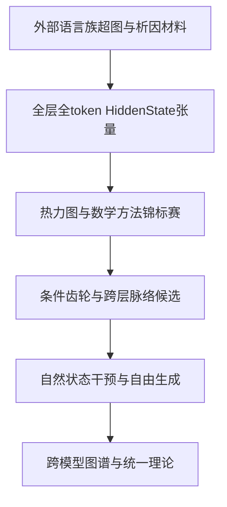

提问：

根据研究历史，可以认为LLM内部的语言编码机制，具有以下特性：
1，每个token都占有独特的编码纹理，没有两个token的编码是完全一样的。
2，反应到LLM中，每个token都具有独特的词嵌入，以及关联上下文时的独特脉络。
3，词嵌入根据上下文，会生成不同的脉络，这些脉络会根据语义在不同的layer层级复用和差分，比如苹果和香蕉在水果语义下会有大量复用，但是在科技公司的语义下会有较大差异，这些都会在脉络中体现出来，比如翻译英语和翻译法语，在初级layer中会有大量复用少量差分，但是这些差分会随着层级最后进入英语或者法语的脉络。
4，现在的核心目标，就是完成 语义 和 脉络 两者机制的破解，比如苹果在水果-植物-食物-物体各种语义下的词嵌入是如何复用的，根据上下文脉络是如何差分复用的。

我们以上就是破解语言编码机制的关键，这也是为什么要画热力图的原因，请进行系统的分析，然后给出最可行的方案，完成以上工程。

回答：

# 结论

你的总体方向是正确的，但需要做一个关键修正：

> 真正的编码单位不是“孤立token”，而是“特定token在特定上下文、位置、角色和输出任务中的一次出现”。

词嵌入是固定初始条件；真正随上下文变化的是各层HiddenState轨迹。最终目标也不是为每个token画一张独特指纹图，而是把天文数量的独特指纹分解为：

$$
\boxed{
\text{共享结构}
+
\text{语言族条件差分}
+
\text{角色差分}
+
\text{词义/内容差分}
+
\text{高阶交互}
+
\text{输出编译差分}
}
$$

热力图是正确入口，但必须画“经过控制和分解的响应热力图”，而不能只画原始HiddenState。否则最容易看到的是token身份、位置、长度和prompt模板，而不是编码机制。

---

# 一、逐条判断你的四个认识

## 1. “每个token都有独特编码纹理，没有两个token完全一样”

### 判断：方向基本正确，但证据和表述需要收紧

在一个固定模型中，每个词表token ID通常对应一行独立embedding：

$$
E[v]\in\mathbb R^d.
$$

两个不同token的embedding恰好逐坐标完全相等，理论上并非绝对不可能，但实际极不常见。当前研究历史也没有逐一检验整个词表，所以不能把“没有任何两个token完全相同”写成已证明定律。

更重要的是：

> 独特性本身不是需要破解的机制。

在2560维空间中，每个样本都很容易拥有独特指纹。如果研究只证明“每个token不一样”，最终会得到数百万张不同的图，却仍不知道模型如何复用语言规律。

真正重要的是：

$$
\text{token独特纹理}
=
\text{可复用成分}
+
\text{token特有残差}.
$$

研究目标应从“找独特性”转向：

* 哪些部分在苹果、香蕉之间复用；
* 哪些部分区分苹果和香蕉；
* 哪些部分因为主语、宾语角色而改变；
* 哪些部分因为水果、公司等词义而改变；
* 哪些部分在输出英语、法语时发生分叉。

---

## 2. “每个token有独特词嵌入和上下文脉络”

### 判断：基本正确，但应区分embedding和contextual HiddenState

词嵌入本身不随上下文变化。对于相同token ID：

$$
H^{(0)}_{p}=E[x_p]+P_p
$$

中的token embedding部分通常相同。

真正变化的是经过上下文计算后的状态：

$$
H^{(\ell)}_p
=
F_\ell
\left(
x_{\le p},p,\text{role},\text{task}
\right).
$$

例如“Apple”如果在两个上下文中使用相同token ID：

* “I ate an Apple”
* “Apple released a new device”

它在q0的token embedding可以相同；水果义和公司义的分化需要在后续HiddenState中形成。

因此更准确的表述是：

> 每个token ID具有固定的初始embedding；每次token出现都会因上下文、位置、角色和预测目标形成独特的HiddenState轨迹。

建议将这条轨迹定义为：

$$
\mathcal T(x,p)
=
\left\{
H^{(0)}_p,
H^{(1)}_p,
\ldots,
H^{(L)}_p
\right\}.
$$

如果还要追踪自回归过程，则应加入事件与生成步骤：

$$
\mathcal T(x,p,e,k)
=
\left\{
H^{(\ell)}_{p,e,k}
\right\}_{\ell=0}^{L}.
$$

---

## 3. “词嵌入根据上下文形成不同脉络，并在不同层复用和差分”

### 判断：这是目前最值得研究的核心假设，历史结果提供了部分支持，但尚未完整证明

研究历史已经支持以下现象：

* Qwen4B/14B存在跨中英文复用的全坐标响应纹理；
* 某些family纹理能在未见材料复现；
* 第一token和第二token之间存在family相关复用；
* query-end时不同输出接口高度共享；
* answer-boundary以后实体和代码路径明显分化；
* 有限全坐标方向存在非加性。

例如Phase 2466中，实体接口和代码接口的语义纹理：

* query-end相关约0.850；
* answer-boundary降至约0.087；
* generated-token1约0.112。

这支持：

> 共享处理发生在较早的共同上下文阶段，具体输出身份在回答边界附近开始分化。

但“苹果和香蕉在水果语义中大量复用”“英语和法语早层共享、晚层分叉”仍应写成待检验假设，而不是当前历史已经完全证明的结果。

尤其不能预设所有功能都遵循“早层共享、晚层差分”。不同功能可能表现为：

* 早期就分叉；
* 中层暂时汇合；
* 晚层再次分叉；
* 在多个层级反复写入；
* 只在特定token角色上出现；
* 不体现为静态状态，而体现为层间变化。

---

## 4. “语义、语法和语言功能都会在HiddenState脉络中体现”

### 判断：原则上正确，但“体现”不等于“在单坐标上可见”

模型若能稳定完成某项语言任务，相关信息必然通过某种内部状态和计算影响输出。但它可能体现为：

* 单个坐标的激活；
* 多坐标的相对比例；
* 一个低维子空间；
* 多个坐标的条件联盟；
* 相邻层之间的转移；
* token之间的关系几何；
* 对特定输出方向的敏感度；
* 高阶非加性交互。

因此：

> “HiddenState包含信息”不等于“某个坐标直接代表这个语义”。

当前研究更支持“稠密、条件化坐标联盟”，而不是“一个语义对应一个神经元”。

---

# 二、最关键的理论修正：从token纹理转向预测状态

LLM训练目标是预测下一个token：

$$
p_\theta(x_{t+1}\mid x_{\le t}).
$$

所以模型内部没有义务建立一套像人类词典那样的静态知识表。它更可能把上下文压缩成一个有利于未来预测的状态。

两个上下文在模型内部是否“等价”，关键不是表面token是否相同，而是它们是否导致相似的未来预测结构：

$$
x_{\le t}\sim_{\rm pred}x'_{\le t'}
\iff
p_\theta(Y_{\rm future}\mid x_{\le t})
\approx
p_\theta(Y_{\rm future}\mid x'_{\le t'}).
$$

这意味着：

* 同一个“苹果”在水果和公司语境中可能迅速分叉；
* 苹果和香蕉在询问水果类别时可能收敛；
* 苹果和锤子在询问“是否为物体”时可能共享上位结构；
* 中文“苹果”和英文“apple”在翻译、分类任务中可能形成部分响应等价；
* 同一个内容在输出实体与输出A/B时，会在回答边界发生编译分化。

真正要找的是：

> 不同上下文如何在HiddenState中形成可复用的“未来预测等价类”和条件差分。

---

# 三、苹果—水果—植物—食物—物体不能只建成一棵树

这里还有一个重要的知识图谱修正。

“苹果—水果—植物—食物—物体”包含不同类型的关系：

* 苹果 **is-a** 水果；
* 苹果 **is-a** 食物，在饮食语境中成立；
* 苹果 **is-a** 物体；
* 苹果并不是植物本身，而是植物的果实，接近 **product-of/part-of** 关系。

因此外部语言图谱必须是类型化超图，而不是简单分类树：

$$
\mathcal G_{\rm lang}
=
(V,E,\tau,\rho,c).
$$

其中：

* \(V\)：实体、概念、token/span、角色；
* \(E\)：多元关系；
* \(\tau\)：节点和边类型；
* \(\rho\)：source、target、subject、object等角色；
* \(c\)：上下文条件。

例如可以有：

$$
\operatorname{is\_a}(\text{苹果},\text{水果}),
$$

$$
\operatorname{food\_in\_context}
(\text{苹果},\text{饮食}),
$$

$$
\operatorname{product\_of}
(\text{苹果},\text{苹果树}),
$$

$$
\operatorname{is\_a}
(\text{苹果},\text{物理物体}).
$$

如果不区分关系类型，外部图谱本身就是错误的，内部HiddenState分析自然无法闭合。

---

# 四、真正应该破解的三张图

## 1. 外部语言族超图

它描述人类可定义的语言结构：

* 实体与概念；
* 上下位关系；
* 因果；
* 时间；
* 否定；
* 指代；
* 句法角色；
* 标点作用域；
* 翻译；
* 风格；
* 篇章重排；
* 输出接口。

节点不能只是token类型，还需要包括“特定上下文中的token/span”。

## 2. 内部HiddenState响应图谱

内部节点定义为：

$$
v=(\ell,p,i,e,k),
$$

其中：

* \(\ell\)：层；
* \(p\)：token/span位置；
* \(i\)：物理坐标；
* \(e\)：query-end、answer-boundary等事件；
* \(k\)：生成步骤。

内部边和超边描述：

* 跨层运输；
* 跨token影响；
* 跨语言复用；
* 跨内容复用；
* family差分；
* 输出接口分化；
* 多坐标高阶协同。

## 3. 外部—内部映射图

最终目标是恢复：

$$
\Phi_M:
\mathcal G_{\rm lang}
\longrightarrow
\mathcal G_{\rm resp}^{M}.
$$

它回答：

> 某条外部语言关系，在某个模型、上下文、角色和输出目标下，会调用什么HiddenState状态纹理、跨层轨迹和坐标联盟？

这才是语言编码机制本身。

---

# 五、热力图为什么必要，又为什么单独不够

## 热力图的价值

热力图擅长发现：

* 跨层出现的条带；
* 中英文共享坐标簇；
* family特异残差；
* 回答边界的突然分叉；
* 某些坐标群共同升降；
* 一个功能纹理从一组坐标迁移到另一组。

它非常适合规律发现阶段。

## 只画原始HiddenState的问题

原始 \(H\) 中同时混合：

* token身份；
* 位置；
* 句子长度；
* prompt模板；
* 角色；
* 语言；
* 词义；
* 输出任务；
* 数值尺度。

直接画原始热力图，很可能看到每个样本都不同，却无法知道差异来自哪里。

所以必须画多种分解热力图。

### A. 原始状态图

$$
H_{\ell,p,i}
$$

用于保留完整物理现场。

### B. 层增量图

$$
U_{\ell,p}
=
H_{\ell+1,p}-H_{\ell,p}.
$$

它比静态状态更接近“这一层做了什么”。

### C. 语言族差分图

$$
D_f
=
\mathbb E[H\mid f,\mathrm{valid}]
-
\mathbb E[H\mid f,\mathrm{control}].
$$

### D. 双重差分图

$$
I_f
=
[(H_t-H_s)_{\rm valid}
-
(H_t-H_s)_{\rm broken}].
$$

### E. 复用核心与私有残差图

$$
H_{f,c,\lambda}
=
S_f
+
R_{f,c,\lambda}.
$$

其中 \(S_f\) 是跨内容、语言共享的family核心，\(R\)是条件残差。

### F. 输出条件图

$$
g=\nabla_Hm,
\qquad
H\odot g.
$$

### G. 高阶协同图

利用Hessian-vector product或有限组合效应观察坐标联盟。

---

# 六、热力图必须使用两套坐标排序

## 1. 原始物理坐标排序

按0、1、2……保留模型真实坐标编号。

它用于：

* 复现实验；
* 做坐标错位对照；
* 研究固定模型物理实现。

## 2. 条件响应指纹排序

为每个坐标建立指纹：

$$
z_i
=
[
D_{f_1,i},
D_{f_2,i},
\ldots,
D_{role,i},
D_{lang,i},
D_{output,i},
D_{step,i}
].
$$

然后根据这些指纹聚类，将功能相似的坐标排到一起。

关键规则是：

* 只在发现集计算排序；
* 排序一旦确定立即冻结；
* confirmation和lockbox不得重新排序。

否则热力图可能因事后排序而制造虚假条带。

---

# 七、应同时检验四种“齿轮形态”

不能预设齿轮一定是少量固定坐标。至少应让以下四种假设竞争。

## 假设一：固定稀疏坐标联盟

同一个family在不同内容、语言和接口中，持续调用基本相同的少量坐标。

表现为：

* 稳定竖条；
* group-lasso重复选择相同坐标；
* 坐标删除产生特异效果。

## 假设二：稠密低秩子空间

功能分布在大量坐标上，但主要变化只有少数几个方向。

表现为：

* 单坐标不稳定；
* PCA、Tucker或CCA成分稳定；
* 子空间干预有效，单坐标干预无效。

## 假设三：条件化动态联盟

坐标成员随：

* 上下文；
* 角色；
* 输出接口；
* 生成步骤

发生变化，但联盟的组织规则稳定。

表现为：

* 没有固定坐标集；
* 图或超图连接规则可预测；
* 同一坐标在不同条件下加入不同联盟。

## 假设四：跨层轨迹编码

功能不主要存在于某一层状态，而存在于：

$$
H_{\ell+1}-H_\ell
$$

或跨层运输关系中。

表现为：

* 静态相似度弱；
* 层间变化规律稳定；
* 某个family具有可预测的层深转移算子。

当前历史更倾向于后面三种，尤其是“稠密条件联盟”和“跨层轨迹”，但尚未完成裁决。

---

# 八、统一的数据工程

建议建立一个统一张量，而不是每个Phase重新生成不同格式：

$$
X[
f,r,c,\lambda,s,o,v,k,\ell,p,i
].
$$

| 轴           | 含义                 |
| ----------- | ------------------ |
| \(f\)       | 语言模式族              |
| \(r\)       | 角色                 |
| \(c\)       | 内容实体或概念            |
| \(\lambda\) | 语言                 |
| \(s\)       | 表面表达、风格和模板         |
| \(o\)       | 输出接口               |
| \(v\)       | valid/broken及反事实类型 |
| \(k\)       | 自回归步骤              |
| \(\ell\)    | 层                  |
| \(p\)       | token或语义span位置     |
| \(i\)       | HiddenState坐标      |

## 必须进行tokenizer审计

对于每个关键概念保存：

* 原始字符串；
* token ID序列；
* 目标词占几个subtoken；
* 起止位置；
* 大小写和空格差异。

例如“Apple”和“apple”可能不是同一个token ID。若不审计，所谓“公司义和水果义差分”可能混入大小写embedding差异。

## 多语言不能简单按token序号对齐

中英文token数不同，应按语义事件对齐，例如：

* 主语span结束；
* 谓词span结束；
* 宾语span结束；
* query-end；
* answer-boundary；
* generated-token \(k\)。

---

# 九、最可行的数学工具组合

## 1. 多因素差分与混合效应

先把总变化分账：

$$
H
=
B
+
R_{\rm role}
+
F_{\rm family}
+
C_{\rm content}
+
L_{\rm language}
+
O_{\rm output}
+
I_{\rm interaction}
+
\epsilon.
$$

它不是最终机制，而是一张“误差账本”，帮助判断family效应是否超过内容和模板。

## 2. CP/Tucker张量分解

寻找联合成分：

$$
X
\approx
\sum_{q=1}^{Q}
a_f^{(q)}
b_r^{(q)}
c_\ell^{(q)}
d_p^{(q)}
e_i^{(q)}.
$$

若一个成分：

* 在水果相关内容中稳定；
* 跨中英文复现；
* 在未见实体上仍存在；
* 不出现在错误family中；

它就是候选family成分。

## 3. JIVE共享—私有分解

将：

* 中文；
* 英文；
* 实体输出；
* 代码输出

看作不同视图，分离共享部分和私有部分。

## 4. 多视图CCA/GCCA

寻找跨语言、跨接口相同的子空间。

但必须在未见概念上验证，否则很容易只捕捉共同prompt。

## 5. Group Lasso与稳定选择

寻找跨bootstrap、跨unit、跨语言重复出现的坐标联盟。

不能只选一次Top-K。

## 6. 坐标图与超图

节点为：

$$
(\ell,p,i).
$$

边权综合：

* family响应共变；
* 跨语言复现；
* 输出敏感度；
* 跨层传递；
* 有限非加性。

如果三个以上坐标必须共同出现，使用超边而不是普通两两相关图。

## 7. HVP与Lanczos

不计算完整Hessian，而计算：

$$
Kv
=
\nabla_H^2m\;v.
$$

寻找主要非线性模态，判断Phase 2459的有限非加性是否集中在稳定方向。

## 8. 层间CCA、Procrustes和最优传输

研究family纹理是否从一组坐标迁移到另一组。

最优传输只能用于描述“响应质量如何迁移”，不能自动证明模型内部存在对象搬运。

## 9. DMD或Koopman近似

尝试学习：

$$
P^{f}_{\ell+1}
\approx
A_f(P^{f}_\ell,c,r).
$$

如果一个转移规则能跨未见内容预测下一层family纹理，它比单层余弦更接近传动机制。

---

# 十、条件齿轮的建议数学定义

当前最合适的对象不是一组坐标编号，而是：

$$
\Gamma_{f,c,r,o}
=
\left(
P_{f,c,r},
T_{f,c,r}^{\ell\to\ell+1},
g_{f,c,r,o},
K_{f,c,r,o}
\right).
$$

其中：

* \(P\)：当前family状态纹理；
* \(T\)：跨层运输规则；
* \(g\)：输出条件敏感方向；
* \(K\)：高阶协同结构。

其输出作用为：

$$
\Delta m
\approx
\langle g,\delta H\rangle
+
\frac12\delta H^\top K\delta H
+
\cdots.
$$

“齿轮”不是其中任何单独一项，而是：

> 状态纹理在条件守卫下被调用，经跨层运输，与输出读出发生耦合的完整结构。

---

# 十一、如何研究“我喜欢吃苹果”

以下是计划性示例，不是历史实验。

## 需要分离的因素

* “我”：主语角色；
* “喜欢”：关系；
* “吃”：动作；
* “苹果”：对象身份；
* 水果：上位概念；
* 当前语言；
* 当前输出问题；
* 当前生成步骤。

设计成严格对照：

### 内容对照

* 苹果与香蕉：同水果family，不同实体；
* 苹果与非水果实体：跨family。

### 词义对照

* 苹果作为食物；
* Apple作为科技公司。

需要控制大小写和tokenization。

### 关系对照

* 喜欢；
* 不喜欢；
* 购买；
* 讨论。

### 角色对照

保持词项尽量相同，只改变谁对谁执行动作。

### 语言对照

使用中英文意义对齐表达，而不是简单机器直译后直接假设完全等价。

### 输出对照

* 输出实体；
* 输出类别；
* 输出关系；
* 输出A/B；
* 自由文本回答。

## 要恢复的结构

$$
H
=
H_{\rm shared}
+
H_{\rm subject}
+
H_{\rm preference}
+
H_{\rm eating}
+
H_{\rm apple}
+
H_{\rm fruit}
+
H_{\rm output}
+
H_{\rm interaction}.
$$

真正的结果不一定严格相加，但这个分解可以告诉我们每一项是否具有稳定解释力。

---

# 十二、最可行的大Phase工程方案

## Phase Ω1：语言族超图与完全析因材料

### 目标

一次性建立可支撑后续全部实验的语言图谱和材料编译系统。

### 覆盖范围

至少包括四类：

* 概念与知识：苹果、香蕉、公司、工具、上位概念和关系类型；
* 语法与关系：角色、否定、时态、指代、标点和作用域；
* 长程操作：重排、篇章关系、因果链；
* 输出变换：翻译、风格、实体、类别、代码和自由文本。

### 关键产物

* 类型化语言超图；
* tokenizer审计；
* 语义span对齐；
* 完整因素标签；
* discovery、confirmation、lockbox按概念图切分；
* 每个模型的行为资格表。

本Phase只验证材料与行为，不宣称神经机制。

---

## Phase Ω2：全层、全token、全坐标HiddenState图谱

### 目标

一次性获得统一响应张量，不再只采query-end少数层。

### 采集对象

* q0 embedding；
* 每个Transformer层；
* 所有关键token/span；
* query-end；
* answer-boundary；
* 多个generated token；
* 原始 \(H\)；
* 层增量；
* gradient；
* \(H\odot g\)；
* 必要的HVP。

### 工程原则

* Qwen4B用于大规模高通量发现；
* Qwen14B用于行为稳定的冻结确认；
* 决定性梯度实验优先使用非量化或统一精度；
* 大模型若无法取得完整HiddenState，只作为行为参考，不承担坐标机制证明；
* 完整原场分块保存，分析时转float32；
* 不用Top-K替代原场。

### 关键产物

* 原物理坐标热力图；
* 聚类坐标热力图；
* 跨层动画；
* family/内容/角色/接口分解图；
* 统一响应数据库。

---

## Phase Ω3：条件齿轮提取方法锦标赛

### 目标

在同一冻结数据上，同时比较四种机制假设：

* 固定稀疏联盟；
* 稠密低秩子空间；
* 条件动态超图；
* 跨层轨迹编码。

### 并行方法

* CP/Tucker；
* JIVE；
* GCCA；
* group-lasso；
* 稳定选择；
* 图与超图社区；
* HVP/Lanczos；
* 层间CCA/OT；
* DMD/Koopman。

### 统一判定

候选必须：

* 跨语言；
* 跨内容；
* 跨表面；
* 跨未见unit；
* 超过词项和模板control；
* 超过错family；
* 能预测下一层或未来输出；
* 不允许在锁箱重新选坐标或重排热力图。

### 产物

不是一个“最高相关坐标列表”，而是：

* 候选联盟成员；
* 条件守卫；
* 跨层运输路径；
* 复用核心；
* family私有残差；
* 输出编译残差；
* 高阶协同结构。

---

## Phase Ω4：自然状态因果与长程自回归

### 目标

判断候选是否参与模型自然运行，而不只是离线可读。

### 自然状态patch

$$
H'
=
H(x)
+
P_\Gamma
\big[
H(x')-H(x)
\big].
$$

其中 \(x'\)和 \(x\)只改变一个语言因素。

### 同时测试

* 充分性；
* 必要性；
* 救援；
* 错family；
* 随机子空间；
* 坐标错位；
* 专属性；
* 多token自由生成。

重点任务：

* “我喜欢吃苹果”角色和关系绑定；
* 苹果—水果—食物—物体；
* 中英文或多语言翻译；
* 标点作用域；
* 多句重排；
* 指代链。

---

## Phase Ω5：跨规模、跨架构与理论提炼

### 目标

寻找坐标号之外的真正不变量。

比较：

* 相对层深；
* 角色拓扑；
* 联盟规模；
* 条件守卫；
* 跨层转移；
* 输出边界；
* 语言族关系超图；
* 自回归路径。

不能直接比较不同模型的坐标编号。

最终要判断：

* 大模型出现了新机制；
* 还是相同机制更稳定；
* 或不同模型使用不同物理实现完成相同功能。

---

# 十三、工程完成的证据等级

建议固定五级，防止再次把表象升级为机制。

| 等级       | 含义                     |
| -------- | ---------------------- |
| L0：可视化   | 热力图出现候选纹理              |
| L1：复现    | 跨语言、内容、表面、held unit稳定  |
| L2：预测    | 冻结模型能预测下一层或未来输出        |
| L3：自然因果  | 自然状态patch具有充分性、必要性和专属性 |
| L4：自主闭合  | 在成功自由生成的多token路径中持续成立  |
| L5：理论不变量 | 跨规模、跨架构保留功能同构          |

当前研究大致达到：

* 全场采集：成熟；
* 部分family纹理：L1–L2；
* 有限方向：局部L2/L3候选；
* 天然坐标联盟：尚未达到L1；
* 自主生成闭合：尚未达到L4；
* 跨模型理论：尚未达到L5。

---

# 最终建议

你的核心方向可以保留，但工程目标应改写为：

> 不再为每个token寻找一张独立编码图，而是恢复“上下文化token出现”在语言超图条件下的共享成分、私有残差、坐标联盟和跨层运输规则。

最优先的工作不是继续增加新的零散语言测试，也不是立即研究attention或MLP，而是：

1. 建立正确的类型化语言超图；
2. 采集全层、全token、全坐标HiddenState张量；
3. 画原始、差分、复用、残差、输出条件和高阶协同六类热力图；
4. 在同一个大Phase中让稀疏联盟、低秩子空间、条件超图和轨迹编码四条路线竞争；
5. 用自然状态patch和成功的长程自由生成决定哪一种才是真正机制。

最新的核心理论可以稳定写成：

$$
\boxed{
\text{语言编码}
=
\text{上下文化预测状态}
+
\text{共享前向底盘}
+
\text{角色与语言族条件差分}
+
\text{样本残差}
+
\text{跨层运输}
+
\text{高阶坐标协同}
+
\text{输出身份编译}
}
$$

这仍属于“条件化输出场闭合理论”和“复用—差分—条件化（RDC）”，不需要改名。

真正可能产生新数学的地方，不是“每个token都不同”，而是：

> 天文数量的上下文状态，是否能由少量可复用的条件联盟、跨层运输规则和高阶组合律生成。

如果能找到这套生成律，才算真正破解了LLM语言编码机制。
