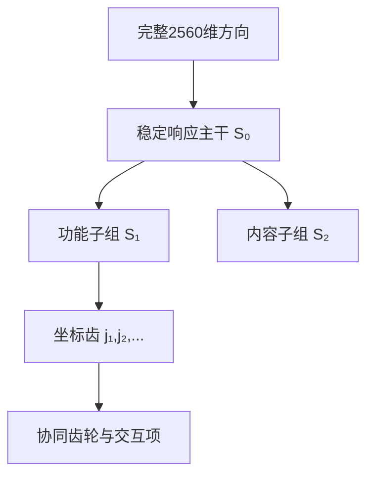

提问：

当前是否有针对单个神经元或者参数的算法，还是所有算法都是基于差分搬运完成的，是否有什么办法可以完成基于单个神经元或者参数的算法， 比如先完成热力图，找到部分主干，然后围绕主干进行计算，逐步细化到单个神经元或者参数

回答：

结论很明确：

> 当前 Phase 2600–2619 的核心因果算法，几乎都是“多坐标差分提取＋搬运”。已经做到逐坐标记录和热力图，但还没有完成经过独立验证的“单激活坐标算法”，更没有完成“单参数编码算法”。

Phase 2606 到达 Q/K/V 与单 head 粒度；Phase 2613 到达逐坐标描述；Phase 2614 建成全坐标热力图；但最强结果 Phase 2619 仍然是把完整的 2560 维训练均值方向一起注入。

你提出的路线基本正确：

> 全场热力图 → 找稳定主干 → 主干分组 → 递归细化 → 单坐标齿 → 坐标协同齿轮 → 反向追踪到参数。

但“主干”不能只凭肉眼看红色区域，而且不一定是连续坐标段。2560 个坐标的排列顺序没有空间邻接意义，真正的主干很可能是散布在整个坐标轴上的坐标集合。

# 一、先严格区分三个对象

| 对象             | 数学形式             | 是什么                                        |
| -------------- | ---------------- | ------------------------------------------ |
| HiddenState 坐标 | \(H_{\ell,t,j}\) | 一次运行产生的激活值，不是参数                            |
| MLP 神经元        | \(a_{\ell,t,k}\) | MLP 中间层某个单元的激活                             |
| 模型参数           | \(\theta_k\)     | embedding、attention、MLP、unembedding 中固定的权重 |

例如：

* `H[5, 苹果位置, 1234]` 是激活坐标；
* `MLP 第5层第8000单元`更接近传统意义上的神经元；
* `W_U[水果token, 1234]` 是 unembedding 参数。

在当前“embedding→HiddenState→unembedding”主线中，最合适的目标不是立即寻找单个 MLP 神经元，而是：

> 先找到原生 HiddenState 坐标组成的最小条件化协同组，再追踪哪些权重负责产生和读取这个组。

# 二、当前研究到底做到哪种粒度

| 粒度               | 对应 Phase            | 当前状态                |
| ---------------- | ------------------- | ------------------- |
| 全部 2560 坐标差分     | 2604、2605、2608、2619 | 已成熟，是当前主要方法         |
| source span 平均状态 | 2605、2608、2617      | 已做，但丢失多 token 次序    |
| 单层 Q/K/V         | 2606                | 已测试，效果较弱            |
| 单 attention head | 2606                | 全部扫描，没有发现强单 head 齿轮 |
| 多层 V/KV 通道       | 2607、2608           | 强 oracle 充分性        |
| 单坐标能量与原值         | 2613、2614           | 已描述、已可视化            |
| 单坐标因果效应          | 尚未系统完成              | 缺失                  |
| 最小坐标协同组          | 尚未完成                | 核心缺口                |
| 单参数因果归因          | 尚未完成                | 核心缺口                |
| 坐标组到参数组的映射       | 尚未完成                | 核心缺口                |

所以，准确表述是：

> 当前已经拥有“逐坐标测量能力”，但还没有“逐坐标机制识别能力”。

# 三、是否存在单神经元、单参数算法

存在，但这些算法各自只能回答一部分问题。

## 1. 单激活坐标干预

直接修改一个坐标：

$$
H_{\ell,t,j}
\leftarrow
H_{\ell,t,j}+\alpha\delta_j.
$$

可以比较：

* 改正确坐标；
* 改错坐标；
* 改相反方向；
* 改错误位置；
* 使用自然范围内不同剂量。

它能回答：

> 第 \(j\) 个物理坐标是否对输出有因果影响？

但单坐标无效并不意味着它没有作用。多个坐标可能必须共同改变，类似齿轮箱中的一颗齿单独移动不了整个系统。

## 2. Leave-one-coordinate-out

假设完整方向为 \(\delta\)，先测整个方向，再每次删除一个坐标：

$$
\delta^{(-j)}_k=
\begin{cases}
0,&k=j\\
\delta_k,&k\neq j.
\end{cases}
$$

比较：

$$
C_j
=
Effect(\delta)-Effect(\delta^{(-j)}).
$$

如果删除坐标 \(j\) 后效果明显下降，说明它是完整方向中的重要组成部分。

这通常比“单独加入一个坐标”更适合强耦合系统，因为它测试的是：

> 这颗齿是否是整个齿轮组中的必要组成部分？

## 3. 梯度×激活/梯度×差分

对目标答案 margin \(m\)：

$$
A_{\ell,t,j}
=
D_{\ell,t,j}
\frac{\partial m}{\partial H_{\ell,t,j}}.
$$

其中：

* \(D_{\ell,t,j}\) 表示这个坐标在反事实中的变化；
* 梯度表示输出对这个坐标有多敏感。

只有两个量同时较大，才是值得优先测试的候选坐标。

但这只是局部一阶近似，不能替代真实干预。

## 4. 单坐标 Jacobian 传播

把每个 layer 暂时视为黑盒，不分析 attention/MLP 内部：

$$
J_{\ell,t,j\rightarrow \ell+1,t',k}
=
\frac{\partial H_{\ell+1,t',k}}
{\partial H_{\ell,t,j}}.
$$

它可以回答：

> 在 source 位置改变坐标 \(j\)，下一层哪些位置、哪些坐标 \(k\) 会响应？

完整 Jacobian 极大，因此不适合直接对全部坐标暴力计算。正确做法是先用热力图和统计筛出主干，再对主干做 JVP/VJP。

这仍然符合 HiddenState 优先路线：层内部可以暂时作为黑盒状态转移算子。

## 5. 坐标交互差分

两个坐标的联合效应：

$$
I_{jk}
=
f(H+\delta_j+\delta_k)
-f(H+\delta_j)
-f(H+\delta_k)
+f(H).
$$

如果 \(I_{jk}\) 很大，说明两个坐标不是独立工作的。

更一般地，对坐标组 \(S\)：

$$
\operatorname{Syn}(S)
=
Effect(S)-\sum_{j\in S}Effect(\{j\}).
$$

这正是研究“单坐标是齿、坐标组是齿轮”的核心数学工具。

## 6. 单参数梯度和参数影响

对于参数 \(\theta_k\)：

$$
A_k=\frac{\partial m}{\partial\theta_k}.
$$

或者研究参数对目标 HiddenState 齿轮组的影响：

$$
J_{S,\theta_k}
=
\frac{\partial H_S}{\partial\theta_k}.
$$

这些方法能筛选参数，但模型有数十亿参数，直接全参数逐个干预在计算上不可行，而且单参数效应通常极小。

因此单参数研究必须放在激活主干确定之后。

# 四、最适合当前项目的“从主干到单齿”算法

建议采用分层坐标因果解析，而不是直接暴力扫描 2560 个坐标。

## 第一级：画对的热力图

不能只画 raw HiddenState。至少需要六种并排热力图：

1. 原始场：

$$
H_{\ell,t,j}
$$

2. 最小反事实差分：

$$
D_{\ell,t,j}=H^1_{\ell,t,j}-H^0_{\ell,t,j}
$$

3. 语言族均值：

$$
\mu_{F,\ell,t,j}
=
\mathbb E[D_{\ell,t,j}\mid F]
$$

4. 条件残差：

$$
R=D-\text{词形效应}-\text{事件效应}
-\text{位置效应}-\text{答案身份效应}
$$

5. 跨数据集稳定性：显示每个坐标在 discovery、confirmation、external 中是否方向一致。

6. 输出贡献：

$$
A_{\ell,t,j}
=
D_{\ell,t,j}
\frac{\partial m}{\partial H_{\ell,t,j}}.
$$

其中第 4–6 类比 raw 热力图更接近机制。

## 第二级：寻找“响应主干”，但不能寻找连续红带

每个坐标建立一个响应指纹：

$$
r_j=
[
D_{\text{不同层}},
D_{\text{不同位置}},
D_{\text{不同语言}},
D_{\text{不同事件}},
D_{\text{不同关系}}
].
$$

然后根据响应指纹聚类坐标。

例如可能发现：

* 坐标 17、291、836、1907 在“先于→后于”改变时同步响应；
* 坐标 54、601、1700 更跟随具体事件名称；
* 坐标 83、414、2011 更跟随答案 token 身份。

第一组才是时序齿轮候选。

这只是解释示意，不是当前实验结果。

要同时保留两种视图：

* 原始物理坐标顺序；
* 按响应指纹聚类后的顺序。

聚类不能取代原坐标编号。

## 第三级：主干分组因果测试

设热力图得到候选集合：

$$
S_0=\{j_1,j_2,\ldots,j_k\}.
$$

分别测试：

* 只搬运 \(S_0\)；
* 搬运它的补集；
* 搬运等范数随机组；
* 搬运错误语言/错误关系的同规模组；
* 阻断 \(S_0\)；
* 搬运完整方向。

如果小集合 \(S_0\) 能保留完整方向的大部分内部传播或输出效应，才说明找到了主干。

## 第四级：递归二分，不断细化

不要一开始对每个坐标做数千次独立实验。可以把候选主干分成两个响应相近的子组：

$$
S_0=S_1\cup S_2.
$$

测试：

* \(S_1\)
* \(S_2\)
* \(S_1+S_2\)
* 删除 \(S_1\)
* 删除 \(S_2\)

然后只继续细分有稳定作用的组。

其结构类似：

这种递归方法能把搜索从“全部坐标逐个暴力扫描”压缩成“先组后单点”。

## 第五级：区分四类坐标

每个候选坐标最后可能属于四种角色：

| 类型  | 特征                       |
| --- | ------------------------ |
| 驱动齿 | 单独或小组干预能启动下游响应           |
| 路由齿 | 本身不携带答案，但决定信息传到什么位置      |
| 内容齿 | 跟随苹果、香蕉、具体事件身份变化         |
| 编译齿 | 在后层直接影响目标 token 的 logits |

同一个坐标也可能在不同上下文承担不同角色，所以必须给它加条件：

$$
Role(j\mid F,C,\ell,t).
$$

# 五、怎样判断“单坐标”还是“坐标组”才是机制

对候选组 \(S\) 做四项比较。

## 1. 单坐标充分性

$$
Effect(\{j\})
$$

单独改变 \(j\) 是否产生预期传播？

## 2. 单坐标必要性

$$
Effect(S)-Effect(S\setminus\{j\})
$$

从有效组中删掉 \(j\) 后，效果是否明显下降？

## 3. 协同效应

$$
Effect(S)
-
\sum_{j\in S}Effect(\{j\}).
$$

如果组效应远大于单坐标效应之和，说明这是耦合齿轮。

## 4. 冗余效应

如果删除任何单坐标都不影响，但删除一类坐标才影响，说明系统存在冗余编码。

这可以避免把“单坐标无效”误判为“该坐标没有参与”。

# 六、输出端可以先做到严格单坐标分解

在最终层，两个候选 token \(y_1,y_0\) 的 logit 差为：

$$
m_{y_1,y_0}
=
(W_{U,y_1}-W_{U,y_0})^\top N(H_L).
$$

因此最终层每个坐标的直接贡献可以精确写成：

$$
c_j
=
(W_{U,y_1,j}-W_{U,y_0,j})N(H_L)_j.
$$

而且：

$$
m_{y_1,y_0}=\sum_jc_j.
$$

这是真正精确的单坐标输出分解，不需要梯度近似。

但是它只能解释“最后怎样读出答案”，不能解释“苹果、时序或句法信息从前面怎样形成”。因此应把它当作反向追踪的终点：

> 先找到最终输出坐标 → 向前追踪哪些中层坐标产生它 → 再追踪哪些早层条件坐标驱动中层。

# 七、从激活坐标反推参数

找到稳定激活齿轮 \(H_S\) 后，再计算参数到齿轮的局部映射：

$$
\delta H_S
\approx
J_{S,\theta}\delta\theta.
$$

随后求一个稀疏参数集合：

$$
\delta\theta^*
=
\arg\min_{\delta\theta}
\left[
\|J_{S,\theta}\delta\theta-\delta H_S\|^2
+\lambda\|\delta\theta\|_{\text{group}}
\right].
$$

通俗解释：

* 已知想让某个 HiddenState 齿轮怎样变化；
* 反问哪些少量权重最能产生这种变化；
* 使用稀疏约束避免得到“整个模型所有参数都有一点贡献”的无用答案。

参数应按结构分组逐步细化：

1. 哪些层产生该激活；
2. 哪个参数矩阵；
3. 哪些行/列；
4. 哪些参数块；
5. 最后才到单个参数。

验证时必须检查：

* 新事件是否仍有效；
* 错误关系是否无效；
* 其他语言能力是否被破坏；
* 真实 forward 是否符合线性预测；
* 是否只是总体困惑度上升导致输出改变。

如果严格坚持暂不分析 attention/MLP，那么可以完成激活坐标齿轮，却不能完成“哪些内部权重产生它”的最终归因。参数级追踪必然需要至少把各层看成参数化黑盒。

# 八、最可行的后续大阶段

## Phase 2620：全坐标条件主干图谱

以 Phase 2619 英语时序方向作为阳性控制，同时加入：

* 苹果—香蕉：同族身份差分；
* 苹果水果义—公司义：同词语义分叉；
* 苹果—水果—食物—物体：知识层级；
* 句法和标点：结构对照。

一次采集全部 token×layer×coordinate，并生成：

* raw；
* 差分；
* 条件残差；
* 稳定性；
* 输出贡献；
* 跨位置传播；

六套热力图。

本 Phase 只使用 discovery 选择主干，confirmation/external 不允许参与坐标筛选。

## Phase 2621：坐标组递归因果解析

对每个主干同时完成：

* 整组充分性；
* 整组必要性；
* 补集测试；
* matched-null；
* 递归二分；
* 单坐标加入；
* leave-one-coordinate-out；
* 两两和小组协同；
* 剂量反应；
* 单次早层写入后的自然传播。

最终输出不只是 Top-K 坐标，而是：

$$
\text{齿轮}
=
\{\text{驱动齿},\text{路由齿},\text{内容齿},\text{编译齿}\}
+\text{交互规则}.
$$

## Phase 2622：激活齿轮到参数主干

只针对 Phase 2621 独立确认的坐标组：

* 计算受限 Jacobian/JVP/VJP；
* 定位负责产生和读取该组的参数块；
* 按层→矩阵→行列→小块→单参数递归细化；
* 用真实参数修改复验；
* 测量非目标任务副作用。

这能避免直接在数十亿参数中盲目扫描。

## Phase 2623：语言族复用与知识网络

比较不同齿轮组的重叠和差分：

$$
S_{\text{苹果}}
,\quad
S_{\text{水果}}
,\quad
S_{\text{食物}}
,\quad
S_{\text{物体}}.
$$

重点测试：

* 苹果和香蕉共享哪些齿；
* 苹果水果义与公司义在哪一层分叉；
* 水果→食物→物体是嵌套、组合还是重新编码；
* 中英文是否共享功能结构但使用不同物理坐标；
* 不同层是复用同一组，还是通过算子把旧组编译成新组。

# 九、最重要的研究原则

1. 先研究激活坐标，再追参数。
   直接从数十亿参数开始几乎不可行。

2. 主干不是最大激活坐标。
   应是跨事件稳定、与输出相关、能自然传播且具有因果中介作用的坐标组。

3. 主干不一定连续。
   坐标 10、800、1900 可能属于同一组；物理编号相邻没有特殊意义。

4. 不只做“加入”，还要做“删除、补集、恢复和协同”。
   否则只能证明充分性，无法确认齿轮结构。

5. 单坐标无效不能关闭路线。
   强耦合、冗余和 LayerNorm 都可能使单齿干预无效。

6. 热力图负责发现，锁箱预测负责确认，因果中介负责命名机制。

最终目标不应限定为“找到一个神经元代表苹果”，而应改成：

$$
\boxed{
\text{找到最小、稳定、条件化的物理坐标联盟}
+
\text{它的跨层运行规则}
+
\text{产生和读取它的参数主干}
}
$$

这才是“单个激活坐标构成精密齿轮”的可执行版本。当前最合理的下一步，就是直接围绕 Phase 2619 已确认的英语时序早层方向，实施“热力图主干提取＋递归坐标因果细化”，而不是再增加新的整体差分搬运实验。
