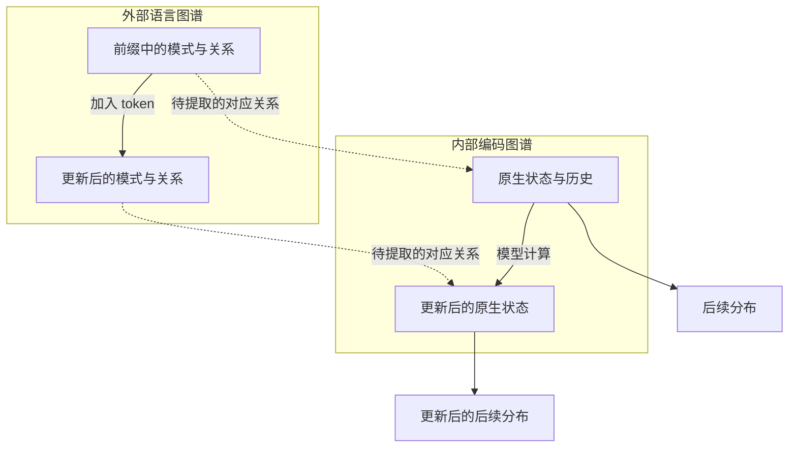

提问：
如果继续设计某种语句结构，测试某种语言特性，会有两个结果，一个是始终无法找到可以闭合的机制，一个是找到了但是一旦扩大范围还是失败，几千个Phase都无法突破这个循环。  所以接下来不能再继续设计某种测试例子找局部特征的研究方式了，没有意义，     唯一可行的做法，是围绕自回归机制这个核心切入点，把所有语言机制都放到一个平面内， 把句子看成是多个语言模式族的集合，比如我喜欢吃苹果，包括了四个语言模式，但是在不同语境下，有不同的优先级和结构。    看能不能建立对应的语言模式族图谱。以及对应的LLM的编码机制图谱。      不能再回到找局部特征，然后无法闭合的死循环了。

以上分析是否正确，应该如何改进当前研究，还是应该继续当前研究

回答：

**应该调整研究主线。你的核心判断是对的：继续为每一种句型建立局部预测器，再不断扩大范围检验它，很容易重复“局部成功—推广失败—更换材料”的循环。**

但有三点需要修正：

1. **自回归可以成为所有语言现象的共同研究接口，但不能由此认定所有机制只有一种形式。**
2. **句子不是若干语言模式的简单集合，而是多个模式之间有角色、范围、顺序和条件关系的组合。**
3. **整体图谱是值得优先投入的路线，但目前不能证明它是唯一可行路线，或者必须依赖新数学才能成功。**

我会实质性调整上一回答的建议：**不再把“继续扩大 2710 的测试材料”作为主任务。主任务改为建立统一的、随前缀更新的语言模式图谱与内部状态图谱。**2710 的提取器保留为其中一个参照工具。

---

**为什么你的批评击中了当前研究的问题？**

当前不少阶段实际回答的是：

> 给定这一类材料，能否找到一个函数，把早层状态映射到某个后层目标？

这当然能积累信息，但它不一定回答：

> 不同语言现象为什么能由同一套参数处理？这些现象之间共享的组织规则是什么？

例如，一个预测器可以分别拟合：

* 交接题的后层状态；
* 翻译题的后层状态；
* 否定题的后层状态。

即使三者都很准确，也未必知道**交接、翻译、否定怎样共同作用于同一个表达**。

最近的结果已经说明了这个缺口：

| 历史结果                         | 对当前方向的启示            |
| ---------------------------- | ------------------- |
| 2703：共享读法很强，但模型自己的答案仍明显较差    | 应研究信息的组织和使用，不能停在可读性 |
| 2707：已生成的 Trace 会进入后续来源写回    | 语言处理必须包含生成历史的更新     |
| 2708：预测入口＋真实 attention 在局部有效 | 已有可用的内部计算连接工具       |
| 2709：冻结入口提取器在广材料上明显失效        | 旧提取器没有充分表达实际条件      |
| 2710：简单加入当前 embedding 没有解决问题 | 缺口不只是一个 token 身份标签  |

这些证据支持**改变研究组织方式**，但尚不能证明已有数学工具整体无效。

真正需要改变的是：**让所有材料共同约束一套持续更新的结构，而不是让每批材料产生一套独立解释。**

---

**“把所有语言机制放到一个平面”应理解为统一研究对象，而不是压成二维结构。**

这个共同对象可以定义为：

> **一个完整前缀，目前支持哪些解释、维持哪些关系、留下哪些未完成要求，并因此允许哪些后续。**

知识、语法、推理、风格、翻译，都可以通过这个对象连接起来：

| 语言能力 | 放到自回归框架中观察什么              |
| ---- | ------------------------- |
| 知识   | 当前实体与关系使哪些后续更有支持          |
| 语法   | 哪些成分已经形成，哪些角色或结构尚未完成      |
| 推理   | 已有事实怎样更新后续结论的支持关系         |
| 指代   | 新表达应该绑定哪个已有实体             |
| 翻译   | 怎样保持内容关系，同时改变输出语言         |
| 风格   | 在内容约束下，哪些表达方式更合适          |
| 长句重排 | 哪个内容单元下一步应被输出，哪些已输出、哪些待输出 |
| 自我修正 | 新信息怎样改变当前解释与后续计划          |

**共同点是“前缀条件如何组织后续”，不是“所有能力都对应同一种坐标形状”。**

这也与已有预测状态研究的思想相通：研究内部表示应保留哪些信息，可以从“它需要支持哪些未来预测”出发。有研究在明确的生成过程设定中，将自回归表示与预测充分统计量联系起来；但这些结果不能直接推广成真实 LLM 全部语义的定理。[What Should Embeddings Embed?](https://arxiv.org/abs/2406.03707)

---

**“我喜欢吃苹果”不能只分成四个模式。**

“我／喜欢／吃／苹果”是四个直观的语言片段，不一定是四个模型 token，更不是只有四种模式。

它同时包含：

* 第一人称指称；
* 主体与谓语关系；
* 喜好的体验者与对象；
* “喜欢＋动作”的组合；
* 吃这一事件的施事与受事；
* 食物类别约束；
* 陈述句组织；
* 当前任务要求；
* 尚待确定的后续结构。

这些模式是重叠的。

可以把核心关系写成：

$$
\operatorname{喜欢}
\left(
\text{体验者}=\text{我},
\text{对象}=
\operatorname{吃}
(\text{施事}=\text{我},\text{受事}=\text{苹果})
\right).
$$

这只是语言分析示意，**不是已经从模型里提取出的结构**。

同样的字面内容，放进不同语境后，关系会改变：

| 语境示意             | 需要改变的结构                |
| ---------------- | ---------------------- |
| 普通陈述“我喜欢吃苹果”     | 当前说话者表达偏好              |
| “他说：‘我喜欢吃苹果’”    | “我”进入引语范围，指称需要重新绑定     |
| “把‘我喜欢吃苹果’翻译成法语” | 句子成为被操作的内容，输出语言受到任务约束  |
| “我喜欢吃苹果，但是……”    | 已有偏好仍保留，同时出现转折所要求的后续结构 |

因此，你说的“不同优先级”是有用直觉，但不能预设每种模式都有一个简单的全局权重。

有时发生的是：

* 某个模式变强或变弱；
* 某个实体重新绑定；
* 某个关系进入引语或假设范围；
* 某个任务约束开始生效；
* 某个尚未完成的结构等待后续填充。

**图谱必须能表达这些变化，而不仅记录“哪些模式同时出现”。**

---

**自回归研究的单位应从“完整句子”进一步改成“每个前缀的结构状态”。**

仍以你的句子作示意：

| 当前前缀   | 图谱应记录什么                        |
| ------ | ------------------------------ |
| 我      | 一个指称已经出现，但后续仍可能进入多种结构          |
| 我喜欢    | 喜好关系开始形成，对象尚未确定                |
| 我喜欢吃   | 喜好的对象可以是一个动作事件；动作的参与者与后续内容仍在形成 |
| 我喜欢吃苹果 | 核心事件关系更完整，但仍可能接修饰、转折、并列或结束     |

这里不能用完整句子的答案，提前标注尚未看到后文的前缀。

例如，读到“我喜欢吃”时，不能因为后来出现了“苹果”，就把前面的状态解释为“已经确定要输出苹果”。

同样，后文可以使研究者重新理解前面的词义，但在标准缓存式自回归计算中，**已经算好的过去 K/V 不会因此自动重算；新的解释主要体现在当前及后续计算中。**

这要求同时研究两条轴：

* **层轴：**同一个前缀怎样经过不同层加工；
* **时间轴：**加入一个新 token 后，条件和内部状态怎样更新。

只研究其中一条，都会遗漏重要结构。

---

**统一的数学起点，应是后续分布及其更新。**

设完整前缀为 \(u\)，一段可能的后续为 \(w\)，定义：

$$
\Pi_u(w)=P_\theta(w\mid u).
$$

它表达的是：在前缀 \(u\) 下，这段后续有多大概率。

当新 token \(a\) 出现后：

$$
\boxed{
\Pi_{ua}(w)
=
\frac{\Pi_u(aw)}{\Pi_u(a)}
}
\qquad \Pi_u(a)>0.
$$

这是条件概率的恒等式，不是新理论。它的重要性在于给所有语言现象提供了同一个接口：

> **模式的形成、绑定、竞争和更新，最终必须反映为后续条件分布的变化。**

但不能只看下一 token。

两个前缀可能都很倾向于先输出同一个常见词或标点，后续却完全不同。因此应同时观察：

* 完整下一 token 分布；
* 不同长度后续的条件概率；
* 实体、角色、命题和输出任务的后续状态。

完整后续空间无法穷举，实际只能逐步扩大覆盖范围。这种有限覆盖必须明确记录，不能称为已经观察“全部未来”。

还要注意：**预测分布是研究模型语义使用的共同接口，不是自然语言意义的唯一、完整定义。**

---

**两个图谱应怎样建立？**

我建议保留 RDC 名称，改变图谱的基本单位和连接方式。

**外部语言模式族图谱：有类型、有作用范围、随前缀更新的超图。**

图中至少包含：

| 对象    | 内容                   |
| ----- | -------------------- |
| 词形与词片 | 实际文本、token、跨度、位置     |
| 词义候选  | 果实、公司、引用对象等，不必立即唯一确定 |
| 实体与事件 | 谁、什么对象、发生什么事件        |
| 角色绑定  | 谁是施事、受事、拥有者、指称对象     |
| 关系与范围 | 类属、属性、否定、假设、引语、时间    |
| 组合模式  | 一个事件怎样嵌入另一个关系        |
| 任务条件  | 续写、翻译、重排、回答、风格要求     |
| 状态    | 已确认、待确定、待完成、已完成      |

采用超图的原因很具体：一个关系往往同时连接多个对象。例如“甲把苹果交给乙”，需要同时保留事件、物体、来源、目标和时间，普通无类型的两两连线容易丢掉绑定关系。

但不应先假定这套人工分类就是模型的真实分类。图谱应允许：

* 一个实例属于多个模式族；
* 未知模式暂时不命名；
* 不同解析保留不确定性；
* 随语料增加修正分类。

**内部编码图谱：原生坐标上的条件状态与更新。**

基本地址保持：

$$
(\text{模型},\text{层},\text{位置},\text{原生坐标}).
$$

再连接：

* embedding 行；
* 完整 H 场；
* 已有历史状态；
* 可查的单元和参数路径；
* 当前输出分布。

不先要求一个模式对应一个固定坐标集合。更现实的研究对象是：

> 一个模式与其他模式共同出现时，哪些坐标联合关系重复出现，它们如何随角色和语境调整，又怎样跨层接续。

**两个图谱的关系很可能是多对多，并且依赖上下文。**不能预设存在简单的一一同构。

下面只是研究对象的示意：

真正的发现应同时说明**横向怎样更新、纵向怎样对应**。

---

**新的主算法应怎样组织，才不会重新变成局部拟合？**

建议把主算法定义为：

> **在一个共同语料库上，联合学习语言模式的组织、原生坐标的条件响应，以及两者随前缀推进的共同更新规则。**

其中有五个具体环节。

**第一，使用覆盖多种现象的自然语料主库。**

研究主库不再由某一种句型模板主导，而是包含完整上下文中的：

* 叙述、对话、解释、论证；
* 实体和属性描述；
* 指代与关系更新；
* 翻译、改写、重排；
* 不同语言和风格。

已有受控材料全部保留为可追溯参照，不再不断以新模板替换主任务。

划分应按文档、基础内容及相关表达分组，避免同一内容的改写分别进入训练和确认。

**第二，建立完整的前缀记录。**

每条记录连接：

$$
\text{前缀}
\leftrightarrow
\text{外部结构}
\leftrightarrow
\text{全坐标状态}
\leftrightarrow
\text{后续分布}.
$$

输入分析只能使用当前前缀。后文标注可以帮助复核，但不能作为提前预测的输入。

同时区分：

* 沿自然文本前缀观察；
* 沿模型自己生成的前缀观察。

两者都重要，不能混为一条轨迹。

**第三，全局提取重叠模式与坐标关系。**

同时运行少量有明确分工的数学路线：

| 数学工具         | 在这个主任务中承担什么工作        |
| ------------ | -------------------- |
| 类型化超图／因子图    | 表达实体、角色、范围和组合        |
| 条件统计与多因素交互分析 | 查找模式共同出现时的坐标关系       |
| 全坐标算子辨识      | 学习前缀推进与跨层更新的共享规则     |
| 预测状态方法       | 用多步后续约束内部特征的用途       |
| 信息几何         | 区分 H 的大幅变化与输出真正敏感的变化 |
| 原生参数展开       | 把稳定候选落实到实际读取、乘合和写回   |

所有坐标继续参与；不以 PCA 或 Top-K 作为主体。

但必须认识到：**保留全坐标只是数据要求，不会自动得到正确算法。**提取器还需要保留角色、位置、组合与时间组织。

**第四，同时解释内部更新和后续概率。**

如果一个候选只能预测词表概率，却解释不了原生状态，它可能只是另一个语言模型。

如果只能拟合 HiddenState，却解释不了后续条件，它可能主要学到了背景纹理。

因此，同一套候选应同时接受这两方面约束：

$$
\text{语言模式组合}
\longrightarrow
\begin{cases}
\text{原生坐标的条件更新},\\
\text{后续分布的变化}.
\end{cases}
$$

这里的坐标更新可以用相邻层或相邻前缀的自然变化描述，**不需要把差分注入模型**。

**第五，限制解释变成逐句查表。**

这是避免循环的关键：

* 不能每增加一种表述，就新增一套独立预测器；
* 不能给每个句子一个自由条件编号，再把拟合成功叫共享机制；
* 不能用一个不透明的大网络准确模仿原模型，就称为完成解释；
* 必须记录：新增语言现象有多少能用已有规则解释，哪些确实要求增加新结构。

**研究进度应体现为共享规则覆盖面的增长，而不只是测试数量增长。**

---

**热力图也要从“样本展示”升级成“全局规律地图”。**

建议同时提供四种视图：

| 视图          | 用途                |
| ----------- | ----------------- |
| 模式族×层×全坐标   | 查找跨词汇、跨语境重复出现的组织  |
| 模式组合×全坐标    | 区分单模式效应与组合关系      |
| 前缀时间×层×角色   | 观察信息何时进入、绑定、维持和改变 |
| 规则预测误差×语言现象 | 显示当前统一模型缺少哪些条件    |

原始坐标值、训练侧标准化视图和低能量部分并列保留。

也不能把相邻坐标默认当成相邻语义位置。原生坐标编号通常不自带像图像像素那样的空间邻接关系，热图上的“形状”必须回到坐标计算和语言条件中解释。

你的“先观察再总结”应落实为：

> 先看哪些关系在整库中重复出现，再提出共享规则，随后用未参与发现的整批语料检验。

这与不断设计一个新句型、追逐一个局部热点，是不同的研究组织。

---

**接下来可以合并为三个大阶段，始终围绕同一个主任务推进。**

以下是建议，尚不是已执行结果。

| 大阶段      | 一次完成的工作                                                   | 核心产物                |
| -------- | --------------------------------------------------------- | ------------------- |
| A：统一前缀图谱 | 整合历史与自然语料；建立前缀、模式、角色、全场、后续分布的共同索引；绘制全局图；把旧提取器放入统一比较       | 可持续扩展的外部—内部联合图谱     |
| B：共享更新规则 | 同时比较超图条件模型、全坐标交互、预测状态、跨层算子；寻找同一模式在不同语境的复用和重绑定；追踪稳定候选的原生参数 | 能解释多类语言现象的规则集合及残差地图 |
| C：规则覆盖扩展 | 用新的文档、语言、组合和生成轨迹评价整套规则；判断缺口来自词义、角色、历史还是更新形式；必要时引入更合适的数学结构 | 同一理论版本的覆盖增长与明确失效边界  |

这里有一个与过去不同的规定：

**某个局部现象失败，不更换整个研究对象。**

它应进入同一图谱，要求当前理论解释：

* 是模式识别错了？
* 角色绑定错了？
* 少了历史条件？
* 更新规则不对？
* 还是内部坐标对应方式本来就需要更复杂的结构？

只有这样，失败才会推动同一个理论成长。

同时，不能要求“一开始就覆盖全部语言”。**统一的是数据结构、解释对象和规则体系；覆盖范围仍然需要逐步扩大。**

---

**对于新数学，应保持开放，但把“需要什么新结构”具体化。**

目前最值得追问的不是抽象地问“是不是新数学”，而是：

* 怎样表示一个内容同时参与多个模式？
* 怎样表示角色绑定改变，而实体内容保持？
* 怎样表示语境让某些规则暂时生效？
* 怎样把这种变化同时对应到跨层与跨时间计算？
* 怎样用有限规则解释越来越多的合法组合？

如果现有超图、条件算子、张量交互和预测状态工具在这些问题上系统失效，并且出现新的可重复结构，就有明确理由发展新数学。

几千个 Phase 没有得到完整闭合，本身只能说明**现有研究流程与候选模型没有完成目标**；不能单独判定自然界缺少对应数学。

**因此，我建议改变当前研究，而不是照原路线继续扩测试。保留全场采集、真实参数账本、2708／2710 的局部工具；把下一阶段的主交付改成“统一前缀图谱及其共享更新规则”。局部分析以后只负责解释这张图上的具体结构，不再各自成为一条不断重启的研究主线。**
