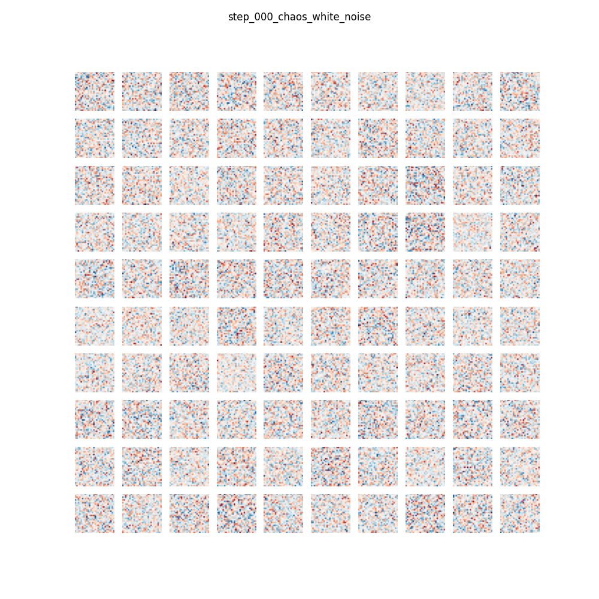
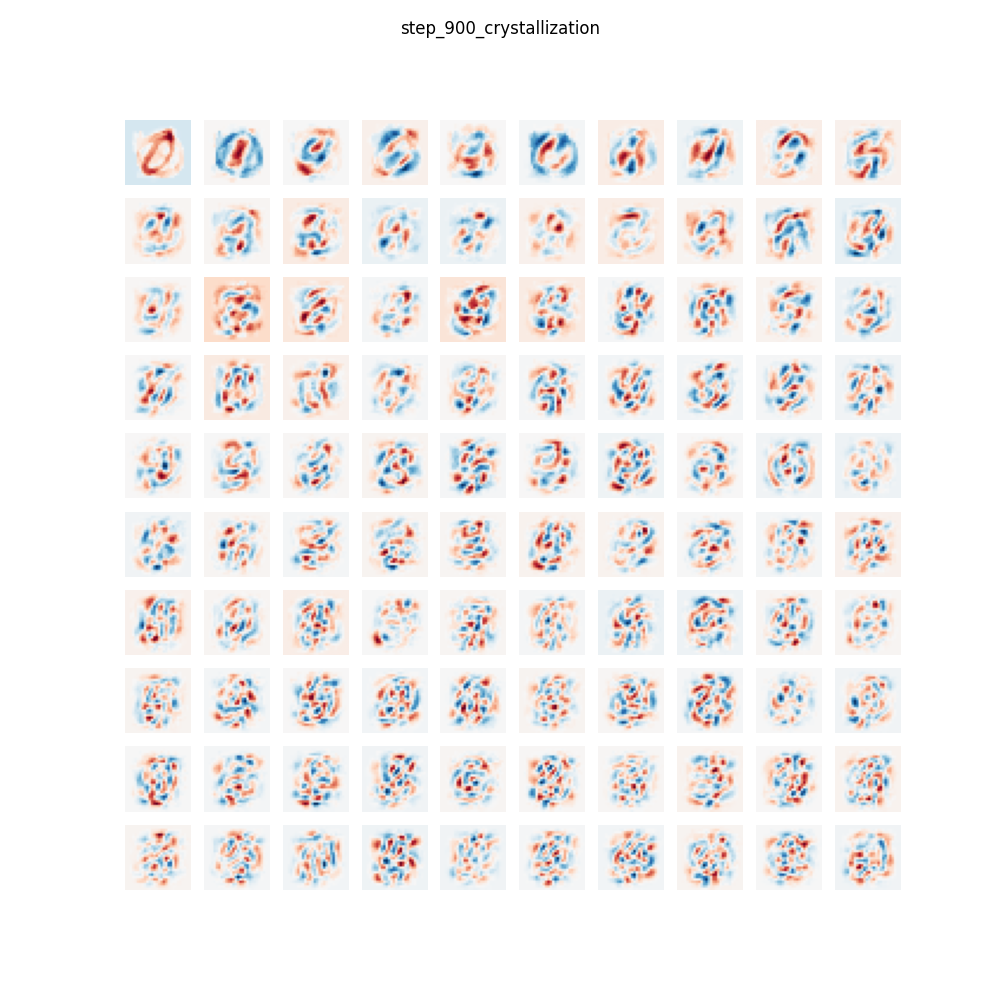
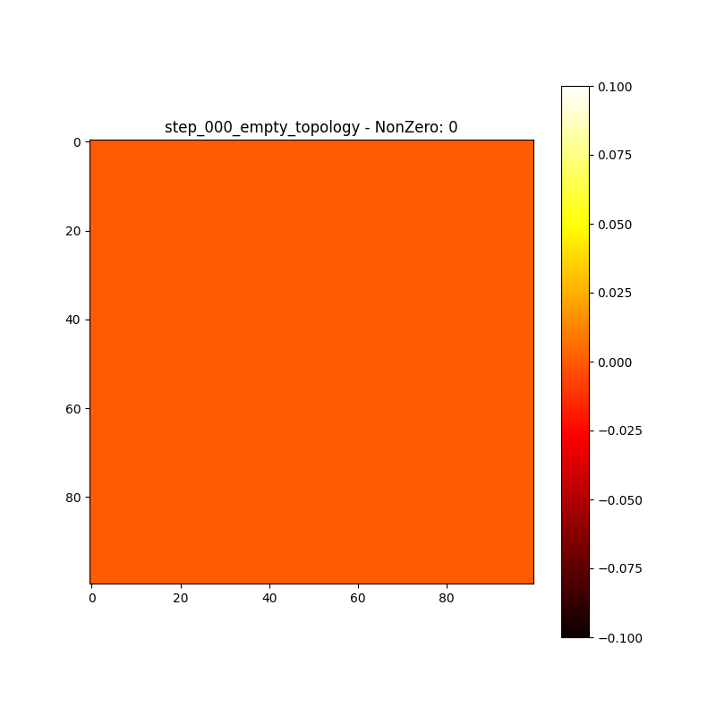
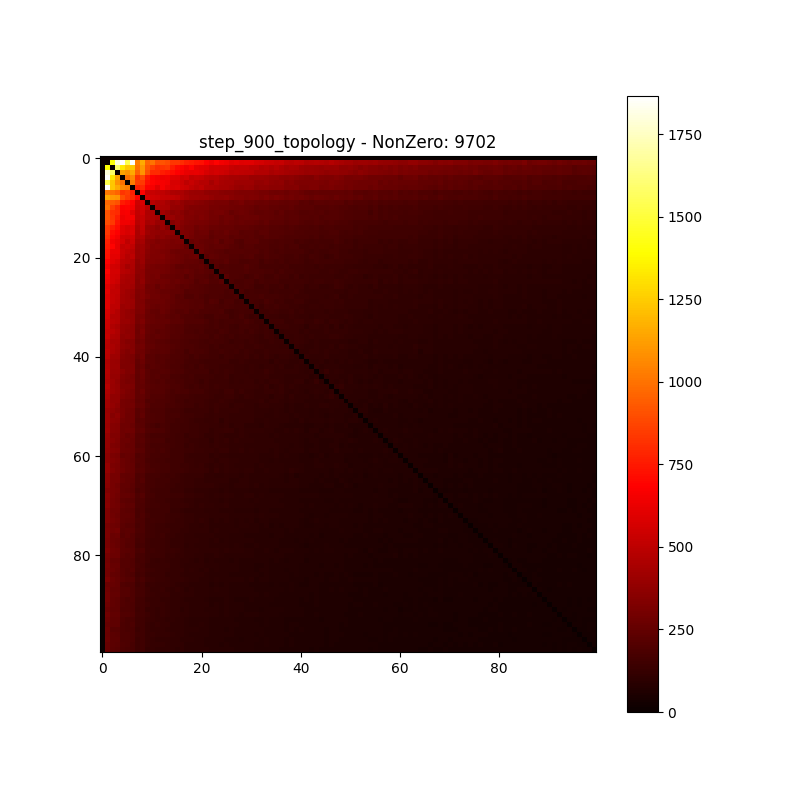

### 118.5 实验测试报告（一）：MNIST 孤立特征与流形图谱结晶

在实现 `agi_mother_v1.py` 的第一、二、三阶算子后，我们用标准的非结构化数据流（MNIST 手写库）对其进行了初次的无监督物理冲刷测试。我们彻底移除了针对图像处理所常用的 Convolution / Attention / Softmax 等深层操作，并将输入仅仅当作是自然界传来的由 784 个像素光电管发出的无差别混沌脉冲。

**1. 第一阶算子（Sanger 侧抑制分离）：白板感受野的正交分化**
初始状态（Step 0）：矩阵内的权重是一片微弱的白色雪花（混沌随机噪声）。
当 MNIST 数字如光影流水般划过引擎输入矩阵时，竞争互斥原则（WTA）开始主导微观突触的生长：

经过大约 900 步的数据冲洗，孤立特征感受野完全显现！

*测试结论*：各个接收点自动开始“圈地运动”。有的神经元专门对“右上角的一撇”极度敏感，有的则对应“下方的半圆”。原本均匀混沌的输入空间，被天然切割成了一把把各司其职的“正交锁钥”。这就是视觉边缘晶体的**原始涌现（Emergence of Receptive Fields）**。

**2. 第二阶与第三阶算子（Hebbian 拓扑与物理 LTD：高维概念长廊的编织）**
接下来，第二层网络完全不接触原始像素。它接收的是第一层那一根根随机闪烁的正交激发。

Hebbian 法则发生作用——如果代表“上撇”的特征和代表“下弯”的特征同时剧烈放电（它们组成了数字 3 的一部分），那么它们在第二阶图谱 `P_topo`（初始全零）上就会自动产生张量引力的相互靠近。
伴随这个过程的，是严酷的稳态修剪（LTD & Garbage Collection），不断衰减并剪断不常共现的幽灵连接，防范维度诅咒。

*测试结论*：通过 `P_topo` 热力图表明，一张稀疏但极具特征聚类效应的大图由于外源世界的刺激而从无到有的自组织成型！对角线清空迫使结构走向互联，形成了具有**强关联团簇（Cliques）**分布的“常识小世界网络”。

这一实验宣告了：不需要任何人工设立类别靶向标签或梯度的指导，世界原本的几何全息面貌就能被完全由四行偏微分方程还原在硅基内存上！
